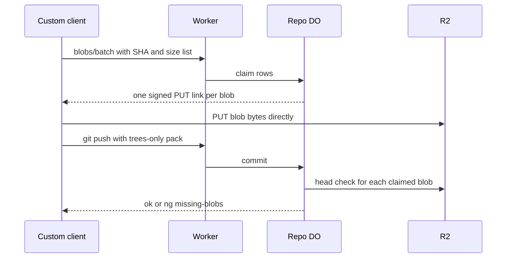

# Per-blob presigned direct upload for giant pushes

> Verdict: **risky** · feasibility 4/5 · reliability 2/5 · correctness 3/5 · effort: weeks
> Read the words in [how-to-read.md](../findings/how-to-read.md). Engineers: [proof](../proofs/presigned-direct-upload.md) · [review](../reviews/presigned-direct-upload.md)

## What this idea is

Git is a tool that keeps every version of a set of files, and lets many people share those versions. A repository, or repo, is one project's full set of files and their history. A push is sending your new commits to the server. An object is one stored item in git. An object is a file's content, a folder listing, or a commit. A blob is an object that holds one file's content. Big files make a push slow, because every byte passes through the server. This idea lets a special client send each big blob straight to the file store with a one-time signed link. The client then sends the server a small list of what was uploaded. A normal git push cannot use this idea, so the client must be a custom program.

Think of it like this. You move house. The heavy furniture goes by truck straight to the storage unit, with a gate pass that works for one day. You hand the front desk only the list of boxes.

## How it works

R2 is Cloudflare's large file store. It holds the git objects. A SHA, or hash, is a fingerprint of an object's content. Two objects with the same content have the same fingerprint. A Durable Object, or DO, is a single small program with its own storage that handles one thing at a time. There is one DO for each repo. Think of it like the one librarian who is allowed to update the catalog. DO SQLite is the small database inside each Durable Object. Cloudflare Workers, or Workers, are small programs that run on Cloudflare's network close to the user, with no server to manage. A packfile, or pack, is one bundle that holds many objects, squeezed to save space. A commit is one saved version of the files, with a note about what changed. A ref is a name that points at one commit. A branch is a ref. A tag is a ref. An alarm is a timer inside a Durable Object. A DO has only one alarm at a time.

1. The custom client calls the blobs/batch endpoint with the SHA and size of every blob about to be pushed.
2. The repo DO skips blobs that are already in its objects index. The DO inserts the rest as "claimed" rows in DO SQLite and returns one signed PUT link per blob.
3. The link's signature covers a checksum header equal to the SHA. R2 rejects any body whose fingerprint does not match that header.
4. The client PUTs each blob straight to R2. The bytes never pass through a Worker.
5. The client then runs a normal push. The packfile holds only commits and folder listings, not blobs, so the packfile is small.
6. In phase two of two-phase push, the DO checks each folder entry against the objects rows. For a "claimed" row, the DO asks R2 whether the key exists with a matching checksum, and then marks the row "ok".
7. If any blob cannot be found, the push fails with `ng <ref> missing-blobs`.
8. A janitor alarm removes claimed rows that are older than the link expiry.

## What the reviewer decided

The reviewer's verdict is Risky.

| Score | Value |
|---|---|
| Feasibility | 4 of 5 |
| Reliability | 2 of 5 |
| Correctness | 3 of 5 |

Risky. The idea can be built. But the proof shows one or more problems the reviewer could not fully solve, or it does a weaker version of the goal. Think of it like a runway you can see on the map, but nobody has checked it for holes.

For this idea, every Cloudflare feature used is GA. GA, or generally available, means a Cloudflare feature that is finished and supported, not a preview. Using a blob-free pack as the list of what changed is the right design. A blocker is a problem that stops the idea from working until it is fixed. But the proof's main claim about safety is wrong as written. In two ordinary orderings of events, a committed ref ends up pointing at a blob that no longer exists. The fixes are small. The real cost is the custom client, which is weeks of work, and stock git never benefits.

## Problems that must be fixed first

### Problem 1: The janitor deletes real files

**What goes wrong.** The janitor deletes the R2 key as well as the row. The input gate is the rule that a Durable Object handles one request at a time while it waits on its own storage. The gate opens when the DO waits on the network instead. The check of a claimed blob waits on R2, so the gate is open. The janitor alarm can run in that gap and delete the key, and the push then marks the row "ok". The same collision hits the ordinary push path, and with global object keys the janitor can delete a blob that another tenant committed long ago.

**Why it matters.** A committed ref points at a missing blob. Every later git clone of that branch fails. No later check notices, because the row says "ok". This is data loss with no crash needed.

**How to fix it.** Never delete R2 keys from this janitor. Delete rows only. Leave file cleanup to the GC and repack alarm.

### Problem 2: Waiting on R2 inside the ref transaction

**What goes wrong.** The blob check waits on R2 inside what two-phase push treats as one database transaction with no waits. While the first push waits, a second push to the same branch can complete and move the ref. If the first push read the old ref value before its waits, the first push then overwrites the second.

**Why it matters.** Two records disagree about the branch. One push's work is silently lost.

**How to fix it.** Compare-and-swap, or CAS, means change a value only if it still has the value you expect. If someone changed it first, do nothing and report it. Run the blob check before the ref CAS and outside the transaction. Re-check each row's state after every wait. Then run the CAS with no waits inside.

### Problem 3: R2 checksum behaviour is not tested

**What goes wrong.** The proof claims that R2 rejects a PUT whose body does not match the signed SHA-1 checksum. The proof also claims that a head call returns the stored checksum. Both claims come from changelog notes, not from a test.

**Why it matters.** If either claim is false, the server must hash the whole blob again itself. For a blob of several gigabytes, that hash runs inside the push request.

**How to fix it.** Test both claims on a real bucket before shipping.

## Things to know

A caveat is a limit or a condition. The idea works, but only inside this limit.

- Stock git cannot use this idea, because git send-pack has no filter option. The custom helper git-remote-edge must implement the push capability and speak git-receive-pack itself, and that helper is most of the work.
- Folder entries with mode 160000 point at commits in another repo, and the proof sends them to the R2 check and fails the push. The helper must skip them, as git's own connectivity check does.
- The signing library leaves the content length out of the signature, so the declared size is not enforced. Quotas must be applied at the blobs/batch step.
- Objects over 5 GiB need a multipart upload that the proof does not show. R2 gives no checksum for those uploads, so each one costs a full read-back hash in an alarm.
- The key layout objects/oid conflicts with the per-repo prefix in the content-addressed keys idea. The size column mixes the content size with the size that includes the header.

## How this idea connects to the others

This idea adds a blob check to the commit step of [#6 Two-phase push](./two-phase-push.md).

This idea must agree on the key layout with [#5 Content-addressed R2 keys](./content-addressed-r2-keys.md).

This idea reuses the pack reader from [#4 Packfile parsing in a Worker with a streaming inflater](./streaming-pack-parser.md) for the small pack.

This idea relies on the repo's DO owning the refs, as in [#1 One Durable Object per repo as the ref authority](./repo-do-ref-authority.md).

This idea shares the signed link method with [#11 Git LFS natively via presigned R2 URLs](./native-lfs.md).
