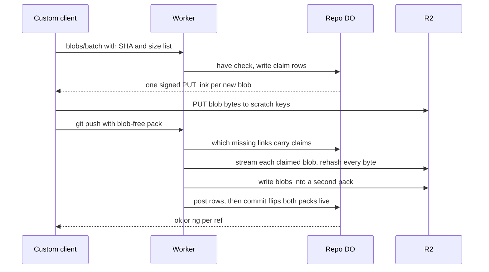

# Per-blob presigned direct upload for giant pushes

> Verdict: **risky** · feasibility 4/5 · reliability 2/5 · correctness 3/5 · effort: weeks
> Read the words in [how-to-read.md](../findings/how-to-read.md). Engineers: [proof](../proofs/presigned-direct-upload.md) · [review](../reviews/presigned-direct-upload.md)

## What this idea is

Git is a tool that keeps every version of a set of files, and lets many people share those versions. A repository, or repo, is one project's full set of files and their history. A push is sending your new commits to the server. An object is one stored item in git. An object is a file's content, a folder listing, or a commit. A blob is an object that holds one file's content. Big files make a push slow, because every byte passes through the server. This idea lets a special client send each big blob straight to the file store with a one-time signed link. The client tells the server which blobs are coming, uploads each one, and then pushes without them. A normal git push cannot use this idea, so the client must be a custom program.

Think of it like this. You move house. The heavy furniture goes by truck straight to the storage unit, with a gate pass that works for one day. You hand the front desk the list of boxes. The desk then moves each box into the house before it signs the form.

## How it works

The second pass writes the design in Rust, against one shared contract that every idea in this set follows. The contract allows no loose objects, so a staged blob must land inside a normal pack before the push commits. R2 is Cloudflare's large file store. It holds the git objects. A SHA, or hash, is a fingerprint of an object's content. Two objects with the same content have the same fingerprint. A Durable Object, or DO, is a single small program with its own storage that handles one thing at a time. There is one DO for each repo. Think of it like the one librarian who is allowed to update the catalog. DO SQLite is the small database inside each Durable Object. Cloudflare Workers are small programs that run on Cloudflare's network close to the user, with no server to manage. A packfile, or pack, is one bundle that holds many objects, squeezed to save space. A commit is one saved version of the files, with a note about what changed. A ref is a name that points at one commit. A branch is a ref. A tag is a ref.

1. The custom client calls the blobs/batch endpoint with the SHA and size of every blob it wants to send. One batch holds at most 1,000 objects, and each blob can be at most 5 GiB.
2. The repo DO answers "have" for each SHA that already sits in a live pack. For the rest, the DO writes a claim row in DO SQLite and returns one signed PUT link per blob.
3. The link's signature covers a checksum header equal to the SHA. The body must be the exact bytes that hash to that name.
4. The client PUTs each blob straight to R2 under a scratch key. The bytes never pass through a Worker. No reader ever resolves a scratch key, so a ref can never point at one.
5. The client then runs a normal push. The packfile holds only commits and folder listings, not blobs, so the packfile is small.
6. During the link check of two-phase push, the Worker collects every link that resolves neither to this push's pack nor to a live pack. The Worker asks the DO which of those carry a claim, in groups of 1,000. Asking also leases each claim, so the sweep cannot take the claim during the copy.
7. A link with no claim ends the push with `unpack error missing object` and an `ng` line for every ref.
8. For each claimed blob, the Worker streams the staged body out of R2 and rehashes every byte. The declared size is checked against the claim row, the body's own header, and the stored size. The bytes then go into a second pack as an ordinary entry.
9. The Worker posts the second pack's rows to the DO. The commit flips both packs to live in one span and moves the refs with a compare-and-swap. Compare-and-swap, or CAS, means change a value only if it still has the value you expect. If someone changed it first, do nothing and report it. At no point does a ref point at a loose key.
10. A sweep job then cleans up. A sweep is a background task that deletes files nobody points to anymore. The sweep deletes the scratch key and the claim row, but only after the claim is two hours old. The worst outcome of a sweep during a copy is a failed push, never a dangling ref.

## What the reviewer decided

The reviewer looks for blockers and caveats. A blocker is a problem that stops the idea from working until it is fixed. A caveat is a limit or a condition. The idea works, but only inside this limit.

The verdict is Lands with caveats.

| Score | Value |
|---|---|
| Feasibility | 4 of 5 |
| Reliability | 2 of 5 |
| Correctness | 3 of 5 |

| Score | First pass | Second pass |
|---|---|---|
| Feasibility | 4 of 5 | 3 of 5 |
| Reliability | 2 of 5 | 3 of 5 |
| Correctness | 3 of 5 | 3 of 5 |

Lands with caveats. The idea is sound and can be built. The proof has one or more problems that must be fixed first, and the reviewer described each fix. Think of it like a flight with a runway that needs some repairs before you land. The runway is there. The repairs are known.

For this idea, the second pass is a real step forward. The verdict moved from Risky to Lands with caveats. All three first-pass blockers are closed. Two of them are closed by the shape of the design, not by a check at run time. No ref can ever reach the scratch key, and nothing waits on the network inside the ref update. The third blocker is defused, because the rehash is folded into a copy the bytes must go through anyway.

The reliability score moved up. Feasibility moved down and correctness stayed flat, because the loop that squeezes each staged blob into the second pack cannot compile or drain as written. That is a defect of code, not of approach. What remains is not a redesign. One squeezing loop must be rebuilt on a lower-level call. The sweep needs one reschedule line. One pack row must be posted earlier. A set of shared signatures must line up across the proofs.

## What changed in the second pass

- The sweep deletes real files: fixed. The fix is the shape of the design, not a check. No ref ever resolves through a scratch key, and the sweep touches only claims older than two hours. Keys carry the repo id, so the cross-tenant case cannot exist. The worst outcome of a sweep during a copy is a failed push.
- Waiting on R2 inside the ref transaction: fixed. There is no wait inside the ref update at all. The copy and the rehash run in the Worker before the commit call, and the commit stays one span.
- R2 checksum behaviour is not tested: partly fixed. A real bucket test is still owed, and the test stays the day-1 gate. The design no longer depends on the checksum, because the copy rehashes every byte anyway. A dropped checksum only loses the early reject at upload time.
- The custom client is the bulk of the work and is not shown: still open. The helper must batch, PUT, and speak receive-pack itself. Without the helper the feature has no users.
- Batch paging and upload quotas: partly fixed. The batch caps at 1,000 objects and 5 GiB per blob, and claims are paged at 1,000 ids. Per-repo byte quotas stay out of scope.
- Objects over 5 GiB needed a multipart upload with no checksum: fixed. The design allows single PUTs only. The batch rejects anything larger, and the real cap is about 4 GiB, the largest length a pack entry can record.
- The key layout collided with content-addressed keys, and the size column mixed two meanings: fixed. Scratch keys now sit under the repo's own prefix. The size is always git content bytes, checked three ways.
- The content length stayed unsigned: fixed. The checksum is the only signed extra header. The declared size is enforced at copy time, when the Worker counts the bytes.
- Folder entries of mode 160000 failed the push: partly fixed. The link extractor must skip them, as git's own check does. The change is registered but not written, so they still fail like an ordinary submodule push does today.

## Problems that must be fixed first

### Problem 1: The squeezing loop cannot compile

**What goes wrong.** Deflate is the squeezing method a packfile uses. The copy stage squeezes each staged blob with the pinned deflate helper. That helper has no call to drain the buffer and no call to finish the stream. Its flush call ends the stream at the first chunk. The code does not compile.

**Why it matters.** This loop is the point of the feature. Until the loop works, no staged blob can enter a pack. The broken drain also lets all squeezed output pile up in memory, so the small-memory argument fails too.

**How to fix it.** Rebuild the loop on the library's lower-level compress call, which takes input, output, and a flush flag. A bounded output buffer keeps memory small.

### Problem 2: The sweep job never runs on its own

**What goes wrong.** Two gaps stop the cleanup. The contract says every route must rearm the alarm after its work, but the route that would arm the sweep never does. And a firing never reschedules itself while claims remain, so the sweep stops at the first quiet moment.

**Why it matters.** Claim rows and scratch keys leak forever in a quiet repo. The blobs keep costing storage.

**How to fix it.** Make a firing return a reschedule time set to the oldest claim's expiry whenever rows remain. Add the missing rearm call in the sibling's route, the same fix other ideas already need.

### Problem 3: A killed staging leaves a pack nobody can find

**What goes wrong.** The second pack's row is posted only after the upload finishes. Two-phase push's own rule is the opposite. The row must exist before the first part uploads, so a finished key always has a row. A kill in the gap leaves a durable pack with no row.

**Why it matters.** Every reader and every sweeper works from rows. The lost pack sits in the bucket forever, paid for and invisible.

**How to fix it.** Post an empty pack row before the upload starts, exactly as the main pack does.

### Problem 4: Shared function signatures do not line up

**What goes wrong.** Several shared calls differ across the proofs. The index sink's fields are private, but this code builds one directly. The pack writer's create call has three different shapes in three proofs. The commit request now carries a list of pack ids, while the ref code still expects one.

**Why it matters.** Rust code with mismatched signatures does not compile. The crate stays broken until each pair agrees.

**How to fix it.** Pick one shape per function, record the choice in the shared contract, and change the proofs to match. Every fix is mechanical.

## Things to know

- The custom client is still not shown. Without git-remote-edge speaking receive-pack itself, the feature has no users, unchanged from the first pass.
- The second pack's rows go to the DO in one call, and that call rejects more than 10,000 rows. A push that stages more blobs fails with a plain error instead of splitting the post. Few huge blobs stay under the wall, but the wall is silent.
- The batch route reads the whole request body into memory before the 1 MiB check runs. A large body is fully resident first.
- The sweep reads the header of every stale key before the delete call. Deleting a missing key is already a no-op, so up to 150 reads per slice are wasted. A subrequest is one call from a Worker to another service, such as one read from R2.
- The batch admits 5 GiB, but a pack entry fails above about 4 GiB once squeezed. The batch must cap where the pack can succeed.
- One bad id or one oversize blob fails the whole batch. The Git LFS idea returns a per-object error instead. The two conventions must be aligned for the client's retry logic.
- A two-pack push has no specified value for the audit column. The push row still records one pack id.
- The day-1 test list stands. Real-bucket checksum enforcement, the JSON call path into the DO, the random id source, the deployed subrequest cap, multi-GB squeezing speed inside the CPU limit, and the rule that removes incomplete uploads are all unverified. Two small crypto crates must also enter the tree for the signer.

## How this idea connects to the others

- The staging step, the second pack, and the commit that flips both packs live are part of [#6 Two-phase push](./two-phase-push.md).

- The object index, the pack rows, and the per-repo key layout come from [#2 Refs in DO SQLite, objects in R2](./refs-sqlite-objects-r2.md).

- The pack reading and the link extraction come from [#4 Packfile parsing in a Worker with a streaming inflater](./streaming-pack-parser.md).

- The commit route and the compare-and-swap on refs come from [#1 One Durable Object per repo as the ref authority](./repo-do-ref-authority.md).

- The sweep runs as one job slice of the alarm dispatcher from [#55 GC and repack as a DO alarm](./gc-and-repack-alarm.md).

- The link signer and the R2 credentials come from [#11 Git LFS natively via presigned R2 URLs](./native-lfs.md).
