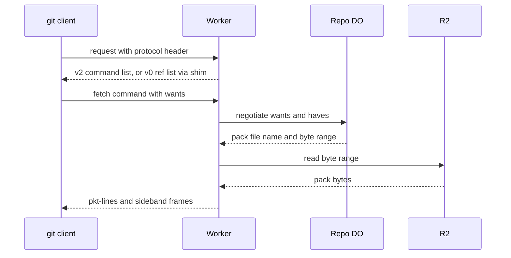

# Speak git protocol v2 only, translate v0 at the edge

> Verdict: **risky** · feasibility 4/5 · reliability 3/5 · correctness 2/5 · effort: weeks
> Read the words in [how-to-read.md](../findings/how-to-read.md). Engineers: [proof](../proofs/protocol-v2-only.md) · [review](../reviews/protocol-v2-only.md)

## What this idea is

git is a tool that keeps every version of a set of files, and lets many people share those versions. A repository, or repo, is one project's full set of files and their history. A commit is one saved version of the files, with a note about what changed. A branch is a named line of commits, like a bookmark that moves forward as you save.

A ref is a name that points at one commit. A branch is a ref. A tag is a ref.

The git tool talks to a server over smart HTTP. Smart HTTP is the way git talks to a server over normal web requests. There are two sets of messages for that talk, an old one called v0 and a new one called protocol v2. Protocol v2 is the newer, cleaner set of messages git uses to talk to a server.

Every v2 message is a full, self-contained request. That shape fits Cloudflare Workers well. Cloudflare Workers are small programs that run on Cloudflare's network close to the user, with no server to manage. This idea makes the server speak only v2 inside. Old clients that still speak v0 get a thin translation layer at the edge.

Think of it like this. A hotel front desk decides to work in one language only. A guest who speaks an older dialect talks to an interpreter at the door. The interpreter turns each question into the desk's language and turns each answer back.

## How it works

A fetch is getting commits from the server. A clone gets everything for the first time. A push is sending your new commits to the server. An object is one stored item in git. An object is a file's content, a folder listing, or a commit.

A packfile is one bundle that holds many objects, squeezed to save space. A SHA is a fingerprint of an object's content. Two objects with the same content have the same fingerprint.

1. The git client sends a header that says which protocol version it speaks. The Worker reads that header before doing any other work.
2. For a v2 client, the Worker answers the first request with a fixed list of supported commands. No Durable Object is touched. A Durable Object, or DO, is a single small program with its own storage that handles one thing at a time. There is one DO for each repo. Think of it like the one librarian who is allowed to update the catalog.
3. Each later request holds one v2 command, such as ls-refs or fetch. The Worker parses the pkt-lines and forwards one command to the repo's DO. A pkt-line is git's way of framing a message. Each line starts with four characters that give its length.
4. The DO answers ls-refs from its refs table in DO SQLite. DO SQLite is the small database inside each Durable Object.
5. For fetch, the DO turns the wanted commits into a packfile name and a byte range in R2. R2 is Cloudflare's large file store. It holds the git objects.
6. The Worker streams that byte range from R2 to the client as sideband frames. Sideband is a way to send two kinds of data in one stream, like a main channel and a progress channel. No pack bytes pass through the DO.
7. A v0 client goes through a shim. The shim renders the same ref list in the old format and rewrites the old want and have lines into the same internal fetch command.
8. Push stays unchanged. The git tool has no v2 for push, so push always uses the old format and goes to the push pipeline.

## What the reviewer decided

The reviewer looks for blockers and caveats. A blocker is a problem that stops the idea from working until it is fixed. A caveat is a limit or a condition. The idea works, but only inside this limit.

The verdict is Risky.

| Score | Value |
|---|---|
| Feasibility | 4 of 5 |
| Reliability | 3 of 5 |
| Correctness | 2 of 5 |

Risky. The idea can be built. But the proof shows one or more problems the reviewer could not fully solve, or it does a weaker version of the goal. Think of it like a runway you can see on the map, but nobody has checked it for holes.

For this idea, the design is the right one for Workers, and every building block is GA. GA, or generally available, means a Cloudflare feature that is finished and supported, not a preview. The read path writes nothing, so it can never lose or split a ref. But the proof code as written cannot complete a single git clone from a modern client. The v0 shim only handles clones, so the claim of one thin shim and one code path is unproven.

The fixes are edits to the wire format, not changes to the design. The reviewer expects days for v2 clone and fetch. The reviewer expects weeks for a correct v0 shim plus shallow and filter support.

## Problems that must be fixed first

### Problem 1: The fetch answer starts with a section git does not expect

**What goes wrong.** A fresh clone has no local commits, so the client sends done in its first fetch request. The v2 rules say the server must then leave out the acknowledgments section. The proof always sends that section first.

**Why it matters.** A normal git clone would fail. The client stops with the message "expected packfile, received acknowledgments".

**How to fix it.** When the request contains done, send the packfile section right away. Send NAK or ACK and ready only in rounds without done.

### Problem 2: The v0 shim cannot do a second round

**What goes wrong.** An old v0 client sends have lines without done until the server acknowledges some of them. That needs a capability called multi_ack_detailed, which the shim does not offer. The shim replies NAK followed by pack bytes to a have-only round.

**Why it matters.** A normal git fetch from a v0 client with existing history would fail. The client stops with "expected ACK/NAK, got PACK". Only a fresh v0 clone works, so the shim is clone-only.

**How to fix it.** Offer multi_ack_detailed and answer each round with ACK lines marked common or ready. Or refuse v0 incremental fetch on purpose.

### Problem 3: Compressed request bodies are read as raw bytes

**What goes wrong.** The git client compresses the body of a fetch request with gzip once the body grows past a small size. The Worker parses the raw body and ignores the Content-Encoding header.

**Why it matters.** A normal git fetch with many have lines sends a compressed body. The Worker would parse garbage and the fetch would fail.

**How to fix it.** Check the Content-Encoding header. Decompress the body with DecompressionStream in gzip mode before parsing pkt-lines.

### Problem 4: Wanted commits are never checked

**What goes wrong.** The DO never checks that a wanted commit is one the server advertised or can reach. An unknown want returns the whole latest pack.

**Why it matters.** The client gets a large answer instead of a clean error. After a forced push, a stale fetch becomes a full download instead of a clear failure.

**How to fix it.** Compare each want against the advertised refs, or against the commits reachable from them. Answer an unknown want with an ERR line.

## Things to know

- The pkt-line helper copies each 65 KB frame through a JavaScript array. Replace that with direct buffer copies, or a large clone uses up the CPU budget.
- The pack name and byte range from the DO are not tied to one version of the pack file. If a rebuild replaces the file between the two steps, the client gets a corrupt pack, so use versioned names or an etag match.
- The server advertises wait-for-done, shallow, and object-info but does not honour them. A clone with a depth limit silently gets the full history.
- There is no symref for HEAD, so a clone picks the default branch by matching the commit SHA.
- "v2 only" really means v2 for fetch and v0 for push. Dumb HTTP clients are out of scope.

## How this idea connects to the others

- The single DO that owns the refs comes from [#1 One Durable Object per repo as the ref authority](./repo-do-ref-authority.md).
- The refs table and the object store come from [#2 Refs in DO SQLite, objects in R2](./refs-sqlite-objects-r2.md).
- The first request and the pkt-line code come from [#53 The /info/refs?service= entrypoint and pkt-line codec](./info-refs-endpoint.md).
- The want and have matching comes from [#56 Want/have negotiation with a commit-graph in SQLite](./want-have-negotiation.md).
- The ready-made pack for fresh clones comes from [#7 Precomputed pack slices for clone](./precomputed-clone-pack.md).
