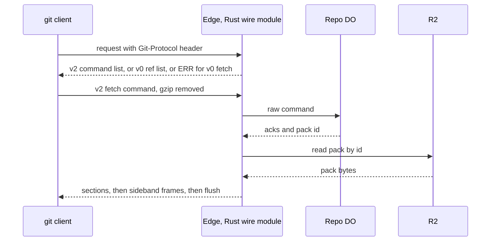

# Speak git protocol v2 only, translate v0 at the edge

> Verdict: **risky** · feasibility 4/5 · reliability 3/5 · correctness 2/5 · effort: weeks
> Read the words in [how-to-read.md](../findings/how-to-read.md). Engineers: [proof](../proofs/protocol-v2-only.md) · [review](../reviews/protocol-v2-only.md)

## What this idea is

git is a tool that keeps every version of a set of files, and lets many people share those versions. A repository, or repo, is one project's full set of files and their history. A commit is one saved version of the files, with a note about what changed. A branch is a named line of commits, like a bookmark that moves forward as you save.

A ref is a name that points at one commit. A branch is a ref. A tag is a ref.

The git tool talks to a server over smart HTTP. Smart HTTP is the way git talks to a server over normal web requests. There are two sets of messages for that talk, an old one called v0 and a new one called protocol v2. Protocol v2 is the newer, cleaner set of messages git uses to talk to a server.

Every v2 message is a full, self-contained request. That shape fits Cloudflare Workers well. Cloudflare Workers are small programs that run on Cloudflare's network close to the user, with no server to manage. This idea makes the server speak only v2 for reads. An old v0 client can still list the refs. For a real fetch, the server tells the old client to upgrade instead of translating.

Think of it like this. A hotel front desk decides to work in one language only. A guest who speaks an older dialect can still read the room list at the door. To book a room, the guest must speak the desk's language.

## How it works

A fetch is getting commits from the server. A clone gets everything for the first time. A push is sending your new commits to the server. An object is one stored item in git. An object is a file's content, a folder listing, or a commit.

A packfile is one bundle that holds many objects, squeezed to save space. A SHA is a fingerprint of an object's content. Two objects with the same content have the same fingerprint.

The second pass is written in Rust and runs as Wasm. Wasm, or WebAssembly, is a way to run code from other languages, such as Rust, inside a Worker. All ideas now share one written contract that fixes the module names, the wire rules, and the error rules. This idea owns the wire module and the code at the edge that picks the protocol version.

1. The git client sends a Git-Protocol header that names the version it speaks. The edge reads that header and nothing else to pick the version.
2. For a v2 client, the edge answers the first request with a fixed list of five lines. The list names the two supported commands, ls-refs and fetch, with the shallow and filter options. No Durable Object is touched. A Durable Object, or DO, is a single small program with its own storage that handles one thing at a time. There is one DO for each repo. Think of it like the one librarian who is allowed to update the catalog.
3. For a v0 or v1 client, the edge asks the DO for the ref list and writes the old format. That keeps git ls-remote working for old clients.
4. Each later v2 request holds one command. A body reader removes gzip first. The wire module then parses the pkt-lines into one command and refuses any unknown command or argument. A pkt-line is git's way of framing a message. Each line starts with four characters that give its length. The command body is capped at 1 MB.
5. A v0 or v1 client that posts a fetch request is refused with one ERR line that says protocol v2 is required. There is no v0 translation of fetch.
6. The edge forwards the raw v2 command to the repo's DO. The DO answers ls-refs from its refs table in DO SQLite. DO SQLite is the small database inside each Durable Object. HEAD comes first, with the branch name it points to.
7. For fetch, the DO checks every wanted commit, matches the haves, and picks a pack by an unchanging pack id in R2. R2 is Cloudflare's large file store. It holds the git objects.
8. The wire module writes the answer sections in the order git expects. When the request contains done, the acknowledgments section is left out and the packfile section starts at once.
9. The pack bytes stream from R2 to the client as sideband frames of 65515 bytes. Sideband is a way to send two kinds of data in one stream, like a main channel and a progress channel. Each frame is copied once. No pack bytes pass through the DO.
10. Push stays unchanged. The git tool has no v2 for push, so push always uses the old format and goes to the push pipeline.

## What the reviewer decided

The reviewer looks for blockers and caveats. A blocker is a problem that stops the idea from working until it is fixed. A caveat is a limit or a condition. The idea works, but only inside this limit.

The verdict is Lands with caveats.

| Score | Value |
|---|---|
| Feasibility | 4 of 5 |
| Reliability | 4 of 5 |
| Correctness | 4 of 5 |

| Score | First pass | Second pass |
|---|---|---|
| Feasibility | 4 of 5 | 4 of 5 |
| Reliability | 3 of 5 | 4 of 5 |
| Correctness | 2 of 5 | 4 of 5 |

Lands with caveats. The idea is sound and can be built. The proof has one or more problems that must be fixed first, and the reviewer described each fix. Think of it like a flight with a runway that needs some repairs before you land. The runway is there. The repairs are known.

For this idea, the reviewer checked every library call in the code against the pinned crate sources and found no compile error. The reviewer then walked every byte of a clone, an incremental fetch, and an ls-remote against git 2.43 source. No byte breaks the happy path. The one blocker is an error in the shared contract, not in the design. The reviewer expects days for the wire code and weeks for the full conformance work.

## What changed in the second pass

- The fetch answer no longer starts with a section git does not expect. Fixed by code. The acknowledgments section is written only when the request has no done line, which matches git's own fetch code.
- The v0 shim could not do a second negotiation round. Fixed by removal. The shared contract dropped the shim, so a v0 fetch request now gets one ERR line that says v2 is required.
- Compressed request bodies were read as raw bytes. Fixed by a dependency. A body reader removes gzip before the parser runs, but the reader lives in another idea and is not yet tested at runtime.
- Wanted commits were never checked. Still open in this proof. The parser refuses a fetch with no want line, but the real check lives in the negotiation idea and is claimed, not shown. The ERR line for a bad want must also ride an HTTP 200, see Problem 1.
- The pkt-line helper copied each frame through a JavaScript array. Fixed. The Rust code slices the input into 65515 byte chunks and writes each one straight into one buffer.
- The pack name and byte range could point at a rebuilt file. Fixed by the contract. A pack now has an unchanging id, and a rebuild writes a new id instead of replacing the file.
- The server advertised options it did not honour. Fixed. The advertisement lists only ls-refs, fetch, shallow, and filter, and the parser refuses everything else.
- There was no symref for HEAD. Fixed. The ls-refs answer writes HEAD first with the branch name it points to, so a clone picks the default branch by name.
- The ls-refs arguments peel, unborn, and symrefs were not handled. Fixed. The parser accepts all three plus ref-prefix.

## Problems that must be fixed first

### Problem 1: Error lines sent with HTTP 400 are never shown to the user

**What goes wrong.** The contract says a protocol error is an HTTP 400 with one ERR pkt-line in the body. The git HTTP client throws away any body that comes with a status of 300 or higher. The ERR text is never read.

**Why it matters.** A v0 client that posts a fetch sees only "RPC failed, HTTP 400" and no reason. Test scenario 13 asserts the text "protocol v2 required" and cannot pass. The same loss hits the "not our ref" error for a bad want.

**How to fix it.** Change one line of the contract. Send a protocol error raised after the command was parsed as HTTP 200 with one ERR pkt-line. Keep 400 only for garbage before the handshake. Map that rule in the edge response code.

## Things to know

- When a body is too large, the code returns early and leaves the request stream unread. The spike showed that pattern restarting the local runtime twice, so cancel the stream on every early return instead of draining it.
- Want checking and gzip decoding are contract dependencies, not code in this proof. The gzip stream bridge and the streaming response are still unverified at runtime.
- The server says ready on the first known have. Long divergent histories get a larger pack than needed. That is legal and allowed by the contract, but it is not what git itself does.
- The proof claims that a blob size filter such as blob:limit=1m fails. That claim is wrong in the harmless direction, because git expands the size to bytes before sending.
- The glue for the first request is not shown. That glue must set the exact git Content-Type and a no-cache header, or the client refuses the answer. Another idea owns that glue.
- One writer function listed in the contract is missing from the code. The contract's wording for the fetch sections reads as two delimiters where git accepts only one, so the contract text must be corrected.
- The peeled target of a tag is never computed by any sync route today. The peeled line in ls-refs depends on a schema addition outside this proof.
- The proof marked the sideband writer's argument order as unverified. The reviewer read the crate source and closed that doubt. The frame size limit of 65515 bytes is exact.

## How this idea connects to the others

- The single DO that owns the refs comes from [#1 One Durable Object per repo as the ref authority](./repo-do-ref-authority.md).
- The refs table and the object store come from [#2 Refs in DO SQLite, objects in R2](./refs-sqlite-objects-r2.md).
- The first request and the pkt-line code come from [#53 The /info/refs?service= entrypoint and pkt-line codec](./info-refs-endpoint.md).
- The want and have matching comes from [#56 Want/have negotiation with a commit-graph in SQLite](./want-have-negotiation.md).
- The push path and its report format come from [#6 Two-phase push](./two-phase-push.md).
- The blob filters for partial clone come from [#10 Shallow and partial clone as first-class filters](./partial-clone-filters.md).
