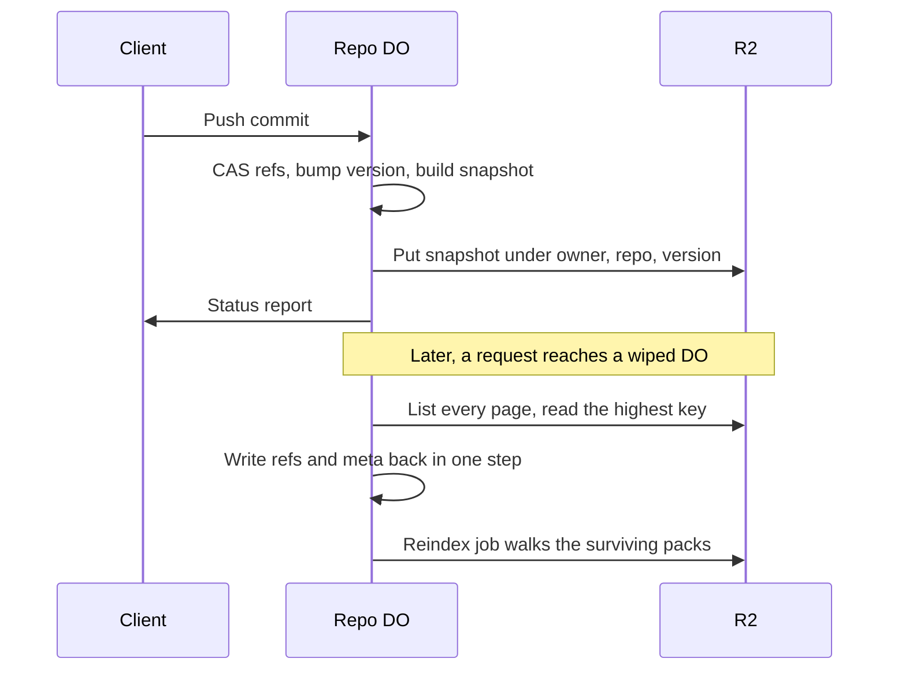

# Snapshots via R2 object versioning of ref state

> Verdict: **lands with caveats** · feasibility 4/5 · reliability 2/5 · correctness 3/5 · effort: days
> Read the words in [how-to-read.md](../findings/how-to-read.md). Engineers: [proof](../proofs/r2-versioned-snapshots.md) · [review](../reviews/r2-versioned-snapshots.md)

## What this idea is

Git is a tool that keeps every version of a set of files, and lets many people share those versions. A repository, or repo, is one project's full set of files and their history. A commit is one saved version of the files, with a note about what changed. A ref is a name that points at one commit. A branch is a ref. A tag is a ref.

A push is sending your new commits to the server. A Durable Object, or DO, is a single small program with its own storage that handles one thing at a time. There is one DO for each repo. Think of it like the one librarian who is allowed to update the catalog. R2 is Cloudflare's large file store. It holds the git objects.

The refs of a repo live only inside the repo DO. If that storage is wiped, the repo loses every branch name, even though the commits are safe in R2. This idea writes a full copy of the refs to R2 after every push. When a DO starts with empty storage but finds a copy in R2, the DO restores the refs from that copy before serving anyone.

Think of it like this. A shopkeeper photocopies the whole ledger page after every sale and puts the copy in a fireproof cabinet. If the ledger burns, the newest copy brings the shop back to the last sale.

## How it works

The second pass writes the design in Rust, against one shared contract that every idea in this set follows. Cloudflare Workers are small programs that run on Cloudflare's network close to the user, with no server to manage. Wasm, or WebAssembly, is a way to run code from other languages, such as Rust, inside a Worker. DO SQLite is the small database inside each Durable Object.

1. A push arrives at a Worker. The Worker stores the pushed objects in R2 and calls the commit route on the repo DO.
2. The DO moves each ref with a compare-and-swap and adds one to a version counter in DO SQLite. All of this happens in one step with no wait on the network. Compare-and-swap, or CAS, means change a value only if it still has the value you expect. If someone changed it first, do nothing and report it.
3. In the same step, the DO builds the snapshot. A snapshot is one JSON file. The file holds every ref, the final commit behind each tag, the default branch, the repo id, and the list of live packs. A snapshot that would be larger than 8 MiB fails the whole commit, and nothing moves.
4. After the step and before the answer, the DO writes the snapshot to R2. The key holds the owner name, the repo name, and the new version number. The file is never changed after it is written.
5. The DO returns the status report to the client. A client can see ok only after R2 holds the snapshot, because the write finishes before the answer leaves.
6. There is no pointer file. A restore finds the newest snapshot by taking the highest key over every page of the R2 list. The design assumes no list order.
7. A request that reaches a DO with empty storage runs the restore before anything else is served. Empty storage means version zero, no refs, and no pushes. A DO that ever committed cannot look like that.
8. The restore writes the refs, the default branch, the repo id, and the version back in one step. Then a reindex job rebuilds the object rows by walking every pack still stored under the repo's R2 prefix. The job does not trust the pack list inside the snapshot.
9. A moving commit also schedules a prune job, and the route arms the alarm. An alarm is a timer inside a Durable Object. A DO has only one alarm at a time. The prune job keeps the newest 50 snapshots and deletes older keys one page of 300 at a time.
10. R2 still has no real file versioning. The design fakes that feature with one immutable key per version, and no pointer at all.

## What the reviewer decided

The reviewer looks for blockers and caveats. A blocker is a problem that stops the idea from working until it is fixed. A caveat is a limit or a condition. The idea works, but only inside this limit.

The verdict is Lands with caveats.

| Score | Value |
|---|---|
| Feasibility | 4 of 5 |
| Reliability | 3 of 5 |
| Correctness | 4 of 5 |

| Score | First pass | Second pass |
|---|---|---|
| Feasibility | 4 of 5 | 4 of 5 |
| Reliability | 2 of 5 | 3 of 5 |
| Correctness | 3 of 5 | 4 of 5 |

Lands with caveats. The idea is sound and can be built. The proof has one or more problems that must be fixed first, and the reviewer described each fix. Think of it like a flight with a runway that needs some repairs before you land. The runway is there. The repairs are known.

For this idea, the second pass is a real step forward. Both first-pass blockers are closed by the shape of the design, not by a check at run time. The pointer file is gone, the snapshot key survives a recreated namespace, and a client can see ok only after the snapshot is durable. Reliability moved from 2 of 5 to 3 of 5, and correctness moved from 3 of 5 to 4 of 5.

What remains is local and mostly inherited. One library call uses the wrong type, and a few small compile fixes are needed. The promise that an over-limit snapshot cancels the commit depends on a one-line fix in a sibling idea that has not landed. And a one-line gap in arming the alarm can strand a restore halfway. The reviewer still expects days of work.

## What changed in the second pass

- The LATEST pointer could go backwards when two pushes interleaved: fixed. The pointer and its conditional write are gone. Each commit writes its own key that nothing overwrites, and a restore takes the highest key over every page. The newest snapshot always holds every move a client saw ok for.
- The snapshot prefix came from the DO's internal id, which changes when a namespace is recreated: fixed. The prefix now uses the owner and repo names stored in the DO's own metadata. The repo id, which a wiped DO regenerates, travels inside the snapshot and is adopted back on restore.
- The snapshot held no default branch and no final commit behind each tag: fixed. The snapshot now carries both. A restored repo advertises the default branch again.
- A push that moved many refs could get back too few status lines: fixed by the contract modules. The shared commit code does one compare-and-swap per ref and returns one result per ref. The snapshot only checks whether any ref moved.
- The restore trusted that the objects named in a snapshot still exist: fixed. The reindex job lists the packs that remain in R2 and rebuilds the object rows from them. A pack the janitor already deleted gets no row. A janitor is a background task that deletes files nobody points to anymore.
- The prune step listed at most 1,000 keys at a time: fixed. Pruning is now a job slice that reads one page of 300 keys per run and continues while a whole page is old. A backlog drains over several runs.
- Each push added two or three round trips to R2: partly fixed. A moving commit now makes exactly one write, with no read and no pointer write before it. That one write still adds delay inside the part of the commit that runs one push at a time.
- The title's R2 object versioning is still an emulation: still open. R2 has no real file versioning. The design now says so plainly, and fakes versioning with one immutable key per version and no pointer.

## Problems that must be fixed first

### Problem 1: The code does not build as written

**What goes wrong.** The reindex job un-squeezes each stored object with a call that does not exist in the pinned library. The resumable call has a different name, and the sibling parser already uses the right one. The fingerprint call drops one argument and stores a maybe-error instead of the fingerprint. The code also reads the commit answer in a shape that matches only one of two sibling definitions. And the job file calls DO helper methods that are private to another module.

**Why it matters.** Rust code with these errors does not build. Nothing in the crate can run until they are fixed. Every fix is small and sits at a marked or single site.

**How to fix it.** Use the resumable un-squeeze call the sibling parser uses. Add the missing argument and unwrap the result. Pick one shared shape for the commit answer. Make the helpers visible to the jobs module.

### Problem 2: An over-limit snapshot can still commit

**What goes wrong.** A snapshot larger than 8 MiB is meant to cancel the whole commit, so no ref can move without a snapshot behind it. That works only if the request handler throws the error. The shared helpers turn that error into a 500 answer instead of throwing it. The code then moves the ref, adds one to the version, marks the push committed, and never writes the snapshot.

**Why it matters.** This is the exact un-backed state the module exists to prevent. A later wipe restores the previous version, which does not contain the move.

**How to fix it.** Make the shared finish helper throw storage and internal errors out of the request handler instead of answering 500. The fix is one line in the sibling idea, and it is already filed there.

### Problem 3: A crash can strand the restore halfway

**What goes wrong.** The restore writes the refs and sets a rebuild marker in one step, then arms the alarm in a later wait. A kill between the two leaves the marker set and a rebuild job queued, but no alarm ever fires. Every later request sees a DO that no longer looks empty and skips the restore.

**Why it matters.** On a repo that only receives reads after the crash, the rebuild never runs. The ref list stays right forever, and every fetch fails with "not our ref" forever.

**How to fix it.** Arm the alarm whenever the rebuild marker is set, or arm it at boot when any job row is still queued. The fix is one line.

## Things to know

- After a restore, the refs are advertised before the objects are indexed again. A fetch of a branch whose pack is still being rebuilt fails with "not our ref" until the job marks the pack live. On a large repo the rebuild can take minutes.
- A corrupt or missing newest snapshot stops the whole repo. Every request then fails with a 500 answer, and there is no fallback to the next newest snapshot. A transient R2 failure still retries cleanly.
- Packs the janitor had marked dead before the wipe come back as live after a restore. Their objects cost storage until the next janitor run. Nothing is lost.
- The janitor can never remove a pack row that the rebuild job left half-indexed, because the row has no push id. The documented escape of deleting one marker leaves invisible rows behind.
- The final commit behind a tag survives a wipe only once a sibling idea fills that column. Until then a restored repo advertises exactly what it advertises today.
- The delete call inside the store module does not carry the call budget that every R2 call must charge against. The job counts the call by hand, the same way the push idea does.
- Every cold start of a never-pushed repo costs one extra list call to R2. A normal repo pays one extra database read per request.
- Some parts are checked only on the local simulator, not on real Cloudflare infrastructure. These include the order of R2 listings, the call limit inside a DO, and rollback after a crash.

## How this idea connects to the others

- The commit route and the compare-and-swap on refs come from [#1 One Durable Object per repo as the ref authority](./repo-do-ref-authority.md).
- The refs table, the pack rows, and the object index in DO SQLite come from [#2 Refs in DO SQLite, objects in R2](./refs-sqlite-objects-r2.md).
- The push that moves the refs and then writes the snapshot is the push from [#6 Two-phase push](./two-phase-push.md).
- The prune job and the reindex job run as slices of the alarm dispatcher from [#55 GC and repack as a DO alarm](./gc-and-repack-alarm.md).
