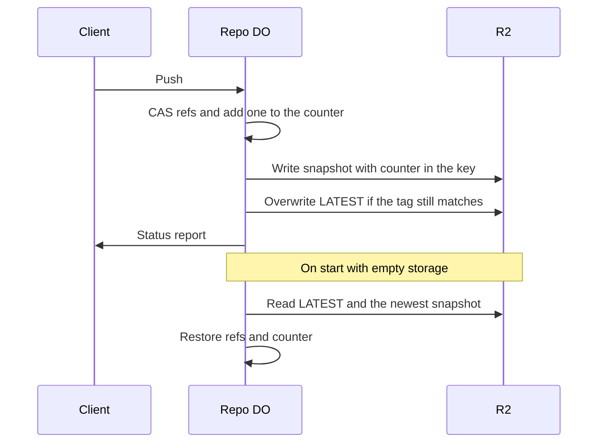

# Snapshots via R2 object versioning of ref state

> Verdict: **lands with caveats** · feasibility 4/5 · reliability 2/5 · correctness 3/5 · effort: days
> Read the words in [how-to-read.md](../findings/how-to-read.md). Engineers: [proof](../proofs/r2-versioned-snapshots.md) · [review](../reviews/r2-versioned-snapshots.md)

## What this idea is

Git is a tool that keeps every version of a set of files, and lets many people share those versions. A repository, or repo, is one project's full set of files and their history. A commit is one saved version of the files, with a note about what changed. A ref is a name that points at one commit. A branch is a ref. A tag is a ref.

A push is sending your new commits to the server. A Durable Object, or DO, is a single small program with its own storage that handles one thing at a time. There is one DO for each repo. Think of it like the one librarian who is allowed to update the catalog. R2 is Cloudflare's large file store. It holds the git objects.

The refs of a repo live only inside the repo DO. If that storage is wiped, the repo loses every branch name, even though the commits are safe in R2. This idea writes a full copy of the refs to R2 after every push. When a DO starts with empty storage but finds a copy in R2, the DO restores the refs from that copy before serving anyone.

Think of it like this. A shopkeeper photocopies the whole ledger page after every sale and puts the copy in a fireproof cabinet. If the ledger burns, the newest copy brings the shop back to the last sale.

## How it works

1. A push arrives at the repo DO after the Worker has stored the objects in R2. Cloudflare Workers are small programs that run on Cloudflare's network close to the user, with no server to manage.
2. In one database transaction, the DO updates each ref with a compare-and-swap and adds one to a counter. Compare-and-swap, or CAS, means change a value only if it still has the value you expect. If someone changed it first, do nothing and report it. The counter lives in DO SQLite. DO SQLite is the small database inside each Durable Object.
3. The DO writes a copy of every ref, as one JSON file, to R2 at a key that contains the counter value. That file is called a snapshot. A snapshot is never changed after it is written.
4. The DO then overwrites a pointer file named LATEST with the key of the newest snapshot. The write happens only if the pointer still has the tag the DO saw a moment before.
5. The DO returns the status report to the client.
6. When a DO starts, the DO checks whether the counter is zero while LATEST exists in R2. If so, the storage was wiped or recreated, and the DO loads the refs and the counter from the newest snapshot before serving any request.
7. An alarm deletes old snapshots beyond a set number. An alarm is a timer inside a Durable Object. A DO has only one alarm at a time.
8. R2 does not keep old versions of a file on its own. The proof fakes that feature with one new key per counter value plus the pointer file.

## What the reviewer decided

The reviewer's verdict is Lands with caveats.

| Score | Value |
|---|---|
| Feasibility | 4 of 5 |
| Reliability | 2 of 5 |
| Correctness | 3 of 5 |

Lands with caveats. The idea is sound and can be built. The proof has one or more problems that must be fixed first, and the reviewer described each fix. Think of it like a flight with a runway that needs some repairs before you land. The runway is there. The repairs are known.

For this idea, the reviewer says every Cloudflare feature the proof uses is GA. GA, or generally available, means a Cloudflare feature that is finished and supported, not a preview. The order of the steps is right. The DO commits the refs first and writes the snapshot second, so the client never gets ok for an unsaved move. The design is simple.

But the proof misreads how the DO handles two pushes at once. The input gate is the rule that a Durable Object handles one request at a time while it waits on its own storage. The gate opens when the DO waits on the network instead. The pointer can then end up on a stale snapshot after a push the client saw succeed. And the proof stores the snapshots under a key that changes in exactly the failure the idea is meant to survive.

The reviewer sees two blockers. A blocker is a problem that stops the idea from working until it is fixed. The fixes are small and take days. The idea also has caveats. A caveat is a limit or a condition. The idea works, but only inside this limit.

## Problems that must be fixed first

### Problem 1: The LATEST pointer can go backwards

**What goes wrong.** The writes to R2 are network waits, so the input gate opens and a second push can run while the first push writes its snapshot. Push A commits counter 1 and push B commits counter 2, and both read the same tag on LATEST. If A writes LATEST last, the write of B fails, and the code never checks the result. LATEST now points at snapshot 1, while the client of B already received ok.

**Why it matters.** A later restore loads snapshot 1 and drops a ref move that a client saw succeed. The proof says that loss cannot happen, and nothing detects the loss.

**How to fix it.** Make each snapshot write wait for the one before it inside the DO. Or drop the LATEST pointer and restore from the snapshot with the highest counter in the key. Check the result of every conditional write.

### Problem 2: The snapshot key changes when the DO is recreated

**What goes wrong.** The proof builds the R2 key prefix from the DO's internal id. When the DO namespace is deleted and created again, or the DO class is migrated, the same repo name gets a new internal id. The new DO looks for LATEST under the new prefix, finds nothing, and treats the repo as new.

**Why it matters.** The wiped namespace and the migrated class are the two cases the idea claims to cover. In both cases the restore silently does nothing.

**How to fix it.** Build the key prefix from the DO's name, which is the owner and repo, not from the internal id.

## Things to know

- The snapshot does not contain the default branch or any other symbolic ref. After a restore, a normal git clone cannot find the default branch and leaves the working folder empty.
- On a CAS failure the transaction throws at the first bad ref and returns one status line for a push with many refs. Git then prints "remote failed to report status" for the refs with no line.
- R2 has no built-in versioning of files. The proof fakes that feature with one key per counter value plus the LATEST pointer.
- The restore assumes the objects named in a snapshot still exist, so the janitor must keep objects longer than snapshots, and no code enforces that. A janitor, also called a sweep or GC, is a background task that deletes files nobody points to anymore.
- Each push adds two or three round trips to R2, about 20 to 50 milliseconds, inside the part that runs one push at a time. That lowers how many pushes per second one repo can take.
- The alarm that deletes old snapshots lists at most 1,000 keys at a time. That is fine when 50 snapshots are kept, but the list grows without limit if pushes outrun the alarm.

## How this idea connects to the others

The snapshots copy the refs held by the single ref owner from [#1 One Durable Object per repo as the ref authority](./repo-do-ref-authority.md).

The refs live in DO SQLite and the objects live in R2, as in [#2 Refs in DO SQLite, objects in R2](./refs-sqlite-objects-r2.md).

The objects that a snapshot names are stored under their fingerprint, as in [#5 Content-addressed R2 keys](./content-addressed-r2-keys.md).

The push that moves the refs and then writes the snapshot is the push from [#6 Two-phase push](./two-phase-push.md).
