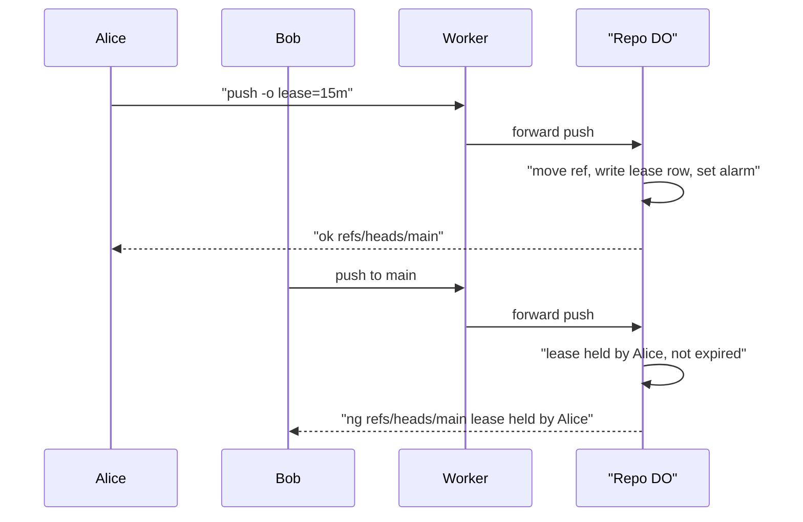

# Ref leases

> Verdict: **lands with caveats** · feasibility 5/5 · reliability 4/5 · correctness 4/5 · effort: days
> Read the words in [how-to-read.md](../findings/how-to-read.md). Engineers: [proof](../proofs/ref-leases.md) · [review](../reviews/ref-leases.md)

## What this idea is

Git is a tool that keeps every version of a set of files, and lets many people share those versions. A branch is a named line of commits, like a bookmark that moves forward as you save. A commit is one saved version of the files, with a note about what changed. A lease lets one person lock a branch for a set number of minutes. While the lease lasts, the server rejects a push to that branch from anyone else. A push is sending your new commits to the server.

Think of it like this. A restaurant puts a reserved card on a table for fifteen minutes. Other guests cannot sit there until the time runs out or the guest who reserved the table leaves.

## How it works

1. A client asks for a lease in one of two ways. The client sends a web request, or the client adds the option `-o lease=15m` to a normal push.
2. A Worker at the edge checks who the client is. Cloudflare Workers are small programs that run on Cloudflare's network close to the user, with no server to manage.
3. The Worker forwards the request to the Durable Object for the repository. A repository is one project's full set of files and their history. A Durable Object is a single small program with its own storage that handles one thing at a time. There is one DO for each repo. Think of it like the one librarian who is allowed to update the catalog.
4. The DO writes one row with the ref name, the holder, and the expiry time into a leases table in DO SQLite. A ref is a name that points at one commit. A branch is a ref. A tag is a ref. DO SQLite is the small database inside each Durable Object.
5. The DO sets an alarm for the earliest expiry time. An alarm is a timer inside a Durable Object. A DO has only one alarm at a time. The alarm only deletes expired rows.
6. When a push arrives, the DO checks each branch update against the leases table. The check runs in the same transaction as the compare-and-swap on the ref. Compare-and-swap means: change a value only if it still has the value you expect. If someone changed it first, do nothing and report it.
7. If another person holds a lease that has not expired, the DO answers with an ng line for that ref. The client sees the branch rejected with the holder's name and the expiry time.
8. If the holder pushes with the lease option again, the DO refreshes the lease in the same transaction.
9. Every check compares the expiry time to the current time. Correctness never depends on the alarm.

## What the reviewer decided

The verdict is: lands with caveats.

| Score | Value |
|---|---|
| Feasibility | 5 of 5 |
| Reliability | 4 of 5 |
| Correctness | 4 of 5 |

Lands with caveats. The idea is sound and can be built. The proof has one or more problems that must be fixed first, and the reviewer described each fix. Think of it like a flight with a runway that needs some repairs before you land. The runway is there. The repairs are known.

For this idea, the verdict means the following. The reviewer found no blocker. A blocker is a problem that stops the idea from working until it is fixed. The lease check sits in the one place where refs change, inside a single transaction that cannot pause. Every Cloudflare building block is GA. GA means a Cloudflare feature that is finished and supported, not a preview. A crash cannot leave the ref and the lease in disagreement. Two people who push at the same time are handled one after the other. The reviewer listed six caveats. A caveat is a limit or a condition. The idea works, but only inside this limit. The caveats are details of fitting the idea into the rest of the system, not design flaws. The reviewer estimates the work at days on top of two-phase push.

## Things to know

- The server must announce the push-options feature when a client first connects for a push. If the server does not, the command `git push -o lease=15m` stops on the client side with an error and never sends anything. The proof never shows that announcement. The push options arrive after a second end marker, and the proof's parser must expect that marker.
- A DO has only one alarm. The lease cleanup alarm overwrites the alarm of the cleanup and repack idea and of the CI idea. Those alarms also overwrite the lease alarm. The proof admits the problem but does not solve it. The proof also starts the alarm call from inside the synchronous transaction, which is sloppy but harmless.
- The holder of a lease is the signed-in account, not one job or one session. Two jobs that share one token cannot fence each other. There is no way to break a lease. If the holder's job crashes, the branch stays locked for the full lease time, up to 60 minutes.
- The server must not announce the newer status report format or the all-at-once push feature. The proof only writes the older status format. With the all-at-once feature, one rejected ref must roll back every ref in the push, and the proof commits each ref on its own. When a client asks for sideband, the Worker must wrap the status lines in sideband frames. A sideband is a way to send two kinds of data in one stream, like a main channel and a progress channel.
- A push rejected by a lease has already uploaded its objects to R2 in the first push phase. R2 is Cloudflare's large file store. It holds the git objects. An object is one stored item in git. An object is a file's content, a folder listing, or a commit. Those objects become files nobody points to. The cleanup in the two-phase push idea must cover this rejection path.
- The prose says every push from the holder refreshes the lease. The code only refreshes the lease when the push carries the lease option. A fetch cannot see leases. A fetch is getting commits from the server. A lease is visible only through the web endpoint or through a rejected push.

## How this idea connects to the others

- This idea needs one Durable Object per repository to own the refs, from [#1 One Durable Object per repo as the ref authority](./repo-do-ref-authority.md).
- This idea adds its check to the second phase of the push in [#6 Two-phase push](./two-phase-push.md).
- This idea takes the holder's identity from [#54 Auth and multi-tenancy: owner/repo routing to DO ids](./auth-and-multitenancy.md).
- This idea must announce push options in the first connection handled by [#53 The /info/refs?service= entrypoint and pkt-line codec](./info-refs-endpoint.md).
