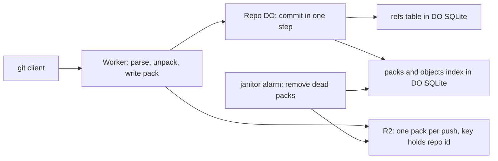

# Refs in DO SQLite, objects in R2

> Verdict: **lands with caveats** · feasibility 4/5 · reliability 2/5 · correctness 3/5 · effort: weeks
> Read the words in [how-to-read.md](../findings/how-to-read.md). Engineers: [proof](../proofs/refs-sqlite-objects-r2.md) · [review](../reviews/refs-sqlite-objects-r2.md)

## What this idea is

git is a tool that keeps every version of a set of files, and lets many people share those versions. A repository, or repo, is one project's full set of files and their history. A commit is one saved version of the files, with a note about what changed. A branch is a named line of commits, like a bookmark that moves forward as you save.

A ref is a name that points at one commit. A branch is a ref. A tag is a ref.

An object is one stored item in git. An object is a file's content, a folder listing, or a commit. A repo holds two very different kinds of data. Refs are tiny, and they change often. Objects are large, and they never change once written. This idea stores the refs in a small database and the objects in a large file store, and never mixes the two.

The small database is DO SQLite. DO SQLite is the small database inside each Durable Object. A Durable Object, or DO, is a single small program with its own storage that handles one thing at a time. There is one DO for each repo. Think of it like the one librarian who is allowed to update the catalog.

The large file store is R2. R2 is Cloudflare's large file store. It holds the git objects.

Think of it like this. A museum keeps a small index of cards at the front desk. Each card says which room and which shelf holds one painting. The paintings stay in the storerooms and never move. When a painting gets a new place, only the card changes.

## How it works

A push is sending your new commits to the server. A fetch is getting commits from the server. A clone gets everything for the first time. Cloudflare Workers are small programs that run on Cloudflare's network close to the user, with no server to manage. The second pass writes the code in Rust and follows one shared contract that all ideas use.

1. A Worker receives every git request for a repo. The Worker reads the address and the git protocol version, so the DO never sees a client address.
2. The DO keeps a refs table, a packs table, and an objects index in DO SQLite. A packfile, or pack, is one bundle that holds many objects, squeezed to save space. The objects index says which pack holds each object, and at which offset.
3. When git asks for the list of refs, the DO reads the refs table in one step, with no wait on the network. The Worker turns the rows into git's messages. R2 is never touched.
4. On a push, the Worker unpacks the packfile and rebuilds each object in full. A thin pack is a packfile that contains deltas against objects the server already has. The Worker reads those base objects from R2 with the index and a range read.
5. The Worker writes one new pack to R2 under a key that holds the repo id. Only after R2 confirms the write does the Worker insert the index rows. The pack row is marked "ingesting", so no reader can see the new objects yet.
6. The Worker then asks the DO to commit the push. The DO does all commit work in one step with no wait on the network. First the DO checks that the janitor did not run during the push. Then the DO marks the pack "live".
7. For each ref, the DO checks that the target object is in a live pack. Then the DO moves the ref with a compare-and-swap. Compare-and-swap, or CAS, means change a value only if it still has the value you expect. If someone changed it first, do nothing and report it.
8. A fetch looks up each needed object in the index, then reads the bytes from R2. Nearby objects in one pack are read in one range read, so a fetch costs few subrequests. A subrequest is one call from a Worker to another service, such as one read from R2.
9. A janitor is a background task that deletes files nobody points to anymore. The janitor runs from an alarm every 15 minutes and removes packs from crashed or expired pushes. An alarm is a timer inside a Durable Object. A DO has only one alarm at a time.

## What the reviewer decided

The reviewer looks for blockers and caveats. A blocker is a problem that stops the idea from working until it is fixed. A caveat is a limit or a condition. The idea works, but only inside this limit.

The verdict is Lands with caveats.

| Score | Value |
|---|---|
| Feasibility | 4 of 5 |
| Reliability | 4 of 5 |
| Correctness | 4 of 5 |

| Score | First pass | Second pass |
|---|---|---|
| Feasibility | 4 of 5 | 4 of 5 |
| Reliability | 2 of 5 | 4 of 5 |
| Correctness | 3 of 5 | 4 of 5 |

Lands with caveats. The idea is sound and can be built. The proof has one or more problems that must be fixed first, and the reviewer described each fix. Think of it like a flight with a runway that needs some repairs before you land. The runway is there. The repairs are known.

For this idea, the second pass closes all five first-pass blockers with code, not with words. The reviewer checked every library call against the real source of the pinned crates, and every call exists. The reviewer walked through a crash in the middle of a commit and through two pushes that collide on one branch. In both cases no ref can point at a missing object, and exactly one push wins. No message byte would break a current git client.

The remaining work is two changes to the shared contract and some cleanup. The reviewer expects weeks of work, because the push, message, and janitor code around this slice must also exist.

## What changed in the second pass

- The Worker dropped the query string on the way to the DO. Fixed. The DO no longer sees any client address. The Worker parses the service name and protocol version, and the DO returns plain rows.
- Thin packs could not be unpacked. Fixed for this idea. The index lookup and the range read give the Worker the base objects from R2. The delta code itself lives in [#4 Packfile parsing in a Worker with a streaming inflater](./streaming-pack-parser.md).
- All repos shared one folder in R2. Fixed. The only key builder takes the repo id from the DO's own metadata. There is no default folder and no header the Worker could forget.
- The cleanup alarm could delete an object a push was about to use. Fixed. Each push records a janitor epoch at its start, and the commit rejects the push if the epoch changed. The commit also re-checks that each new target is in a live pack, in the same step as the ref write.
- The index said an object existed before R2 had it. Fixed. Index rows land only after R2 confirms the pack, under the pack state "ingesting". Readers only see live packs, and the commit is the one place that marks a pack live.
- The first-pass caveat about a reconciliation list for lost R2 writes is still open. The proof trusts R2's confirmation of a finished upload as proof of durability, and does not model a lost object after that. The reviewer accepts that choice.
- The first-pass caveat about HEAD in the advertisement is fixed for protocol v2. Protocol v2 is the newer, cleaner set of messages git uses to talk to a server. The proof also claims a HEAD line for the old protocol, which the contract does not list. That claim is harmless because the server rejects old-protocol fetches.

## Problems that must be fixed first

### Problem 1: Tags cannot be peeled

**What goes wrong.** A tag can point at a tag object, which points at a commit. git asks the server for the final commit behind each tag. The refs table has no column for that commit, and the refs route may not wait on the network. So the server never answers with a peeled line, and test scenario 3 cannot pass.

**Why it matters.** The proof fails one of its own named tests. git still works, because git fetches the tag object and peels the tag itself. But the test plan and the code disagree.

**How to fix it.** Add a peeled column to the refs table in the contract. Fill the column at commit time from the tag object the Worker already unpacked.

### Problem 2: The contract must be updated to match the code

**What goes wrong.** The contract gives one shape for the R2 read functions, and a later section gives another shape. The code follows the later section. The contract also says that adding a job arms the alarm, but arming the alarm needs a wait on the network. The commit step allows no wait, so the shown code never arms the alarm.

**Why it matters.** Without the alarm, the cleanup job after a push waits for the janitor's next run, up to 15 minutes later. And two parts of the contract cannot both be true, so other ideas may build against the wrong one.

**How to fix it.** Write the read function shapes from the later section back into the contract. Arm the alarm in the outer request handler, after the commit step returns.

## Things to know

- If the commit step fails in the middle, the request handler must throw the error, so the database step rolls back. If the handler returns a 500 answer instead, some refs move and the push stays half done.
- The janitor never aborts the unfinished R2 uploads of crashed or expired pushes. R2's default 7-day cleanup is the only backstop. Store the upload id on the push row so the janitor can abort the upload.
- When the commit rejects a push because the janitor ran, the DO writes the state but not the per-ref results.
- The ref name check accepts names such as HEAD or foo. git requires a refs/ prefix. A non-git client could create a ref named HEAD, and the ref list would then show two HEAD lines.
- HEAD stays at refs/heads/main even when the first pushed branch is master. git clone then warns that the remote HEAD points at a missing ref. Adopt the first created branch when HEAD dangles.
- Real R2 range reads, 8 MiB multipart uploads, the subrequest limit, and rollback after a panic are verified only on the local simulator. The synchronous transaction call is absent from the worker crate, but the commit step holds without it.
- The conflict error has no HTTP status in the contract. That gap is in the contract, not in the proof.

## How this idea connects to the others

- The compare-and-swap on refs comes from [#1 One Durable Object per repo as the ref authority](./repo-do-ref-authority.md).
- The split between the Worker's write and the DO's commit comes from [#6 Two-phase push](./two-phase-push.md).
- The pack parser used on push comes from [#4 Packfile parsing in a Worker with a streaming inflater](./streaming-pack-parser.md).
- The fetch negotiation that calls the index and range read comes from [#3 Speak git protocol v2 only, translate v0 at the edge](./protocol-v2-only.md).
- The message framing comes from [#53 The /info/refs?service= entrypoint and pkt-line codec](./info-refs-endpoint.md).
- The janitor alarm comes from [#55 GC and repack as a DO alarm](./gc-and-repack-alarm.md).
- The repo id in every R2 key comes from [#54 Auth and multi-tenancy: owner/repo routing to DO ids](./auth-and-multitenancy.md).
