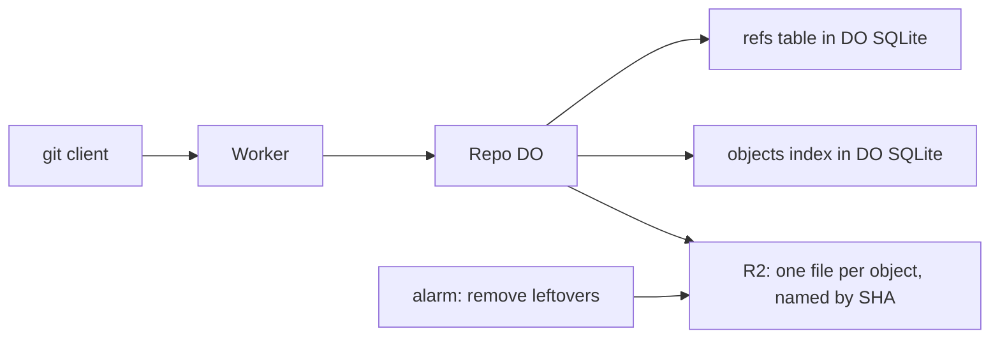

# Refs in DO SQLite, objects in R2

> Verdict: **lands with caveats** · feasibility 4/5 · reliability 2/5 · correctness 3/5 · effort: weeks
> Read the words in [how-to-read.md](../findings/how-to-read.md). Engineers: [proof](../proofs/refs-sqlite-objects-r2.md) · [review](../reviews/refs-sqlite-objects-r2.md)

## What this idea is

git is a tool that keeps every version of a set of files, and lets many people share those versions. A repository, or repo, is one project's full set of files and their history. A commit is one saved version of the files, with a note about what changed. A branch is a named line of commits, like a bookmark that moves forward as you save.

A ref is a name that points at one commit. A branch is a ref. A tag is a ref.

An object is one stored item in git. An object is a file's content, a folder listing, or a commit. A repo holds two very different kinds of data. Refs are tiny, and they change often. Objects are large, and they never change once written. This idea stores the refs in a small database and the objects in a large file store, and never mixes the two.

The small database is DO SQLite. DO SQLite is the small database inside each Durable Object. A Durable Object, or DO, is a single small program with its own storage that handles one thing at a time. There is one DO for each repo. Think of it like the one librarian who is allowed to update the catalog.

The large file store is R2. R2 is Cloudflare's large file store. It holds the git objects.

Think of it like this. A museum keeps a small index of cards at the front desk. Each card says which room holds one painting. The paintings stay in the storerooms and never move. When a painting gets a new place, only the card changes.

## How it works

A push is sending your new commits to the server. A fetch is getting commits from the server. A clone gets everything for the first time. Cloudflare Workers are small programs that run on Cloudflare's network close to the user, with no server to manage.

1. A Worker receives every git request for a repo and sends the request to the one DO for that repo.
2. The DO keeps a refs table and a small objects index in DO SQLite. The index holds each object's SHA, type, and size. A SHA is a fingerprint of an object's content. Two objects with the same content have the same fingerprint.
3. When git asks for the list of refs, the DO answers with one database read, sent as pkt-lines. A pkt-line is git's way of framing a message. Each line starts with four characters that give its length. R2 is never touched.
4. A push streams its packfile through the DO. A packfile is one bundle that holds many objects, squeezed to save space.
5. The DO unpacks each object and writes the object to R2 under its SHA.
6. After all writes to R2 finish, the DO moves each ref with a compare-and-swap in one transaction. Compare-and-swap, or CAS, means change a value only if it still has the value you expect. If someone changed it first, do nothing and report it.
7. A fetch reads the needed SHAs from DO SQLite, then reads each object from R2 to build the answer.
8. An alarm removes objects left behind by a crashed push. An alarm is a timer inside a Durable Object. A DO has only one alarm at a time.

## What the reviewer decided

The reviewer looks for blockers and caveats. A blocker is a problem that stops the idea from working until it is fixed. A caveat is a limit or a condition. The idea works, but only inside this limit.

The verdict is Lands with caveats.

| Score | Value |
|---|---|
| Feasibility | 4 of 5 |
| Reliability | 2 of 5 |
| Correctness | 3 of 5 |

Lands with caveats. The idea is sound and can be built. The proof has one or more problems that must be fixed first, and the reviewer described each fix. Think of it like a flight with a runway that needs some repairs before you land. The runway is there. The repairs are known.

For this idea, the split between refs and objects is sound. Every building block is GA. GA, or generally available, means a Cloudflare feature that is finished and supported, not a preview. One DO with a compare-and-swap makes two pushes at the same time behave exactly as git expects. Object names never change, so a repeated write is safe to repeat.

The proof as written would fail the first git clone, and two paths can delete objects that are still in use. Each fix is bounded, and the reviewer expects weeks of work.

## Problems that must be fixed first

### Problem 1: The Worker drops the query string

**What goes wrong.** The Worker builds the address for the DO from the path only. The part after the question mark, which names the service, is lost. The DO then advertises "service=null".

**Why it matters.** git reads that advertisement first, on every request. A normal git clone, fetch, or push would fail at the first request.

**How to fix it.** Pass the full address, including the query string, from the Worker to the DO.

### Problem 2: Thin packs cannot be unpacked

**What goes wrong.** A push from git sends thin packs by default. A thin pack is a packfile that contains deltas against objects the server already has. A delta is a stored object written as "the same as that other object, with these changes". The base objects live only in R2. The pack parser in the proof has no way to read R2, so the parser cannot rebuild the objects.

**Why it matters.** A normal git push of a changed file would fail. Only pushes with all new content would work.

**How to fix it.** Let the parser read base objects from R2 while the push is unpacked.

### Problem 3: All repos share one folder in R2

**What goes wrong.** The DO reads the repo name from a header. The Worker never sends that header. Every repo falls back to the same folder, objects/default/. The cleanup alarm of one repo can then delete an object that another repo still uses.

**Why it matters.** That outcome is data loss across customers. One user's cleanup can break another user's repo.

**How to fix it.** Send the owner and repo name from the Worker on every request. Use the name as the folder prefix in R2.

### Problem 4: The cleanup alarm collides with a push in progress

**What goes wrong.** The DO handles one thing at a time, but tasks interleave at every wait on the network. The cleanup alarm does not block other requests while it runs. A push can be waiting on R2 with an object marked as pending. The alarm sees that object as stale and deletes it. The push then finishes, and the new ref points at a deleted object.

**Why it matters.** That outcome is data loss, and a normal retry can trigger it. The next fetch of that branch fails.

**How to fix it.** Run the cleanup under blockConcurrencyWhile so no push runs at the same time. Or give each push a generation number and let the cleanup skip objects from a live generation.

### Problem 5: The index says an object exists before R2 has it

**What goes wrong.** The DO inserts a row into the objects index before the R2 write finishes. If the DO crashes, the index can list objects that R2 never received. The ref check trusts the index. A ref can be accepted that points at a missing object.

**Why it matters.** The index is the only integrity check on the write path. A fetch of that ref stops in the middle of the pack.

**How to fix it.** Insert the index row only after the R2 write has finished.

## Things to know

- The push code keeps every unpacked object in memory until all R2 writes finish. Limit how many writes run at once and drop each body after its write, or a large push passes the 128 MB memory limit.
- The pack checksum over a streamed answer needs a hasher that takes data piece by piece. The built-in digest takes all data at once, so a different hasher is needed.
- The advertisement has no HEAD line and no symref for HEAD. A normal git clone would download the data but fail at checkout.
- The pkt-line helper measures length in UTF-16 units, not bytes. A ref name with non-ASCII letters produces a broken pkt-line.
- A delete-only push carries no packfile. The parser must accept an empty body.
- The fetch code ignores the have and done lines from the client. Every fetch is as large as a clone until want-have negotiation exists.
- The cleanup alarm is set only after a successful push. Leftovers from a crash on a quiet repo are never removed.
- A fetch reads one file from R2 for each object. Clone speed therefore depends on idea #7.

## How this idea connects to the others

- The compare-and-swap on refs comes from [#1 One Durable Object per repo as the ref authority](./repo-do-ref-authority.md).
- The object names in R2 come from [#5 Content-addressed R2 keys](./content-addressed-r2-keys.md).
- The pack parser used on push comes from [#4 Packfile parsing in a Worker with a streaming inflater](./streaming-pack-parser.md).
- The pkt-line code comes from [#53 The /info/refs?service= entrypoint and pkt-line codec](./info-refs-endpoint.md).
