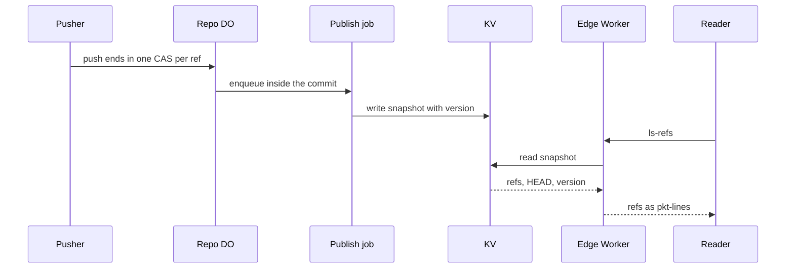

# Refs replicated to every region via KV and DO location hints

> Verdict: **lands with caveats** · feasibility 4/5 · reliability 3/5 · correctness 3/5 · effort: days
> Read the words in [how-to-read.md](../findings/how-to-read.md). Engineers: [proof](../proofs/replicated-refs-edge.md) · [review](../reviews/replicated-refs-edge.md)

## What this idea is

git is a tool that keeps every version of a set of files, and lets many people share those versions. A repository, or repo, is one project's full set of files and their history. Every download from a repo begins by asking the server for its list of named lines of work. This idea answers that question from a copy of the list stored close to the user. Only one program, in one place, is allowed to change the list.

Think of it like this. A railway has one head office that writes the master timetable. Every station posts a printed copy on its wall. Travellers read the wall, not the head office. A copy can be a little out of date.

## How it works

The second pass writes the design in Rust, against one shared contract that every idea in this set follows. The contract already owns the ref table and the push commit inside the DO. This idea adds a publish job inside the DO and a read path at the edge that serves the copy.

Some words first. A commit is one saved version of the files, with a note about what changed. A branch is a named line of commits, like a bookmark that moves forward as you save. A ref is a name that points at one commit. A branch is a ref. A tag is a ref. HEAD is a ref that names the default branch. A clone reads HEAD to know which branch to check out.

A push is sending your new commits to the server. A fetch is getting commits from the server. A clone gets everything for the first time. An object is one stored item in git. An object is a file's content, a folder listing, or a commit.

R2 is Cloudflare's large file store. It holds the git objects. A Cloudflare Worker is one of the small programs that run on Cloudflare's network close to the user, with no server to manage. Wasm, or WebAssembly, is a way to run code from other languages, such as Rust, inside a Worker. A Durable Object, or DO, is a single small program with its own storage that handles one thing at a time. There is one DO for each repo. Think of it like the one librarian who is allowed to update the catalog.

DO SQLite is the small database inside each Durable Object. An alarm is a timer inside a Durable Object. A DO has only one alarm at a time. A job is one slice of background work that the alarm runs inside the DO. The input gate is the rule that a Durable Object handles one request at a time while it waits on its own storage. The gate opens when the DO waits on the network instead. KV is Cloudflare's small, fast, world-wide store for simple values.

Compare-and-swap, or CAS, means change a value only if it still has the value you expect. If someone changed it first, do nothing and report it. Protocol v2 is the newer, cleaner set of messages git uses to talk to a server. A pkt-line is git's way of framing a message. Each line starts with four characters that give its length. A janitor is a background task that deletes files nobody points to anymore.

1. The repo DO is created once. An optional setting gives a location hint near the team that pushes. The hint counts only at creation and is best effort.
2. A push ends inside the DO's commit code. The commit does one CAS on each ref and raises a version number. When any ref moved, the same step enqueues a publish job.
3. The alarm runs the job one second later, because KV allows about one write per second for each key. The job reads the whole ref list, HEAD, and the version in one unbroken step, and packs them into one snapshot value.
4. The job writes the snapshot as one KV value. If a newer push landed while the job waited on KV, the job checks the version again and schedules one more write. A burst of pushes folds into a single extra write.
5. Each time the DO starts, a boot check compares the two version numbers. When the copy is behind, the check enqueues the job again. A quiet repo heals on its next request of any kind.
6. A client sends the protocol v2 ls-refs command. The Worker in the client's location reads the snapshot from KV and turns the list into pkt-lines with the same code the DO path uses.
7. A miss, a stale copy, a corrupt copy, or a KV error falls through to the DO, which stays the authority. The advertisement request that comes before a fetch also tries the copy first.
8. The push answer carries the new version in a header. A client that echoes that header gets the DO answer when KV is behind.
9. The fetch command, the push command, and the push advertisement still go to the DO. A stale push advertisement would reject legal pushes, so it is never served from KV.

## What the reviewer decided

The verdict is "Lands with caveats".

| Score | Value |
|---|---|
| Feasibility | 4 out of 5 |
| Reliability | 3 out of 5 |
| Correctness | 3 out of 5 |

| Score | First pass | Second pass |
|---|---|---|
| Feasibility | 4 out of 5 | 4 out of 5 |
| Reliability | 3 out of 5 | 4 out of 5 |
| Correctness | 3 out of 5 | 4 out of 5 |

The idea is sound and can be built. The proof has one or more problems that must be fixed first, and the reviewer described each fix. Think of it like a flight with a runway that needs some repairs before you land. The runway is there. The repairs are known.

A caveat is a limit or a condition. The idea works, but only inside this limit. GA, or generally available, means a Cloudflare feature that is finished and supported, not a preview. For this idea, one writer DO plus a versioned KV copy rendered at the edge is sound. Every feature used is GA.

The second pass improved the scores. Reliability and correctness each moved from 3 to 4, and feasibility stayed at 4. Two of the three first-pass blockers are closed by the shape of the design, not by a check at run time. A version cursor replaces the flag that forgot pushes. The publish enqueue rides inside the push commit, and the snapshot now carries HEAD. Both weakenings of the title are stated, not hidden.

What remains is small and concrete. One write call stores bytes no reader can parse. One crashed job can freeze the copy for ever. One alarm step must be written into the shared contract. The effort is now weeks, because this idea lands only on the sibling proofs that own the commit, the ls-refs command, and the advertisement.

## What changed in the second pass

- A push could go unpublished for ever: partly fixed. The flag that forgot pushes is gone. A version cursor, an enqueue inside the commit step, and a second check after the KV write close both named races. But a crash inside the single KV wait can leave the job marked running, and that state blocks every later heal. The window is narrower. The outcome can still be a frozen copy.
- A rejected push crashed instead of saying no: fixed by the contract modules. The shared commit code does one CAS per ref and returns one "ng" line per rejected ref. Nothing throws out of the step. This idea never touches ref writes.
- The ref list had no HEAD: fixed. The snapshot carries HEAD and the peeled target of each ref. The shared writer emits the default-branch line and the empty-repo answer, tested against real git.
- The pkt-line length counted characters, not bytes: fixed. The shared pkt-line code counts bytes over the raw name. A ref name with non-ASCII characters is framed correctly.
- The ls-refs answer ignored the ref-prefix and unborn arguments: fixed by the contract modules. The shared writer covers both. An empty repo never reaches KV, so the DO answers.
- The advertisement still went to the DO: fixed. The protocol v2 advertisement is a fixed answer at the edge, and the older kind now tries the copy first. The push advertisement stays on the DO on purpose.
- Read-your-writes needs the client to send a version header: still open. Normal git cannot send the header without per-remote configuration. The push answer now sets the header, and configured clients echo it.
- The copy is a pull-through cache, not a true copy in every region: still open. A cold location or an expired 60 second cache still pays a central read. The proof now states this limit plainly.
- The janitor grace rule lived in another idea: fixed. The shared contract now sets a one hour grace before a dead pack can be deleted. The grace is about thirty times the worst staleness of the copy.
- The location hint applies at creation only: still open. The hint is now real code behind one environment setting. The hint still cannot move a DO that already exists.

## Problems that must be fixed first

A blocker is a problem that stops the idea from working until it is fixed.

### Problem 1: The KV write stores bytes no reader can parse

**What goes wrong.** The publish job hands the snapshot to KV as a list of bytes. The library turns that list into a JSON array of numbers, not the snapshot text. The read path asks KV for the snapshot shape, which can never match.

**Why it matters.** Every read misses and falls through to the DO. The version cursor still moves, and no error is reported. The feature does nothing, and the failure is silent.

**How to fix it.** Write the snapshot as text, or use the call that stores raw bytes, and read the value back the same way. The fix is one line.

### Problem 2: A killed publish job can freeze the copy for ever

**What goes wrong.** The job is marked running before the job waits on KV. A crash during that wait leaves the row running for ever. The rule that stops duplicate jobs then blocks every later enqueue, including the boot check that exists to heal this case.

**Why it matters.** KV serves the last good snapshot to normal clients without end. The crash window is narrower than in the first pass. The outcome is the same unbounded staleness.

**How to fix it.** Add a rule that marks a running job stale after a time limit and lets the job enqueue again. The boot check or the janitor can hold the rule. The shared contract has no such rule yet.

### Problem 3: The heal-on-read path needs an alarm step no route performs

**What goes wrong.** The boot check enqueues the publish job when the copy is behind. The enqueue alone does not set the alarm. The contract says the caller arms the alarm after the caller's own step. No shown route does that.

**Why it matters.** Without the arm step, the queued job never runs. A quiet repo is not healed by the repo's next read, and the copy stays stale.

**How to fix it.** Write the arm step into the shared contract. Every DO route must run the arm step after the boot check.

## Things to know

- Read-your-writes needs the client to send the version header, which normal git does not do without per-remote configuration. Everyone else sees a copy up to about two minutes old and can see their own push roll back.
- KV is a pull-through cache, not a true copy. A cold location or an expired 60 second cache still makes a central round trip. The gain is repeat fetches inside the 60 seconds per location.
- Three names do not line up across the sibling proofs yet. The upload function needs two more arguments. The snapshot record type must move into the shared wire code. A version helper is used by two proofs and defined by none. Each fix is mechanical.
- The version on the push answer needs one extra read inside the commit step. The contract write-back does not say where that read happens.
- Past the 25 MB value cap, about a quarter million refs, the cursor moves without a write and the repo silently serves from the DO. An operator can see this only as a missing header on the answer.
- The KV key is built from the repo name. A rename strands the old value. The object keys use the repo id for exactly this reason.
- The KV read counts against the request budget even though the contract names only storage and stub calls. The proof chose the conservative side, so this is not a defect.
- Some parts are unverified at run time. These are KV calls from inside a DO alarm, the local test server's KV timing, and the location-hint call. The proof admits each one.
- One test scenario needs a published copy to exist before the push. Another scenario does not exercise the heal path for a lost alarm that the scenario was written for.
- The location hint only applies when the DO is first created, and is best effort. The title promises more than the DO can do.

## How this idea connects to the others

This idea needs [#1 One Durable Object per repo as the ref authority](./repo-do-ref-authority.md) as the single writer of refs and the owner of the commit that enqueues the publish job.
This idea needs [#2 Refs in DO SQLite, objects in R2](./refs-sqlite-objects-r2.md) for the refs table and the peeled column the snapshot carries.
This idea needs [#3 Speak git protocol v2 only, translate v0 at the edge](./protocol-v2-only.md) for the ls-refs command and the shared writers.
This idea needs [#53 The /info/refs?service= entrypoint and pkt-line codec](./info-refs-endpoint.md) for the fixed advertisement and the pkt-lines at the edge.
This idea needs [#55 GC and repack as a DO alarm](./gc-and-repack-alarm.md) for the job dispatcher that runs the publish slice.
