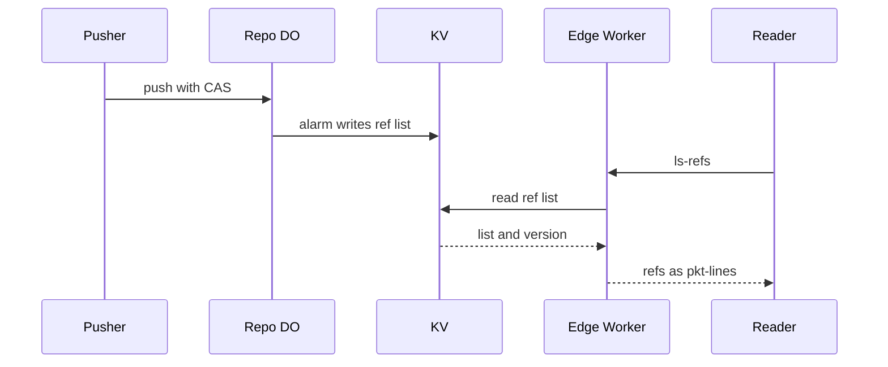

# Refs replicated to every region via KV and DO location hints

> Verdict: **lands with caveats** · feasibility 4/5 · reliability 3/5 · correctness 3/5 · effort: days
> Read the words in [how-to-read.md](../findings/how-to-read.md). Engineers: [proof](../proofs/replicated-refs-edge.md) · [review](../reviews/replicated-refs-edge.md)

## What this idea is

git is a tool that keeps every version of a set of files, and lets many people share those versions. A repository, or repo, is one project's full set of files and their history. Every download from a repo begins by asking the server for its list of named lines of work. This idea answers that question from a copy of the list stored close to the user. Only one program, in one place, is allowed to change the list.

Think of it like this. A railway has one head office that writes the master timetable. Every station posts a printed copy on its wall. Travellers read the wall, not the head office. A copy can be a little out of date.

## How it works

Some words first. A commit is one saved version of the files, with a note about what changed. A branch is a named line of commits, like a bookmark that moves forward as you save. A ref is a name that points at one commit. A branch is a ref. A tag is a ref.

A push is sending your new commits to the server. A fetch is getting commits from the server. A clone gets everything for the first time. An object is one stored item in git. An object is a file's content, a folder listing, or a commit.

R2 is Cloudflare's large file store. It holds the git objects. A Cloudflare Worker is one of the small programs that run on Cloudflare's network close to the user, with no server to manage. A Durable Object, or DO, is a single small program with its own storage that handles one thing at a time. There is one DO for each repo. Think of it like the one librarian who is allowed to update the catalog.

DO SQLite is the small database inside each Durable Object. An alarm is a timer inside a Durable Object. A DO has only one alarm at a time. The input gate is the rule that a Durable Object handles one request at a time while it waits on its own storage. The gate opens when the DO waits on the network instead. KV is Cloudflare's small, fast, world-wide store for simple values.

Compare-and-swap, or CAS, means change a value only if it still has the value you expect. If someone changed it first, do nothing and report it. Protocol v2 is the newer, cleaner set of messages git uses to talk to a server. A pkt-line is git's way of framing a message. Each line starts with four characters that give its length. A janitor is a background task that deletes files nobody points to anymore.

1. The repo DO is created once, with a location hint near the team that pushes.
2. A push ends with a CAS update of the refs table in DO SQLite. The DO raises a version number.
3. The DO sets an alarm one second later. The alarm writes the whole ref list, with the version, as one KV value.
4. A client sends the protocol v2 ls-refs command. The Worker in the client's location reads the ref list from KV.
5. The Worker turns the list into pkt-lines and answers without touching the DO.
6. The push answer carries the new version in a header. A client that echoes that header gets the DO answer when KV is behind.
7. The fetch command that asks for objects still goes to the DO and R2.

## What the reviewer decided

The verdict is "Lands with caveats".

| Score | Value |
|---|---|
| Feasibility | 4 out of 5 |
| Reliability | 3 out of 5 |
| Correctness | 3 out of 5 |

The idea is sound and can be built. The proof has one or more problems that must be fixed first, and the reviewer described each fix. Think of it like a flight with a runway that needs some repairs before you land. The runway is there. The repairs are known.

A caveat is a limit or a condition. The idea works, but only inside this limit. GA, or generally available, means a Cloudflare feature that is finished and supported, not a preview. For this idea, one writer DO plus a versioned KV copy rendered as pkt-lines is sound. Every feature used is GA.

But the proof code has three defects. It can leave KV stale for ever. It breaks the rejection path of a push. It leaves out HEAD, so a clone cannot check out. Fixing those is days of work.

What remains is a cache that catches up over time, not a true copy in every region. It still sends one request per fetch to the DO unless the Worker serves the first message itself.

## Problems that must be fixed first

A blocker is a problem that stops the idea from working until it is fixed.

### Problem 1: A push can go unpublished for ever

**What goes wrong.** The alarm writes to KV and then waits for KV to answer. During that wait the input gate is open, so a new push can land and mark the list dirty again. The alarm then clears the dirty mark without a check, and the second push is never published. Also, if the DO crashes between the CAS commit and setting the alarm, nothing sets the alarm again on restart.

**Why it matters.** The proof says KV is at most two minutes old. As written, KV can stay stale until the next push, which for a quiet repo can be days. Every reader in every region sees the wrong refs for that whole time.

**How to fix it.** Record the version before the KV write. Clear the dirty mark only when the version still matches. On DO start, read the dirty mark and set the alarm if it is set. Better, wait for the alarm to be set before the push answers.

### Problem 2: A rejected push crashes instead of saying no

**What goes wrong.** When the CAS check fails, the code throws an error inside the transaction. Nothing catches the error. The caller never receives the "ng" lines that git expects.

**Why it matters.** A normal git push that is not a fast-forward would fail with a 500 server error. git expects the line "ng main fetch first" instead, so the user gets no useful message.

**How to fix it.** Catch the CAS failure inside the update function. Return a result with ok false and one "ng" line per rejected ref.

### Problem 3: The ref list has no HEAD

**What goes wrong.** The KV copy has no HEAD entry and no symref target. The ls-refs command ignores the symrefs and unborn arguments. A clone asks for HEAD and expects a line that names the default branch.

**Why it matters.** A normal git clone command finishes the download but then prints "remote HEAD refers to nonexistent ref, unable to checkout". The user gets an empty working folder.

**How to fix it.** Add a symref field to each ref entry. Make the publisher write HEAD with its target into the KV copy. Answer the unborn argument for an empty repo.

## Things to know

- KV is a pull-through cache, not a true copy, so a cold location or an expired 60 second cache still makes a central round trip. The gain is for repeat fetches within 60 seconds per location.
- The info/refs request that comes before every ls-refs still goes to the DO in the proof code. The long hop is still paid once per fetch unless the Worker serves that fixed answer itself.
- Read-your-writes needs the client to send the version header, which normal git does not do. Normal git gets a copy up to 120 seconds old and can see its own push roll back.
- The pkt-line builder uses the string length, not the byte length. A ref name with non-ASCII characters produces a bad pkt-line length.
- The janitor must keep deleted objects for longer than the KV lag, or a stale reader fetches a tip that is gone. That rule belongs to another idea and is not enforced here.
- The location hint only applies when the DO is first created, and is best effort. The title promises more than the DO can do.

## How this idea connects to the others

This idea needs [#1 One Durable Object per repo as the ref authority](./repo-do-ref-authority.md) as the single writer of refs.
This idea needs [#2 Refs in DO SQLite, objects in R2](./refs-sqlite-objects-r2.md) for the refs table the alarm publishes.
This idea needs [#3 Speak git protocol v2 only, translate v0 at the edge](./protocol-v2-only.md) for the ls-refs command.
This idea needs [#53 The /info/refs?service= entrypoint and pkt-line codec](./info-refs-endpoint.md) to build the pkt-lines at the edge.
This idea needs [#6 Two-phase push](./two-phase-push.md) for the push that ends in the CAS update.
This idea needs [#54 Auth and multi-tenancy: owner/repo routing to DO ids](./auth-and-multitenancy.md) to map a repo name to its DO and KV key.
