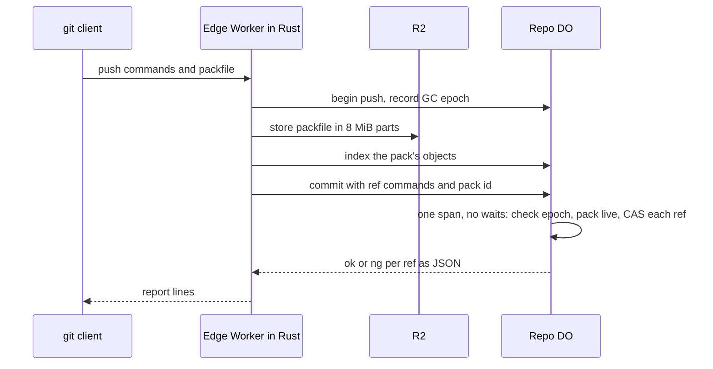

# One Durable Object per repo as the ref authority

> Verdict: **lands with caveats** · feasibility 4/5 · reliability 3/5 · correctness 3/5 · effort: weeks
> Read the words in [how-to-read.md](../findings/how-to-read.md). Engineers: [proof](../proofs/repo-do-ref-authority.md) · [review](../reviews/repo-do-ref-authority.md)

## What this idea is

git is a tool that keeps every version of a set of files, and lets many people share those versions. A repository, or repo, is one project's full set of files and their history. A commit is one saved version of the files, with a note about what changed. A branch is a named line of commits, like a bookmark that moves forward as you save.

A ref is a name that points at one commit. A branch is a ref. A tag is a ref. A push is sending your new commits to the server. Many people can push to one repo at the same moment. The server must decide, for each ref, which change wins.

This idea gives each repo one Durable Object. A Durable Object, or DO, is a single small program with its own storage that handles one thing at a time. There is one DO for each repo. Think of it like the one librarian who is allowed to update the catalog.

The DO is the only program that moves a ref. Because there is only one writer, no two updates can collide, and no shared lock is needed.

Think of it like this. A library keeps one card for each book. Two readers ask the librarian to change the same card at the same moment. The librarian serves one reader, then the other. The second reader sees that the card changed and must read the card again before asking.

## How it works

Cloudflare Workers are small programs that run on Cloudflare's network close to the user, with no server to manage. The Worker and the DO are written in Rust and run as Wasm. Wasm, or WebAssembly, is a way to run code from other languages, such as Rust, inside a Worker. A shared contract document fixes the module names, routes, and tables that every idea in this set uses. This idea is the repo_do module of that contract.

R2 is Cloudflare's large file store. It holds the git objects. An object is one stored item in git. An object is a file's content, a folder listing, or a commit. A janitor, also called GC, is a background task that deletes files nobody points to anymore.

1. A push arrives at a Worker over smart HTTP. Smart HTTP is the way git talks to a server over normal web requests.
2. The Worker reads the command lines. Each line names one ref, the old commit, and the new commit.
3. The lines are pkt-lines. A pkt-line is git's way of framing a message. Each line starts with four characters that give its length.
4. The Worker asks the DO to open a push record. The DO stores the push id, who pushed, and the current GC epoch. The GC epoch is a counter that the janitor raises each time it sweeps.
5. The Worker streams the packfile into R2 in parts of 8 MiB. A packfile is one bundle that holds many objects, squeezed to save space. The DO marks the pack as ingesting in DO SQLite. DO SQLite is the small database inside each Durable Object.
6. The Worker sends the DO the list of objects in the pack, in batches of 10,000 rows. The Worker checks that every object the pack refers to already exists on the server.
7. Only then does the Worker call the commit route on the DO. Only the ref names, the commit SHAs, and the pack id cross into the DO, never the packfile. A SHA is a fingerprint of an object's content. Two objects with the same content have the same fingerprint.
8. The DO runs the commit as one span with no waits. The platform delivers no other event to the DO inside that span. So the span works all at once, or not at all.
9. Inside the span, the DO checks that the push is still open and that the GC epoch has not changed. If the janitor ran during the push, the DO rejects every ref and asks the client to retry.
10. The DO marks the pack live. Then the DO does a compare-and-swap on each ref. Compare-and-swap, or CAS, means change a value only if it still has the value you expect. If someone changed it first, do nothing and report it. The DO reads SQLite's changes counter to learn whether the swap happened.
11. The DO writes a reflog line for each moved ref and raises the refs version. Then the DO records the result on the push record and queues a GC mark job.
12. The DO returns ok or ng for each ref as JSON. The Worker turns the results into the report lines that git expects. When the client asked for sideband, the report travels in channel 1. Sideband is a way to send two kinds of data in one stream, like a main channel and a progress channel.

## What the reviewer decided

The reviewer looks for blockers and caveats. A blocker is a problem that stops the idea from working until it is fixed. A caveat is a limit or a condition. The idea works, but only inside this limit.

The verdict is Lands with caveats.

| Score | Value |
|---|---|
| Feasibility | 4 of 5 |
| Reliability | 4 of 5 |
| Correctness | 4 of 5 |

| Score | First pass | Second pass |
|---|---|---|
| Feasibility | 4 of 5 | 4 of 5 |
| Reliability | 3 of 5 | 4 of 5 |
| Correctness | 3 of 5 | 4 of 5 |

Lands with caveats. The idea is sound and can be built. The proof has one or more problems that must be fixed first, and the reviewer described each fix. Think of it like a flight with a runway that needs some repairs before you land. The runway is there. The repairs are known.

For this idea, the core claim holds. One DO per repo with a compare-and-swap in one span does exactly what git's own push server does. The check on each ref uses the old commit the client saw, the same rule git's own code uses. All the building blocks are GA. GA, or generally available, means a Cloudflare feature that is finished and supported, not a preview. Two pushes to the same ref at the same time cannot leave two records that disagree.

The reviewer walked through a crash before commit and a crash after commit. Both walks are clean. The reviewer walked through two pushes that collide on one ref. The second push gets ng and no update is lost.

The second pass fixed all three first-pass blockers. The three new blockers are small and local. The reviewer expects weeks of work to reach a passing test suite, because the tests also need the ingest, wire, and jobs modules.

## What changed in the second pass

- The ref moved before the objects were safe. This is now fixed. The Worker finishes the pack in R2 and indexes its objects before it calls commit. The DO marks the pack live in the same span as the ref move, and records the push as committed. The janitor kills only ingesting packs that belong to expired or rejected pushes.
- The write counter counted index rows too. This is now fixed. The DO reads SQLite's changes counter right after each write, in the same span. The refs table is declared WITHOUT ROWID. The team measured 1, 0, and 1 for insert, no match, and delete.
- Large pushes arrived with no known length. This is now fixed, but by other ideas, not by this module. A body reader from idea #6 handles chunked and gzip bodies. The pack writer from idea #4 uploads 8 MiB parts to R2. The team measured multipart only on the local simulator.

## Problems that must be fixed first

### Problem 1: An error in the middle of the span does not roll back

**What goes wrong.** When a storage error happens midway through commit, the DO turns the error into an HTTP response and returns normally. The platform sees a normal return and keeps every write made so far. Take a push with two refs. Ref 1 moves and the pack goes live. Then the reflog write for ref 2 fails. The refs version is not raised, and the push record stays open.

**Why it matters.** The janitor's sweep checks the refs version to know whether a ref moved since its mark. A sweep whose mark came before this push passes that check and can delete the new tip of ref 1. Ref 1 then points at a missing commit. That is rare, but it is exactly the collision the design says cannot happen.

**How to fix it.** Let storage and internal errors inside commit_push leave the fetch function as an error. On the platform, an error out of fetch is a throw, and a throw rolls back the whole span. The fix is one line in fetch.

### Problem 2: The proof code does not compile

**What goes wrong.** There are two errors. SqlStorageValue in worker 0.8.5 has no conversion from an optional string, so the pack id line in finish_push fails. And a return with an await sits inside a closure that is not async.

**Why it matters.** Nothing runs until the code compiles. Both errors are mechanical, but they must be fixed before any test can pass.

**How to fix it.** Convert the optional pack id by hand, and write a null value when the pack id is absent. Move the /_do/fetch route out of the closure into its own branch before the sync span starts.

### Problem 3: Commit errors arrive as the wrong kind of HTTP response

**What goes wrong.** After the Worker reads the push header, a conflict or storage error from the commit route becomes a non-200 HTTP error. The contract requires HTTP 200 with an unpack message and one ng line per ref. The Conflict error also has no HTTP status in the contract's mapping table.

**Why it matters.** git has already sent the whole push. A non-200 reply gives the client a confusing error instead of the per-ref report that git knows how to show.

**How to fix it.** Map commit-time Conflict and Storage errors to the 200 report with an unpack message and an ng line per ref. Add a status for Conflict to the contract's mapping table.

## Things to know

- The DO queues the GC mark job before it records the push result. The contract orders those two steps the other way. That is safe only while the queue call never waits, which forces the alarm rearm code to fire its timer without waiting.
- The push begin request carries the principal as well as the push id, because the pushes table requires a principal. The contract route table lists only the push id, so the contract must be amended.
- The worker 0.8.5 crate has no transactionSync binding, only an async transaction. The all-at-once behaviour of the span rests only on the no-wait rule, which the team measured.
- Five items remain unverified on real Cloudflare. They are rollback after a Rust panic, the random bytes binding for ids, the DO name in production, R2 multipart, and the outbound call limit.
- A push that loses the compare-and-swap still gets its pack marked live, because the contract orders the pack flip before the ref check. Its unreachable objects sit in R2 until the GC mark and consolidate jobs drop them.
- The unpack failure path passes an empty result list to the report writer and expects an ng line per ref. The contract signature of the report writer does not promise that.
- Real git puts an inner end marker inside channel 1 and then an outer end marker. The contract is silent on the inner one. git 2.4x tolerates its absence, but the bytes differ from real git.
- The ref name check accepts bare names such as main, which git's own server refuses. git 2.4x never sends bare names, so there is no effect on the wire.
- The Wrangler config class name must match the Rust struct name exactly. The contract writes RepoDo, and the memo and the spike write RepoDO.

## How this idea connects to the others

- The refs table and the object store come from [#2 Refs in DO SQLite, objects in R2](./refs-sqlite-objects-r2.md).
- The pack writer and the object index come from [#4 Packfile parsing in a Worker with a streaming inflater](./streaming-pack-parser.md).
- The object keys in R2 come from [#5 Content-addressed R2 keys](./content-addressed-r2-keys.md).
- The pending pack, the push record, and the janitor come from [#6 Two-phase push](./two-phase-push.md).
- The web handshake and the pkt-line code come from [#53 The /info/refs?service= entrypoint and pkt-line codec](./info-refs-endpoint.md).
- The routing from owner/repo to one DO and the push permission rule come from [#54 Auth and multi-tenancy: owner/repo routing to DO ids](./auth-and-multitenancy.md).
- The GC epoch, the refs version check, and the job queue come from [#55 GC and repack as a DO alarm](./gc-and-repack-alarm.md).
