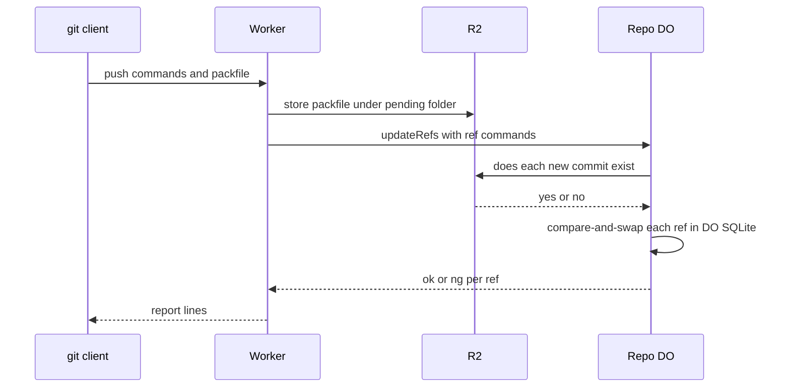

# One Durable Object per repo as the ref authority

> Verdict: **lands with caveats** · feasibility 4/5 · reliability 3/5 · correctness 3/5 · effort: weeks
> Read the words in [how-to-read.md](../findings/how-to-read.md). Engineers: [proof](../proofs/repo-do-ref-authority.md) · [review](../reviews/repo-do-ref-authority.md)

## What this idea is

git is a tool that keeps every version of a set of files, and lets many people share those versions. A repository, or repo, is one project's full set of files and their history. A commit is one saved version of the files, with a note about what changed. A branch is a named line of commits, like a bookmark that moves forward as you save.

A ref is a name that points at one commit. A branch is a ref. A tag is a ref. A push is sending your new commits to the server. Many people can push to one repo at the same moment. The server must decide, for each ref, which change wins.

This idea gives each repo one Durable Object. A Durable Object, or DO, is a single small program with its own storage that handles one thing at a time. There is one DO for each repo. Think of it like the one librarian who is allowed to update the catalog.

The DO is the only program that moves a ref. Because there is only one writer, no two updates can collide, and no shared lock is needed.

Think of it like this. A library keeps one card for each book. Two readers ask the librarian to change the same card at the same moment. The librarian serves one reader, then the other. The second reader sees that the card changed and must read the card again before asking.

## How it works

Cloudflare Workers are small programs that run on Cloudflare's network close to the user, with no server to manage. R2 is Cloudflare's large file store. It holds the git objects. An object is one stored item in git. An object is a file's content, a folder listing, or a commit.

1. A push arrives at a Worker over smart HTTP. Smart HTTP is the way git talks to a server over normal web requests.
2. The Worker reads the command lines. Each line names one ref, the old commit, and the new commit.
3. The lines are pkt-lines. A pkt-line is git's way of framing a message. Each line starts with four characters that give its length.
4. The Worker streams the packfile into R2 under a pending folder named after the push. A packfile is one bundle that holds many objects, squeezed to save space.
5. The Worker calls the DO for this repo. Only the ref names and the commit SHAs cross into the DO, never the packfile. A SHA is a fingerprint of an object's content. Two objects with the same content have the same fingerprint.
6. The DO asks R2 whether each new commit exists.
7. The DO opens one transaction in DO SQLite. DO SQLite is the small database inside each Durable Object.
8. Inside the transaction, the DO does a compare-and-swap on each ref. Compare-and-swap, or CAS, means change a value only if it still has the value you expect. If someone changed it first, do nothing and report it.
9. The DO returns ok or ng for each ref. The Worker turns the results into the report lines that git expects.

## What the reviewer decided

The reviewer looks for blockers and caveats. A blocker is a problem that stops the idea from working until it is fixed. A caveat is a limit or a condition. The idea works, but only inside this limit.

The verdict is Lands with caveats.

| Score | Value |
|---|---|
| Feasibility | 4 of 5 |
| Reliability | 3 of 5 |
| Correctness | 3 of 5 |

Lands with caveats. The idea is sound and can be built. The proof has one or more problems that must be fixed first, and the reviewer described each fix. Think of it like a flight with a runway that needs some repairs before you land. The runway is there. The repairs are known.

For this idea, the core claim holds. One DO per repo with a synchronous compare-and-swap does exactly what git's own push server does. All the building blocks are GA. GA, or generally available, means a Cloudflare feature that is finished and supported, not a preview. Two pushes to the same ref at the same time cannot leave two records that disagree.

The proof code as written has three blockers. The reviewer expects weeks of work to reach a trustworthy foundation.

## Problems that must be fixed first

### Problem 1: The ref moves before the objects are safe

**What goes wrong.** The DO moves the ref before the pushed objects are stored under their final names in R2. The objects sit only under the pending folder. Nothing inside the transaction records that the push was committed. If the Worker crashes after the ref moves, the janitor from idea #6 later deletes the pending folder. A janitor is a background task that deletes files nobody points to anymore. The ref now points at objects that no longer exist.

**Why it matters.** That outcome is data loss. A ref that points at a missing commit breaks the repo. A later clone or fetch of that branch fails. A fetch is getting commits from the server. A clone gets everything for the first time.

**How to fix it.** Write each object to its final key in R2 before the compare-and-swap. The key is objects/SHA. As a second option, record the push id as committed inside the same transaction. Then let an alarm move the objects later. An alarm is a timer inside a Durable Object. A DO has only one alarm at a time.

### Problem 2: The write counter counts index rows too

**What goes wrong.** The code uses rowsWritten to decide whether the compare-and-swap worked. rowsWritten is a billing counter. The counter also counts writes to the table's index. The refs table has a primary key, so the table has a hidden index. An insert or a delete likely reports 2 rows, not 1. The code accepts only 1, so the DO rejects every branch create and every branch delete.

**Why it matters.** A normal git push that creates a new branch would fail. A normal git push that deletes a branch would fail too.

**How to fix it.** Use the SQLite changes function to count the real rows. Or declare the table WITHOUT ROWID. Test the fix on the first day, because the reviewer did not verify the counter against the documentation.

### Problem 3: Large pushes arrive with no known length

**What goes wrong.** git sends a push larger than 1 MiB in chunks, with no total length. R2 needs a known length to store a file in one write. The proof leaves the split between commands and packfile as pseudo-code. That pseudo-code assumes a known length.

**Why it matters.** Any normal git push larger than 1 MiB would fail as written.

**How to fix it.** Use an R2 multipart upload. Buffer parts of at least 5 MiB and upload each part on its own.

## Things to know

- The DO checks only that the new tip commit exists, not that every older object the tip needs is present. A push with a missing ancestor is accepted, so ideas #4 and #56 must close this gap.
- If the server offers side-band-64k, the report lines must travel in channel 1, or git fails with a protocol error. Three more details matter: the server must advertise delete-refs, delete-only pushes carry no packfile, and new-branch pushes carry an empty packfile.
- Every push and every ref listing for one repo goes through one DO in one location, and a cross-region call adds 100 to 300 ms. The DO name comes from owner/repo, so renaming a repo means moving its data.
- The all-or-nothing push option, report-status-v2, and push-options are not built, so the server must not advertise them. The text "fetch first" is a client message in real git, and that difference is cosmetic.

## How this idea connects to the others

- The refs table and the object store come from [#2 Refs in DO SQLite, objects in R2](./refs-sqlite-objects-r2.md).
- The existence check relies on the object keys from [#5 Content-addressed R2 keys](./content-addressed-r2-keys.md).
- The web handshake and the pkt-line code come from [#53 The /info/refs?service= entrypoint and pkt-line codec](./info-refs-endpoint.md).
- The routing from owner/repo to one DO, and the rule on who can push, come from [#54 Auth and multi-tenancy: owner/repo routing to DO ids](./auth-and-multitenancy.md).
- The pending folder and the janitor come from [#6 Two-phase push](./two-phase-push.md).
