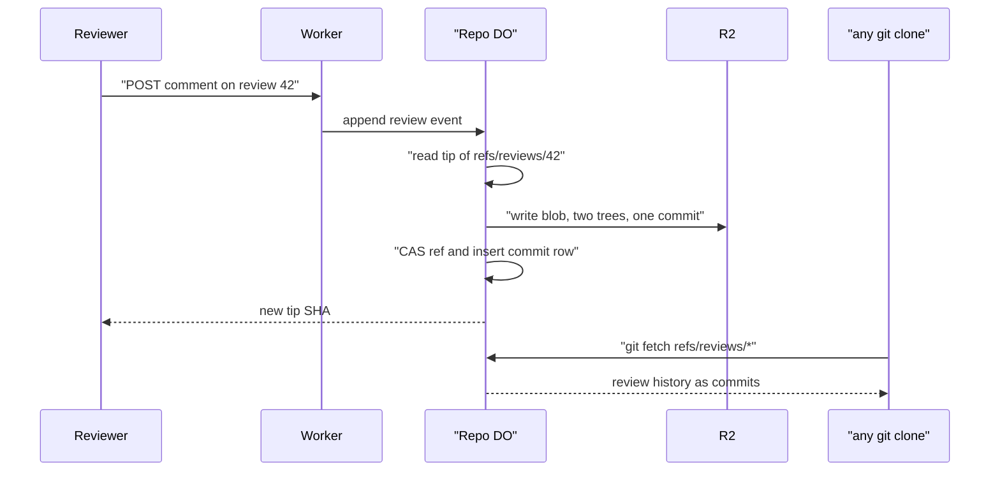

# Pull-request review data as git objects under refs/reviews

> Verdict: **lands with caveats** · feasibility 4/5 · reliability 3/5 · correctness 3/5 · effort: weeks
> Read the words in [how-to-read.md](../findings/how-to-read.md). Engineers: [proof](../proofs/reviews-as-refs.md) · [review](../reviews/reviews-as-refs.md)

## What this idea is

Git is a tool that keeps every version of a set of files, and lets many people share those versions. A repository is one project's full set of files and their history. When people review each other's changes, the review comments normally live in a website database, not in git. If the website goes away, the comments go away. This idea stores every review comment as normal git data inside the repository. A clone then carries its own review history. A fetch is getting commits from the server. A clone gets everything for the first time.

Think of it like this. A reader writes notes in the margins of a book. When the book is copied, the notes are copied too. Nobody needs a separate notebook to keep the notes.

## How it works

1. A reviewer posts a comment to a web endpoint. A Worker receives the request. Cloudflare Workers are small programs that run on Cloudflare's network close to the user, with no server to manage.
2. The Worker calls the Durable Object for the repository. A Durable Object is a single small program with its own storage that handles one thing at a time. There is one DO for each repo. Think of it like the one librarian who is allowed to update the catalog.
3. The DO reads the current tip of the ref named refs/reviews/<id> from DO SQLite. A ref is a name that points at one commit. A branch is a ref. A tag is a ref. A commit is one saved version of the files, with a note about what changed. DO SQLite is the small database inside each Durable Object.
4. The DO builds real git objects for the comment. An object is one stored item in git. An object is a file's content, a folder listing, or a commit. The DO builds four objects. The objects are a file for the comment, a folder listing named events, a top folder listing, and a commit with one parent. The top folder listing holds a meta.json file.
5. The DO computes the SHA of each object and compresses each object. A SHA is a fingerprint of an object's content. Two objects with the same content have the same fingerprint.
6. The DO writes each object to R2 as a single loose object. R2 is Cloudflare's large file store. It holds the git objects.
7. The DO updates the ref with a compare-and-swap and inserts a row in a commits table, both in one transaction. Compare-and-swap means: change a value only if it still has the value you expect. If someone changed it first, do nothing and report it.
8. The result is a plain branch of plain git objects. A branch is a named line of commits, like a bookmark that moves forward as you save. The command `git fetch origin '+refs/reviews/*:refs/reviews/*'` brings the whole review history into any clone.
9. A client can also push into refs/reviews. A push is sending your new commits to the server. The server accepts such a push only when the new tip builds on the old tip and the folder shape is correct.

## What the reviewer decided

The verdict is: lands with caveats.

| Score | Value |
|---|---|
| Feasibility | 4 of 5 |
| Reliability | 3 of 5 |
| Correctness | 3 of 5 |

Lands with caveats. The idea is sound and can be built. The proof has one or more problems that must be fixed first, and the reviewer described each fix. Think of it like a flight with a runway that needs some repairs before you land. The runway is there. The repairs are known.

For this idea, the verdict means the following. The core idea is sound. Review events as forward-only commits under refs/reviews can be fetched and mirrored by any normal git client. Normal git never checks those commits out into the working folder. Every Cloudflare building block is GA. GA means a Cloudflare feature that is finished and supported, not a preview. The proof has two blockers. A blocker is a problem that stops the idea from working until it is fixed. As written, the proof stores objects in a different way than the ideas it depends on. Inside that system, a normal `git fetch` of a review ref would fail. The reviewer also listed five caveats. A caveat is a limit or a condition. The idea works, but only inside this limit. The reviewer estimates the fixes at days and a usable review feature at weeks.

## Problems that must be fixed first

### Problem 1: The objects are stored in the wrong format and place

**What goes wrong.** This proof compresses each object and stores it under a key made from the SHA, with no repository name in the key. The ideas this proof depends on store each object uncompressed, with a header, under a key that includes the owner and repository name. Those ideas compress objects later, when they build a packfile. A packfile is one bundle that holds many objects, squeezed to save space. The pack builder either cannot find the review objects or compresses them a second time.

**Why it matters.** A normal `git fetch` of a review ref fails with the message "did not receive expected object". The review history is advertised but cannot be downloaded.

**How to fix it.** Store review objects in the same key layout and byte format as the content-addressed R2 keys idea. Use the uncompressed header plus content, the repository prefix, and the same integrity field.

### Problem 2: The commit tables for fetch are never filled

**What goes wrong.** The fetch negotiation idea computes what to send from three tables named commits, parents, and introduced. The refs and objects idea also keeps an objects index. This proof writes into a different commits table with a different shape and never fills the other tables.

**Why it matters.** The server advertises the review ref. When a client asks for it, the negotiation finds no objects to send. The packfile section is empty, and the normal `git fetch` fails with the same error as in Problem 1.

**How to fix it.** Fill the commits, parents, and introduced tables and the objects index for every object the DO builds.

## Things to know

- There is no key that makes a request safe to repeat, and no retry after a failed compare-and-swap. When two reviewers comment at once, the loser gets a server error. A retry after a write that was saved but never confirmed writes the same event twice.
- The event number comes from a count of rows in a table. A client push into refs/reviews skips that table. The next server append can then write a file name that already exists in the events folder. The git fsck command reports duplicate file entries.
- The proof sorts folder entries with a locale-aware compare instead of a plain byte compare. The author field is free text. The claim that git fsck passes is false unless the author has the form Name <email>. Clients that check objects on transfer reject the fetch otherwise.
- Every comment costs four R2 writes and rewrites the whole events folder listing. The cost grows with the number of comments. Reviews with many comments need the events folder split into parts and need packing before such a repository clones well.
- The check on a client push only looks at the folder shape. The check does not confirm that meta.json is unchanged or that each event is well-formed JSON. A client push can break the meaning of a review while still being valid git.

## How this idea connects to the others

- This idea needs one Durable Object per repository to own the refs, from [#1 One Durable Object per repo as the ref authority](./repo-do-ref-authority.md).
- This idea keeps refs in DO SQLite and objects in R2, from [#2 Refs in DO SQLite, objects in R2](./refs-sqlite-objects-r2.md).
- This idea must store objects in the layout from [#5 Content-addressed R2 keys](./content-addressed-r2-keys.md).
- This idea must match the byte format used by [#4 Packfile parsing in a Worker with a streaming inflater](./streaming-pack-parser.md).
- This idea accepts client pushes into refs/reviews through [#6 Two-phase push](./two-phase-push.md).
- This idea must fill the tables used by [#56 Want/have negotiation with a commit-graph in SQLite](./want-have-negotiation.md).
- This idea relies on packing of loose objects and cleanup from [#55 GC and repack as a DO alarm](./gc-and-repack-alarm.md).
