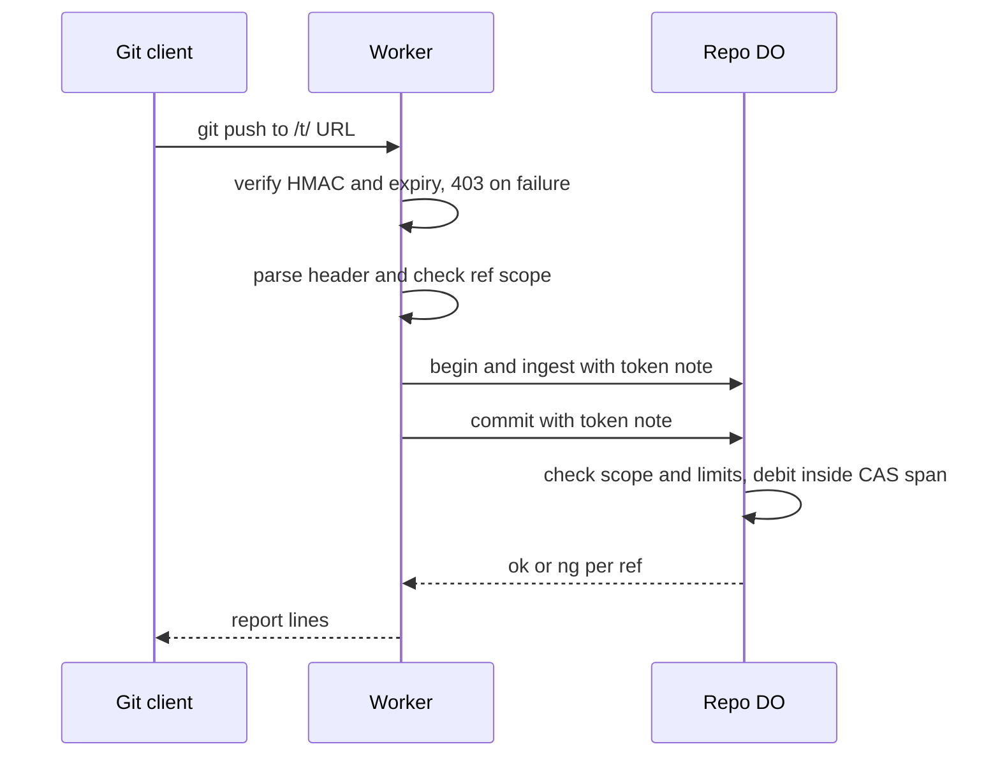

# Rate-limited, token-scoped remote URLs

> Verdict: **lands with caveats** · feasibility 4/5 · reliability 3/5 · correctness 3/5 · effort: days
> Read the words in [how-to-read.md](../findings/how-to-read.md). Engineers: [proof](../proofs/scoped-token-remotes.md) · [review](../reviews/scoped-token-remotes.md)

## What this idea is

Git is a tool that keeps every version of a set of files, and lets many people share those versions. A repository, or repo, is one project's full set of files and their history. A push is sending your new commits to the server. A remote URL is the web address a git client uses to reach a server. This idea puts a signed token inside the URL. The token allows pushes to one branch only, for one hour only, with a limit on the number of pushes and bytes. The server checks the token with no database lookup. A counter in the repo's Durable Object enforces the limits exactly.

Think of it like this. A hotel key card opens one door, for one day, a limited number of times. The front desk can read the card without looking anything up. The door itself counts each use.

## How it works

The second pass writes the design in Rust, against one shared contract that every idea in this set follows. The token is one more credential kind in the auth code, plus three small additions to the push path. A commit is one saved version of the files, with a note about what changed. A branch is a named line of commits, like a bookmark that moves forward as you save. A ref is a name that points at one commit. A branch is a ref. A tag is a ref. Cloudflare Workers, or Workers, are small programs that run on Cloudflare's network close to the user, with no server to manage. Wasm, or WebAssembly, is a way to run code from other languages, such as Rust, inside a Worker. A Durable Object, or DO, is a single small program with its own storage that handles one thing at a time. There is one DO for each repo. Think of it like the one librarian who is allowed to update the catalog. DO SQLite is the small database inside each Durable Object. A pkt-line is git's way of framing a message. Each line starts with four characters that give its length. A packfile, or pack, is one bundle that holds many objects, squeezed to save space. Compare-and-swap, or CAS, means change a value only if it still has the value you expect. If someone changed it first, do nothing and report it. A janitor is a background task that deletes files nobody points to anymore.

1. The server makes a URL that carries a payload and a signature. The payload names the repo, the branch, the expiry time, the maximum pushes, the maximum bytes and a delete flag. The signature is an HMAC over the payload with a secret that only the Worker holds. An HMAC is a signature made with a shared secret, and only the holder of the secret can make or check one.
2. A client runs git push with that URL. The Worker checks the signature and the expiry with pure Rust code. Every failure is a 403, never a 401, so git never asks for a credential that cannot exist. No Durable Object wakes and no storage lookup is needed.
3. The URL serves push only. The info/refs request gets the full advertisement of every ref, so a first push sends only what is new. A fetch request is refused. A push token does not read.
4. On a push, one body reader drives the whole request. The contract's header parser reads the command lines and consumes the "shallow" lines first, so the scope check sees commands only. If no command is in scope, the Worker reads the body to the end before it sends the ng report, because an early answer cancels the stream.
5. If a command is in scope, the request becomes the two-phase push of the sibling idea. A note with the token's limits rides on the begin and commit calls to the DO.
6. Inside the commit step, the DO makes the usage row if the row is missing. The DO denies the push if the row is revoked, the pushes are spent, or the pack's bytes would pass the byte limit.
7. The DO also checks each command against the scoped ref inside the same step. A delete needs the delete flag. When at least one ref moves, the same step adds one push and the pack's bytes to the usage row.
8. A crash before the commit step leaves the usage row untouched, so the token is not spent. The janitor deletes expired rows inside its normal slice, with no second alarm.

## What the reviewer decided

The reviewer looks for blockers and caveats. A blocker is a problem that stops the idea from working until it is fixed. A caveat is a limit or a condition. The idea works, but only inside this limit.

The verdict is Lands with caveats.

| Score | Value |
|---|---|
| Feasibility | 4 of 5 |
| Reliability | 4 of 5 |
| Correctness | 4 of 5 |

| Score | First pass | Second pass |
|---|---|---|
| Feasibility | 4 of 5 | 4 of 5 |
| Reliability | 3 of 5 | 4 of 5 |
| Correctness | 3 of 5 | 4 of 5 |

Lands with caveats. The idea is sound and can be built. The proof has one or more problems that must be fixed first, and the reviewer described each fix. Think of it like a flight with a runway that needs some repairs before you land. The runway is there. The repairs are known.

For this idea, the second pass is a real step forward. Both first-pass blockers are closed by the shape of the design, not by a check at run time. One body reader drives the whole request, and the contract parser handles the shallow lines. The debit now sits inside the commit step, so the worst crash outcome changed from "token spent, nothing moved" to "nothing spent, nothing moved". What remains is a set of mechanical reconciliations, one error arm the token path depends on, and one test line the edge answers earlier with different text. The reviewer now expects weeks of work, not days, because a tokened push needs the sibling's receive-pack code split at the header boundary.

## What changed in the second pass

- The pack handoff stream was broken: fixed. One body reader per request drives the header parse, the drain and the ingest, and the pack hands off through the same reader. There is no second stream to lock.
- Shallow clients were rejected: fixed by the contract modules. The shared header parser consumes the "shallow" lines before the command lines, so the scope check sees commands only. A new test scenario covers the depth-one CI case.
- The debit burned budget on any failure: fixed. The debit moved inside the commit step and runs only when at least one ref moved. A crash in the middle of a pack leaves the usage row untouched.
- Chunked pushes debited zero bytes: fixed. The gate reads the pack size the DO already recorded, so the byte limit counts real stored bytes across pushes.
- The scoped-only advertisement inflated first pushes: fixed. The token URL now serves the full advertisement of every ref, and scope is enforced on the commands. The token holder can see every ref name, which is accepted as a limit.
- Early replies cancelled the stream: partly fixed. The out-of-scope path now reads the body to the end before the report. A body larger than 1 MB on a request rejected before routing can still hit the old cancel, which is narrow because an expired token fails earlier.
- A one-branch token could delete its branch: fixed. The payload has a delete flag that defaults to no, checked at the edge and again inside the DO.
- Revoked rows lived forever: fixed. A revoked row keeps the token's real expiry, and the janitor deletes expired rows whether revoked or not.
- The token in the URL had no key rotation: partly fixed. Rotation now has a two-key window with a previous secret. A key id is still not built, and the token still leaks into config files and logs.
- The Cloudflare body cap: fixed. The cap is documented in the contract and enforced before the code runs.
- Minting was left out: partly fixed. The revoke call is now real code, but minting and the admin route have no owner. The sibling idea that was named does not build them.

## Problems that must be fixed first

### Problem 1: The shared functions do not match the sibling ideas

**What goes wrong.** This proof calls a receive-pack body function with seven arguments. No sibling defines that function. The receive-pack function itself has three different signatures across the two sibling proofs and this one. The route parser is defined twice with different return types.

**Why it matters.** Rust code with mismatched signatures does not compile. The whole crate stays broken until one definition wins. The fix is mechanical, but it must be reconciled, not assumed.

**How to fix it.** Split the sibling's receive-pack code at the header boundary, so the header parse happens before the scope check. Pick one signature per shared function and record the choice in the shared contract.

### Problem 2: The spent-token denial reaches git as HTTP 409

**What goes wrong.** The contract says any error after the command lines are parsed must become a 200 response with an ng line for every ref. The early limit check inside begin returns a conflict error, and nothing maps that error to the 200 report. The exhausted-token retry is the most common denial on this path.

**Why it matters.** A client that pushes twice on a one-push token sees "RPC failed, HTTP 409" and "the remote end hung up unexpectedly", not "ng rate limit". git discards the body of a 409, so the user does not learn that the token was spent.

**How to fix it.** Add the conflict error to the error arm at the edge, next to the unpack error. Map the conflict to a 200 report with an ng line for every command.

## Things to know

- The signature is checked over the decoded payload bytes, not over the encoded text in the URL. Two different encodings of one payload both verify. A holder can rewrite the encoding, not the content.
- A payload with no maximum pushes or no maximum bytes fails to parse and gets a 403. There is no way to say "unlimited" except a very large number.
- The token URL answers info/refs with the full advertisement, so a push-only token can read every ref name and fingerprint in the repo.
- A request rejected before routing drains at most 1 MB of the body before the error reply. A larger body on a bad token can still cancel the stream. The risk is narrow because an expired token fails earlier.
- Minting tokens and the admin route still have no owner. The sibling auth idea builds only the two-token password path in the second pass.
- Several parts are unverified at run time. These are the HMAC, SHA-256 and base64 crates on Wasm, the secret reading, and the stub request bodies.
- The token still lives in the URL, so config files, shell history and logs all see it. Short expiry and the revoke call are the mitigations.
- A push token cannot fetch. The clone for the CI case still needs an ordinary credential.

## How this idea connects to the others

This idea reuses the ref advertisement and pkt-line code from [#53 The /info/refs?service= entrypoint and pkt-line codec](./info-refs-endpoint.md).

This idea finds the right DO for a repo with [#54 Auth and multi-tenancy: owner/repo routing to DO ids](./auth-and-multitenancy.md).

This idea keeps the usage counter in the same DO as [#1 One Durable Object per repo as the ref authority](./repo-do-ref-authority.md).

This idea hands the packfile to [#4 Packfile parsing in a Worker with a streaming inflater](./streaming-pack-parser.md).

This idea rides on the begin and commit calls of [#6 Two-phase push](./two-phase-push.md).
