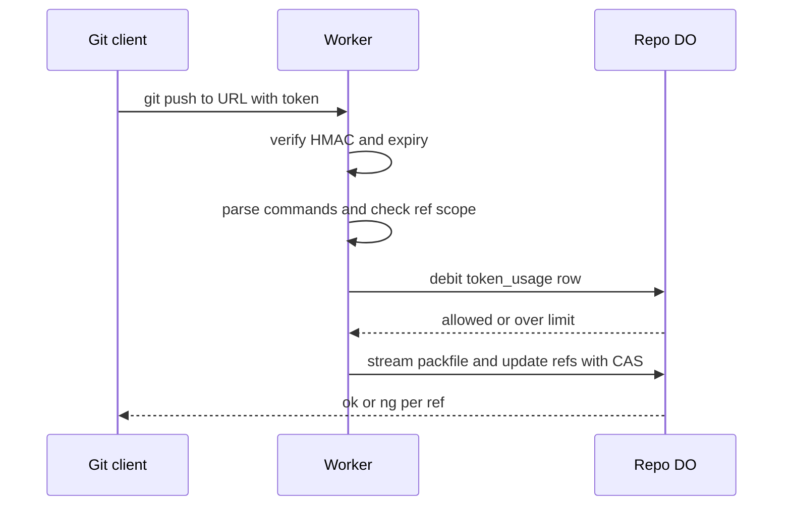

# Rate-limited, token-scoped remote URLs

> Verdict: **lands with caveats** · feasibility 4/5 · reliability 3/5 · correctness 3/5 · effort: days
> Read the words in [how-to-read.md](../findings/how-to-read.md). Engineers: [proof](../proofs/scoped-token-remotes.md) · [review](../reviews/scoped-token-remotes.md)

## What this idea is

Git is a tool that keeps every version of a set of files, and lets many people share those versions. A repository, or repo, is one project's full set of files and their history. A push is sending your new commits to the server. A remote URL is the web address a git client uses to reach a server. This idea puts a signed token inside the URL. The token allows pushes to one branch only, for one hour only, with a limit on the number of pushes and bytes. The server checks the token with no database lookup. A counter in the repo's Durable Object enforces the limits exactly.

Think of it like this. A hotel key card opens one door, for one day, a limited number of times. The front desk can read the card without looking anything up. The door itself counts each use.

## How it works

A commit is one saved version of the files, with a note about what changed. A branch is a named line of commits, like a bookmark that moves forward as you save. A ref is a name that points at one commit. A branch is a ref. A tag is a ref. Cloudflare Workers, or Workers, are small programs that run on Cloudflare's network close to the user, with no server to manage. A Durable Object, or DO, is a single small program with its own storage that handles one thing at a time. There is one DO for each repo. Think of it like the one librarian who is allowed to update the catalog. DO SQLite is the small database inside each Durable Object. A pkt-line is git's way of framing a message. Each line starts with four characters that give its length. A SHA, or hash, is a fingerprint of an object's content. Two objects with the same content have the same fingerprint. An object is one stored item in git. An object is a file's content, a folder listing, or a commit. A packfile, or pack, is one bundle that holds many objects, squeezed to save space. Compare-and-swap, or CAS, means change a value only if it still has the value you expect. If someone changed it first, do nothing and report it. An alarm is a timer inside a Durable Object. A DO has only one alarm at a time.

1. The server makes a URL that contains a payload and a signature. The payload names the repo, the branch, the expiry time, the maximum pushes and the maximum bytes. The signature is an HMAC over the payload with a secret that only the Worker holds.
2. A client runs git push with that URL.
3. The Worker checks the signature and the expiry with WebCrypto. No storage lookup is needed.
4. The Worker reads the pkt-line command section of the push body before touching the packfile. Each command names an old SHA, a new SHA and a ref.
5. The Worker rejects any command whose ref is not the scoped one.
6. If the commands pass, the Worker calls the repo DO. The DO debits a token_usage row in DO SQLite, which counts pushes and bytes and holds a revoked flag.
7. Only then does the Worker stream the packfile to the pack reader. The DO checks the scope again inside the ref compare-and-swap.
8. An alarm set to the earliest expiry deletes expired rows.

## What the reviewer decided

The reviewer's verdict is Lands with caveats.

| Score | Value |
|---|---|
| Feasibility | 4 of 5 |
| Reliability | 3 of 5 |
| Correctness | 3 of 5 |

Lands with caveats. The idea is sound and can be built. The proof has one or more problems that must be fixed first, and the reviewer described each fix. Think of it like a flight with a runway that needs some repairs before you land. The runway is there. The repairs are known.

For this idea, the design is sound and cheap. The signed token in the path, the command check before the packfile, and the single DO counter all work. GA, or generally available, means a Cloudflare feature that is finished and supported, not a preview. Every Cloudflare feature used is GA. The rate limit is exact, not eventually consistent. A blocker is a problem that stops the idea from working until it is fixed. As written, the proof breaks on two real cases that git clients produce, and burns budget when a push crashes. All fixes are hours of work on top of the other ideas, not a redesign. The reviewer expects days of work.

## Problems that must be fixed first

### Problem 1: The pack handoff stream is broken

**What goes wrong.** After reading the commands, the Worker hands the rest of the body to the pack reader as a stream. The code asks the body for a new reader every time the stream is pulled, and never releases the old reader. The second pull throws the error "ReadableStream is locked".

**Why it matters.** Any packfile larger than one chunk cannot be read. A normal git push with real content fails.

**How to fix it.** Hold one reader in a closure. Reuse that reader for every pull.

### Problem 2: Shallow clients are rejected

**What goes wrong.** A fetch or clone is getting commits from the server. A clone gets everything for the first time. A shallow clone gets only the newest commits. When a shallow clone pushes, git sends "shallow SHA" lines before the command lines. The proof parses those lines as commands with no ref name, and answers "ng undefined". The GitHub Actions checkout step makes a shallow clone by default.

**Why it matters.** The main audience for scoped tokens is CI. That exact client fails on every push.

**How to fix it.** Skip every line that starts with "shallow ".

## Things to know

A caveat is a limit or a condition. The idea works, but only inside this limit.

- The DO debits the push and byte budget before the pack is read, with no refund. A crash in the middle of a pack burns the token, so the debit must move inside the ref CAS transaction.
- Chunked pushes with no content length reserve 0 bytes, and nothing writes the real count back. The byte limit holds per push only, not across pushes.
- The server advertises only the scoped ref, so git assumes the server has nothing else. The first push of a new branch then ships the full history, so advertise all refs and rely on the command check.
- Rejecting early without reading the whole body cancels the HTTP/2 stream. Git then prints "RPC failed, curl 92" instead of "remote rejected", so read the body to the end before replying, as git-receive-pack does.
- Branch deletion is advertised, so a one-branch push token can also delete that branch. Revoked rows are never swept, there is no key id for rotation, and the token in the URL leaks into config files and logs.
- Cloudflare caps the request body at 100 to 500 MB, depending on the plan. That cap bounds any single push for the whole project.

## How this idea connects to the others

This idea reuses the ref advertisement and pkt-line code from [#53 The /info/refs?service= entrypoint and pkt-line codec](./info-refs-endpoint.md).

This idea finds the right DO for a repo with [#54 Auth and multi-tenancy: owner/repo routing to DO ids](./auth-and-multitenancy.md).

This idea keeps the usage counter in the same DO as [#1 One Durable Object per repo as the ref authority](./repo-do-ref-authority.md).

This idea hands the packfile to [#4 Packfile parsing in a Worker with a streaming inflater](./streaming-pack-parser.md).

This idea re-checks the scope inside the commit step of [#6 Two-phase push](./two-phase-push.md).
