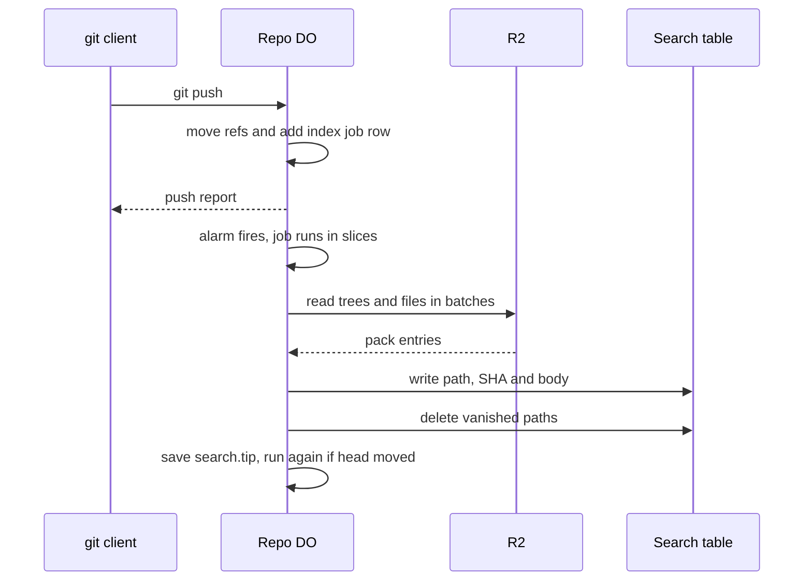

# Search index built on push

> Verdict: **lands with caveats** · feasibility 4/5 · reliability 3/5 · correctness 3/5 · effort: days
> Read the words in [how-to-read.md](../findings/how-to-read.md). Engineers: [proof](../proofs/search-index-on-push.md) · [review](../reviews/search-index-on-push.md)

## What this idea is

Git is a tool that keeps every version of a set of files, and lets many people share those versions. A repository, or repo, is one project's full set of files and their history. A push is sending your new commits to the server. This idea builds a word search index for a repo each time a push arrives. The push finishes first. Then a background task reads the changed files and adds their text to a search table. A user can then search the repo's files by word.

Think of it like this. A librarian adds a card to the catalog each time a new book arrives. The reader who brought the book does not wait. The librarian works after the reader has left.

## How it works

The second pass writes the design in Rust, against one shared contract that every idea in this set follows. Wasm, or WebAssembly, is a way to run code from other languages, such as Rust, inside a Worker. A Durable Object, or DO, is a single small program with its own storage that handles one thing at a time. There is one DO for each repo. Think of it like the one librarian who is allowed to update the catalog. DO SQLite is the small database inside each Durable Object. R2 is Cloudflare's large file store. It holds the git objects. An object is one stored item in git. An object is a file's content, a folder listing, or a commit. A commit is one saved version of the files, with a note about what changed. A ref is a name that points at one commit. A branch is a ref. A tag is a ref. A packfile, or pack, is one bundle that holds many objects, squeezed to save space. Every object at rest is a full entry of a pack, so there are no loose files to read. A SHA, or hash, is a fingerprint of an object's content. Two objects with the same content have the same fingerprint. An alarm is a timer inside a Durable Object. A DO has only one alarm at a time. A job is a unit of background work that runs in short slices when the alarm fires. The index covers only the default branch, the repo's main line of commits.

1. A push lands. In the same step that moves the refs, the commit code adds one index job row. The push report goes back to git before any indexing starts.
2. The alarm fires and the job runs in slices. Each slice runs at most 20 seconds and stops before the budget runs out.
3. The job compares the last indexed commit, kept in a row called search.tip, with the current target of the default branch. Equal values end the job.
4. The job walks the difference between the old and new folder listings. Two tables hold the work: a frontier table of folders still to compare, and a todo table of files still to read.
5. The job reads changed files in batches of up to 64 entries. Each object is found through the shared pack index, read from R2 and inflated. The push already stored every object whole.
6. Each file becomes one row in a full-text search table in DO SQLite. The row holds the path, the SHA and the body text. A binary, oversized or corrupt file gets a row with an empty body.
7. A file that vanished loses its row in one delete. A folder that vanished loses every row under its prefix in one range delete.
8. When the work tables are empty, the job writes the new head into search.tip. If a newer push landed during the job, the job runs again at once.
9. A search request is a web call on the repo. The DO rewrites the terms into quoted phrases and runs a MATCH query on the search table. The answer lists each hit's path and a short snippet, plus the indexed and head tips.
10. If the index lags behind the head, the search route adds the job row itself. A duplicate request merges into the same row.

## What the reviewer decided

The reviewer looks for blockers and caveats. A blocker is a problem that stops the idea from working until it is fixed. A caveat is a limit or a condition. The idea works, but only inside this limit.

The verdict is Lands with caveats.

| Score | Value |
|---|---|
| Feasibility | 4 of 5 |
| Reliability | 3 of 5 |
| Correctness | 4 of 5 |

| Score | First pass | Second pass |
|---|---|---|
| Feasibility | 4 of 5 | 4 of 5 |
| Reliability | 3 of 5 | 3 of 5 |
| Correctness | 3 of 5 | 4 of 5 |

Lands with caveats. The idea is sound and can be built. The proof has one or more problems that must be fixed first, and the reviewer described each fix. Think of it like a flight with a runway that needs some repairs before you land. The runway is there. The repairs are known.

For this idea, the second pass is a real improvement. Both first-pass blockers are closed by the shape of the design. The work state lives in tables instead of in flight, and every object read goes through the shared pack index. Every first-pass caveat is either fixed or dropped. Correctness rose from 3 to 4, because the index is now a true index of the default branch, with deletes, a resume point and safe queries. Feasibility and reliability stayed flat. Feasibility holds at 4 because the FTS5 search engine inside DO SQLite is documented but never exercised. Reliability holds at 3 because two crash holes remain. A kill at one moment can lose a whole folder of changes, and a killed job can wedge the queue. The reviewer still expects days of work.

## What changed in the second pass

- Big jobs restarted from the beginning: fixed. The work state lives in two tables, a frontier of folders to compare and a todo list of files to read. A slice that runs out of budget resumes where it stopped, and a file already in the index is skipped before any read. A first index of a real repo finishes in one or two slices.
- Every object had to be a loose file: fixed by the contract modules. There are no loose objects anymore. Every object at rest is a full entry of a normal pack, found through the shared index and read in coalesced batches.
- One flat row per path mixed the branches: fixed. Only the default branch is indexed. If a push lands during the job, the job runs again and the index catches up to the newest head.
- A poison job stalled the queue: fixed. A bad file becomes a row with an empty body instead of a failure. A job that keeps failing retries with growing waits, goes dead after eight attempts and is queued again at boot. A kill mid-slice leaves a different hole, covered in the problems below.
- Deleted and renamed files left stale rows: fixed. The diff removes each vanished file with one delete and each vanished folder with one range delete over its prefix. A rename is a delete plus an add.
- The D1 fallback lost the same-transaction property: fixed. The index stays in DO SQLite, and the job row lands in the same step as the ref move. Whether the FTS5 engine exists inside DO SQLite remains a day-1 check.
- One remote read per changed object: fixed. Changed files are read in batches of up to 64 entries. A first index of 10,000 files costs about 160 reads over one or two slices.
- The Vectorize stage was a sketch: fixed. The stage is dropped from this design. Meaning-based search can return later as another job kind over the same table.
- Stale rows could survive a crash: partly fixed. Rows written before a crash are valid and are skipped on resume. Orphaned rows can still survive when the head moves past a skipped commit before the job runs again.
- A raw user query could throw a syntax error: fixed. The route rewrites the query into quoted phrases, so no user byte reaches the search engine as syntax. A query longer than 1,024 bytes gets a 400 response.
- The protocol v2 search command could not ride the push protocol: fixed. The command is dropped. Search is a plain web route, and a v2 command can bind to the same table later.
- The index lag was invisible: fixed. The search response carries the indexed and head tips, and a search on a lagging index adds the job row itself.

## Problems that must be fixed first

### Problem 1: A kill between two steps can lose a folder of changes

**What goes wrong.** The job deletes a frontier row in one step, then reads the old and new folder listings in the next step. A kill in between loses the whole subtree's diff. New paths are never queued, removed paths keep their rows, and the job still records the new head.

**Why it matters.** The index then claims to cover a commit it does not cover. The hole is permanent and silent. Searches miss the added files and keep showing the deleted ones.

**How to fix it.** Move the frontier row delete into the same step as the diff, after the reads.

### Problem 2: A killed job wedges the queue

**What goes wrong.** The dispatcher is the part of the DO that runs each job slice. The dispatcher marks the job running before each slice. A kill mid-slice is not an error, so the retry ladder never runs. The next firing selects only queued rows, and every new request to add the job merges into the running row. The index job never runs again.

**Why it matters.** One isolate kill at the wrong moment freezes the index forever. The demand-driven add from the search route merges into the same running row too. The hole sits in the shared job contract, but this proof's resume claim and one test scenario stand on a recovery that does not exist.

**How to fix it.** Give the job contract a recovery for stale running rows. One way is a timeout that marks a running row dead, so the next boot queues the job again.

### Problem 3: Small drifts from the shared contract

**What goes wrong.** One line reads a borrowed fingerprint where an owned value is needed, so the code does not compile. The budget field this proof uses has a different shape from the helper another proof writes back. Three small helpers are assumed but defined nowhere.

**Why it matters.** Rust code with these mismatches does not compile. The crate can hold only one convention, so nothing can be tested until one side changes.

**How to fix it.** Convert the borrowed value on the one line. Pick one budget convention and record it in the shared contract. Define the three helpers, or point at the proof that defines them.

## Things to know

- The whole module rests on the FTS5 engine inside DO SQLite. FTS5 is a table type that finds rows by the words inside them. Cloudflare documents FTS5, but the study never exercised it. If FTS5 is absent, the fallback is a different module that loses the DO's step atomicity.
- The path column has no real index inside an FTS5 table. Every delete and every done-check scans the whole table. A large repo makes each diff cost many scans.
- Two pending rows that share one file fingerprint bind both reads to the first path. The second row survives to the next loop and re-reads the same object. The job still converges, but the extra reads are wasted.
- Only the default branch is indexed, and the design hard-codes the default branch as main. A repo whose only branch is master is never indexed, and the failure is silent.
- The search route adds the job row inside its step, but nothing shown arms the alarm afterwards. An added job can sit with no alarm armed.
- A crash can leave orphaned rows when the head moves past a skipped commit before the job resumes. A generation column would fix the orphaned rows, as the proof notes for the rebuild case.
- The index lags the push by design. The response carries the indexed and head tips. One head move in a narrow gap can stay unindexed until a query arrives.
- File names and bodies that are not valid text are decoded in a lossy way. Two different byte names can share one row, and the last writer wins.
- A read of a swept object burns the full retry ladder, about eight attempts over up to one hour, before the rebuild path engages. One error inside the job also uses the wrong error kind, which is cosmetic.

## How this idea connects to the others

- The commit step that adds the job row and the compare-and-swap on refs come from [#1 One Durable Object per repo as the ref authority](./repo-do-ref-authority.md).
- The pack index and the batched entry reads come from [#2 Refs in DO SQLite, objects in R2](./refs-sqlite-objects-r2.md).
- The push that lands the job row in the same step as the ref move comes from [#6 Two-phase push](./two-phase-push.md).
- The normalized packs that hold every object whole come from [#4 Packfile parsing in a Worker with a streaming inflater](./streaming-pack-parser.md).
- The job table, the slices and the alarm come from [#55 GC and repack as a DO alarm](./gc-and-repack-alarm.md).
- The login check on the search route comes from [#54 Auth and multi-tenancy: owner/repo routing to DO ids](./auth-and-multitenancy.md).
- An optional v2 search command can bind to the same table from [#32 Agent-native protocol v2 commands](./agent-native-commands.md). The dropped meaning-based stage can return through [#45 Commit graph in Vectorize for semantic git log](./vectorized-commit-graph.md).
