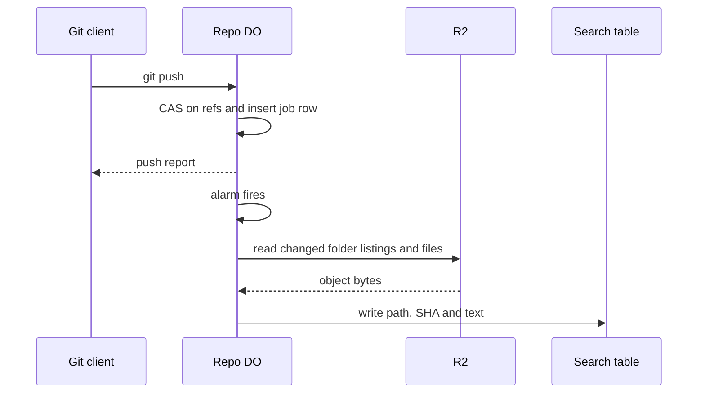

# Search index built on push

> Verdict: **lands with caveats** · feasibility 4/5 · reliability 3/5 · correctness 3/5 · effort: days
> Read the words in [how-to-read.md](../findings/how-to-read.md). Engineers: [proof](../proofs/search-index-on-push.md) · [review](../reviews/search-index-on-push.md)

## What this idea is

Git is a tool that keeps every version of a set of files, and lets many people share those versions. A repository, or repo, is one project's full set of files and their history. A push is sending your new commits to the server. This idea builds a word search index for a repo each time a push arrives. The push finishes first. Then a background task reads the changed files and adds their text to a search table. A user can then search the repo's files by word.

Think of it like this. A librarian adds a card to the catalog each time a new book arrives. The reader who brought the book does not wait. The librarian works after the reader has left.

## How it works

A Durable Object, or DO, is a single small program with its own storage that handles one thing at a time. There is one DO for each repo. Think of it like the one librarian who is allowed to update the catalog. DO SQLite is the small database inside each Durable Object. R2 is Cloudflare's large file store. It holds the git objects. An object is one stored item in git. An object is a file's content, a folder listing, or a commit. A commit is one saved version of the files, with a note about what changed. A ref is a name that points at one commit. A branch is a ref. A tag is a ref. Compare-and-swap, or CAS, means change a value only if it still has the value you expect. If someone changed it first, do nothing and report it. An alarm is a timer inside a Durable Object. A DO has only one alarm at a time. A SHA, or hash, is a fingerprint of an object's content. Two objects with the same content have the same fingerprint.

1. A push arrives. The repo DO writes the pushed objects to R2 and updates the refs with compare-and-swap.
2. The DO adds one row per updated ref to an index_jobs table and sets the alarm to now.
3. The push response goes back to the client before any indexing starts.
4. The alarm handler takes the oldest job. The handler compares the old folder listing with the new folder listing, and skips folders whose fingerprint did not change.
5. For each changed file, the handler reads the object from R2 and unzips the content. The handler then writes the path, the SHA and the text into a full-text search table in DO SQLite.
6. If the handler has run for 20 seconds, the handler re-arms the alarm and stops.
7. A search request runs a MATCH query on that table inside the DO.
8. An optional second stage writes the same text to Vectorize, for meaning-based search across repos.

## What the reviewer decided

The reviewer's verdict is Lands with caveats.

| Score | Value |
|---|---|
| Feasibility | 4 of 5 |
| Reliability | 3 of 5 |
| Correctness | 3 of 5 |

Lands with caveats. The idea is sound and can be built. The proof has one or more problems that must be fixed first, and the reviewer described each fix. Think of it like a flight with a runway that needs some repairs before you land. The runway is there. The repairs are known.

For this idea, every Cloudflare feature used is GA. GA, or generally available, means a Cloudflare feature that is finished and supported, not a preview. The main loop is sound: a durable job row, an alarm, a folder comparison and a search table write. The idea has no effect on how git talks to the server, because indexing runs after the push report is sent. A blocker is a problem that stops the idea from working until it is fixed. As written, the proof never finishes large jobs, mixes branches together, and stalls on a bad job. Until the fixes land, the result is a word search of the last pushed branch, not of the repo. The reviewer expects days of work.

## Problems that must be fixed first

### Problem 1: Big jobs restart from the beginning

**What goes wrong.** When the 20 second budget runs out, the handler re-arms the alarm but saves no position. The next run does not check which files are already indexed. The run starts again from file 1 every time.

**Why it matters.** Any job with more than 20 seconds of work never finishes. The first push of a real repo, with a few thousand files, loops forever. Each loop burns R2 reads and the job row is never deleted.

**How to fix it.** Skip a file when a row with the same path and SHA already exists. One WHERE NOT EXISTS check does that.

### Problem 2: Every object must be a loose file

**What goes wrong.** The handler reads each object as one zipped file at objects/xx/yyyy in R2. That works only if the pack parser writes every pushed object as a loose file. A packfile, or pack, is one bundle that holds many objects, squeezed to save space. If big pushes are stored as packs, the handler needs a pack index and delta resolution. The proof contains neither.

**Why it matters.** The design silently depends on a storage decision made in another idea. If that decision changes, search breaks.

**How to fix it.** Either make the loose file rule a firm part of the object store. Or add pack index lookup and delta resolution to the handler.

## Things to know

A caveat is a limit or a condition. The idea works, but only inside this limit.

- The table has one row per path across all branches, so two branches that change the same file overwrite each other. Results depend on push order and show no single branch.
- Alarm retries are bounded at about six, not unlimited as the proof claims. A failing job sits at the front of the queue and stalls every later job until an attempts column and a dead-letter path exist.
- Deleted and renamed files are never removed from the index. Stale hits remain.
- The raw user query goes straight into the search engine, and a syntax error throws. The endpoint must escape the terms or return a 400 response.
- Using D1 instead of DO SQLite loses the "same transaction as the ref update" property. Each changed folder and file costs one R2 read with no batching, and the Vectorize stage is only a sketch.

## How this idea connects to the others

This idea runs inside the push handler of [#1 One Durable Object per repo as the ref authority](./repo-do-ref-authority.md).

This idea keeps the search table next to the refs, as set out in [#2 Refs in DO SQLite, objects in R2](./refs-sqlite-objects-r2.md).

This idea reads objects by their fingerprint, as set out in [#5 Content-addressed R2 keys](./content-addressed-r2-keys.md).

This idea depends on [#4 Packfile parsing in a Worker with a streaming inflater](./streaming-pack-parser.md) writing every object as a loose file.
