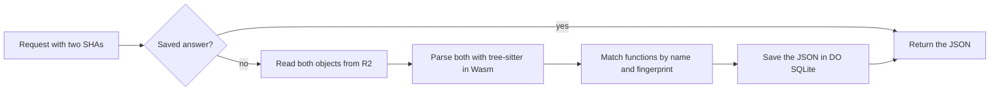

# Semantic diffs via tree-sitter in Wasm

> Verdict: **risky** · feasibility 3/5 · reliability 3/5 · correctness 2/5 · effort: weeks
> Read the words in [how-to-read.md](../findings/how-to-read.md). Engineers: [proof](../proofs/semantic-diffs.md) · [review](../reviews/semantic-diffs.md)

## What this idea is

Git is a tool that keeps every version of a set of files, and lets many people share those versions. A diff is a list of what changed between two versions of a file. A normal diff compares the two versions line by line. This idea compares them function by function, for JavaScript and Ruby code.

Cloudflare Workers are small programs that run on Cloudflare's network close to the user, with no server to manage. Wasm, or WebAssembly, is a way to run code from other languages, such as Rust, inside a Worker. The server parses both versions with a parser called tree-sitter, which runs as Wasm inside a Worker.

The result says which functions were added, removed, changed, or renamed. The server stores each answer for ever, because the two inputs never change.

Think of it like this. You compare two editions of a songbook. Instead of comparing every word on every page, you compare song by song. You note which songs were added, dropped, changed, or renamed.

## How it works

1. A request names two versions of one file by their SHAs and asks for a semantic diff. A SHA, or hash, is a fingerprint of an object's content. Two objects with the same content have the same fingerprint. An object is one stored item in git. An object is a file's content, a folder listing, or a commit. A commit is one saved version of the files, with a note about what changed.
2. The Worker routes the request to the repo's Durable Object. A repository, or repo, is one project's full set of files and their history. A Durable Object, or DO, is a single small program with its own storage that handles one thing at a time. There is one DO for each repo. Think of it like the one librarian who is allowed to update the catalog.
3. The DO looks up the pair of SHAs in a table in DO SQLite. DO SQLite is the small database inside each Durable Object. On a hit, the DO returns the saved answer with no other work.
4. On a miss, the DO reads both objects from R2, unzips them, and removes the git header. R2 is Cloudflare's large file store. It holds the git objects.
5. The DO parses both texts with tree-sitter. The parser and the JavaScript and Ruby grammars are built into one Wasm module that is loaded with the Worker.
6. The DO lists every function, method, class, and module in each version, with a full name and a fingerprint of its body.
7. The DO matches items by name. A new name with an old fingerprint counts as a rename.
8. For each changed function, the DO runs a line diff over only that function's bytes.
9. The DO saves the answer in the table for ever, because the SHAs are content fingerprints, and returns the answer.

## What the reviewer decided

The reviewer looks for blockers and caveats. A blocker is a problem that stops the idea from working until it is fixed. A caveat is a limit or a condition. The idea works, but only inside this limit. The reviewer's verdict is "Risky."

| Score | Out of 5 |
|---|---|
| Feasibility | 3 |
| Reliability | 3 |
| Correctness | 2 |

Risky means the following. The idea can be built. But the proof shows one or more problems the reviewer could not fully solve, or it does a weaker version of the goal. Think of it like a runway you can see on the map, but nobody has checked it for holes.

For this idea, the platform side lands. Every Cloudflare feature used is GA. GA, or generally available, means a Cloudflare feature that is finished and supported, not a preview. The saved answers are safe under crashes and under two requests at once, because each answer is keyed by content fingerprints alone. Nothing is written to R2.

A ref is a name that points at one commit. A branch is a ref. A tag is a ref. A branch is a named line of commits, like a bookmark that moves forward as you save. No ref is involved in this idea.

But three things are unproven or wrong. The recipe for building the Wasm module is unverified. The object read path works only if files are stored one by one, not inside a packfile. A packfile, or pack, is one bundle that holds many objects, squeezed to save space. And the diff algorithm as written is a weaker version of the goal.

Rename detection can never fire, changes outside functions vanish, and classes are reported twice.

The reviewer found three blockers and five caveats. The reviewer expects weeks of work.

One blocker mentions deltas. A delta is a stored object written as "the same as that other object, with these changes". One caveat mentions pushes and fetches. A push is sending your new commits to the server. A fetch is getting commits from the server. A clone gets everything for the first time.

## Problems that must be fixed first

### Problem 1: Rename detection can never fire

**What goes wrong.** The fingerprint of each function is computed over the whole function, including its name. A renamed function has a new name inside its bytes, so its fingerprint changes. A rename therefore never matches an old fingerprint. The rename code path never runs.

**Why it matters.** Function-level renames are a headline feature of the idea, like what git does for whole files. As written, every rename is reported as one removal plus one addition.

**How to fix it.** Compute the fingerprint over the function body only. Or hash the function's bytes with the name token removed.

### Problem 2: Only loose objects can be read

**What goes wrong.** The read step expects each file as a loose object, which is one zipped file with a "blob <length>" header. A real push delivers a packfile. Inside a packfile, an entry has a different header and is often a delta against another entry. The read step fails its header check on every delta entry. The proof names two other ideas for delta resolution but never calls them.

**Why it matters.** Unless the push path rewrites every object into loose form, most files cannot be read at all. The diff then fails for most real requests.

**How to fix it.** Call the delta resolution path from the diff API idea or the Wasm git core idea. Or store every file as a loose object on push.

### Problem 3: The Wasm build is unverified

**What goes wrong.** The build recipe compiles tree-sitter and the Ruby scanner with no standard library. Those programs need memory allocation, string copy, character class checks, and a clock. The recipe as written does not link. The code also imports a helper from Emscripten while claiming to use no Emscripten.

**Why it matters.** Cloudflare Workers forbid compiling Wasm at run time, so the stock tree-sitter loader cannot be used. The custom build is the only path, and nobody has shown that the build works.

**How to fix it.** Build with wasi-sdk and stub the system imports the parser needs. Verify that the module links and loads in a Worker before building on top of it.

## Things to know

- The saved answer is keyed by the two SHAs and the language, but not by the grammar or code version. Every bug fix leaves stale answers for ever, and unknown file types default to JavaScript and get saved too.
- Changes outside any function, such as imports, top-level statements, and constants, are silently dropped. A class with one changed method is reported twice, once as the whole class and once as the method.
- Two items with the same full name, such as a Ruby class opened twice or a conditional definition, collapse into one entry. The last one wins.
- Parsing runs inside the single repo DO and blocks every push and fetch on that repo. The parse step has no state and belongs in the plain Worker, with the DO used only for saved answers.
- The tree walk is recursive and can overflow on deeply nested minified JavaScript. The table of saved answers grows without limit against the 10 GB DO SQLite ceiling, and there is no concrete plan to prune it.

## How this idea connects to the others

This idea needs [#2 Refs in DO SQLite, objects in R2](./refs-sqlite-objects-r2.md), because the file versions are read from R2.

This idea needs [#5 Content-addressed R2 keys](./content-addressed-r2-keys.md), because each file version is found in R2 by its SHA.

This idea needs [#27 Diff API served with R2 range reads](./diff-api-range-reads.md), because that idea provides the read path for entries inside a packfile.

This idea needs [#25 Wasm git core (gitoxide/libgit2) for delta resolution and merge](./wasm-git-core.md), because that idea provides delta resolution.
