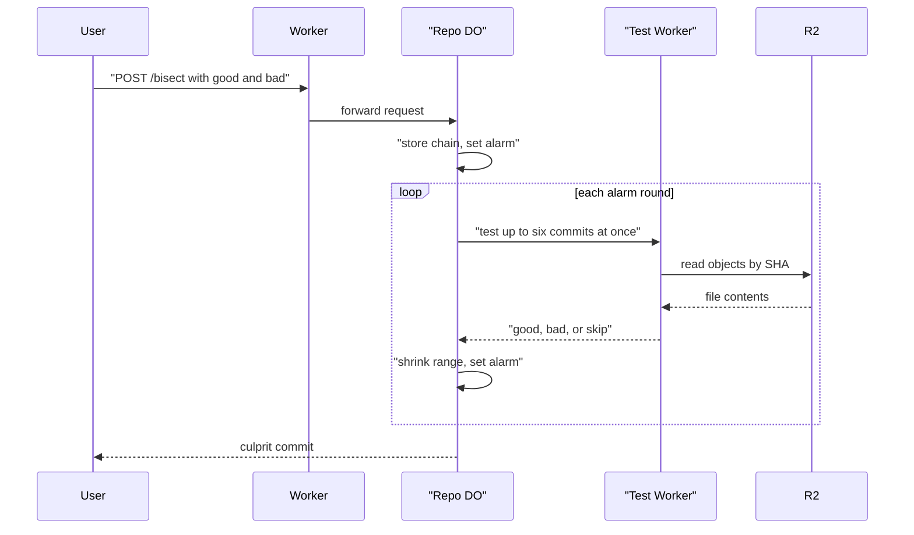

# Bisect on the server with parallel test Workers

> Verdict: **lands with caveats** · feasibility 4/5 · reliability 2/5 · correctness 3/5 · effort: weeks
> Read the words in [how-to-read.md](../findings/how-to-read.md). Engineers: [proof](../proofs/server-side-bisect.md) · [review](../reviews/server-side-bisect.md)

## What this idea is

Git is a tool that keeps every version of a set of files, and lets many people share those versions. A commit is one saved version of the files, with a note about what changed. Sometimes a bug appears, and nobody knows which commit caused the bug. Bisect is a search that tests commits in the middle of the history until it finds the first bad commit. This idea moves that search to the server and tests several commits at the same time.

Think of it like this. You have a row of 1,000 light bulbs, and one broken wire somewhere in the row. One person tests the middle bulb, then the middle of the dark half, and so on. Six people test six bulbs at once, so each round removes a larger part of the row.

## How it works

1. A user sends a web request that names one good commit and one bad commit.
2. A Worker receives the request. Cloudflare Workers are small programs that run on Cloudflare's network close to the user, with no server to manage.
3. The Worker passes the request to the Durable Object for the repository. A repository is one project's full set of files and their history. A Durable Object is a single small program with its own storage that handles one thing at a time. There is one DO for each repo. Think of it like the one librarian who is allowed to update the catalog.
4. The DO lists the chain of commits between the good commit and the bad commit. The DO follows only the first parent of each commit.
5. The DO stores the chain in DO SQLite. DO SQLite is the small database inside each Durable Object.
6. The DO sets an alarm. An alarm is a timer inside a Durable Object. A DO has only one alarm at a time.
7. When the alarm fires, the DO picks up to six untested commits, spread evenly across the search range.
8. The DO calls the user's test Worker once for each pick, all at the same time.
9. The test Worker reads the files for that commit straight from R2. R2 is Cloudflare's large file store. It holds the git objects. An object is one stored item in git. An object is a file's content, a folder listing, or a commit.
10. The test Worker never runs a clone. A fetch is getting commits from the server. A clone gets everything for the first time.
11. Each test returns good, bad, or skip. The DO saves each answer in DO SQLite.
12. The DO shrinks the search range to the segment between the highest good commit and the lowest bad commit.
13. The DO sets the alarm again. The rounds repeat until the range holds one commit. That commit is the culprit.

## What the reviewer decided

The verdict is: lands with caveats.

| Score | Value |
|---|---|
| Feasibility | 4 of 5 |
| Reliability | 2 of 5 |
| Correctness | 3 of 5 |

Lands with caveats. The idea is sound and can be built. The proof has one or more problems that must be fixed first, and the reviewer described each fix. Think of it like a flight with a runway that needs some repairs before you land. The runway is there. The repairs are known.

For this idea, the verdict means the following. Every Cloudflare building block in the proof is GA. GA means a Cloudflare feature that is finished and supported, not a preview. The search state lives in DO SQLite, so a crash does not lose progress. A normal git command such as clone, push, or fetch is not affected, because the idea does not touch how git talks to the server. A push is sending your new commits to the server. The proof code has three blockers. A blocker is a problem that stops the idea from working until it is fixed. The reviewer also listed six caveats. A caveat is a limit or a condition. The idea works, but only inside this limit. The result is a search that follows first parents only and tests at most six commits per round. That is a small gain over the local git bisect command, not the large leap the idea promised. The reviewer estimates the work at weeks.

## Problems that must be fixed first

### Problem 1: A finished search blocks the next search

**What goes wrong.** When a search reaches the done state, the alarm code returns without setting a new alarm. If a second search was started while the first one ran, the second search waits in the table forever. Nothing wakes the DO alarm again until someone starts a third search.

**Why it matters.** The user of the second search sees the state running with no end. The server has the work stored but never does the work.

**How to fix it.** Set the alarm again after a search ends when other searches are still in the running state. Or order the search rows and pick the oldest unfinished one on every alarm.

### Problem 2: A failed round repeats forever

**What goes wrong.** The alarm picks commits without checking which ones already have an answer. A failed call to the test Worker leaves no answer and there is no retry limit. If all picks in a round fail or return skip, the DO sets the alarm for now and picks the same commits again. This repeats without end.

**Why it matters.** The DO runs a hot loop. Every loop calls the test Worker, and every call costs money. The search never ends.

**How to fix it.** Pick only commits that have no answer yet. Count the retries for each commit and stop after a fixed number. Add a growing wait between retries.

### Problem 3: The test Worker can read every repository

**What goes wrong.** The DO hands the test Worker a read token that is limited to one repo. The test Worker ignores that token. Instead, the test Worker reads R2 through a direct platform binding. A test Worker supplied by a customer cannot get that binding without also getting access to every repo on the platform.

**Why it matters.** The design claims isolation between customers, but the proof does not deliver isolation. The honest path is to read objects over web requests through the edge Worker. Each such read is a subrequest. A subrequest is one call from a Worker to another service, such as one read from R2. Each request may make at most 50 subrequests on the free plan and 10,000 on the paid plan. Only six subrequests can be open at once. A test that walks a wide folder tree hits those caps.

**How to fix it.** Make the test Worker use the scoped token and read objects through the edge Worker. Design the object reads to stay inside the subrequest limits, or serve many objects in one request.

## Things to know

- The answers must be in order, with all good commits before all bad commits. If a good answer sits above a bad answer, the range flips. The DO then reports the commit at the top of the range as the culprit. The local git bisect command reports a conflict instead.
- The DO follows only the first parent of each commit. In a history with many merges, the search names the merge commit, not the true culprit inside the merged branch. A branch is a named line of commits, like a bookmark that moves forward as you save.
- Sometimes the good commit is not a first-parent ancestor of the bad commit. Then the chain walk continues to the root of the history with no limit. The lookup function throws on zero rows, so the guard that checks for a missing parent never runs.
- The proof assumes each object is stored on its own in R2 under its SHA. A SHA is a fingerprint of an object's content. Two objects with the same content have the same fingerprint. The prose and the code disagree on the exact key. If objects are stored in packfiles, the tester needs pack index lookups and range reads instead. A packfile is one bundle that holds many objects, squeezed to save space.
- Only six subrequests can be open at once, so at most six tests run per round. Each round narrows the range about seven times instead of two times. That is about 2.8 times fewer rounds than the local git bisect command, not a headline win.
- The proof names a replay log for the local `git bisect replay` command but never writes one. That log must start with the line `git bisect start` and use lines such as `# bad: [sha] subject` and `git bisect bad sha`.

## How this idea connects to the others

- This idea needs one Durable Object per repository to own the refs, from [#1 One Durable Object per repo as the ref authority](./repo-do-ref-authority.md).
- This idea reads objects from R2 by their fingerprint, from [#5 Content-addressed R2 keys](./content-addressed-r2-keys.md).
- This idea reads the commit chain from the commit table built in [#56 Want/have negotiation with a commit-graph in SQLite](./want-have-negotiation.md).
- This idea calls the test Worker the same way hooks are called in [#23 Pre/post-receive hooks as Workers via service bindings](./hooks-as-workers.md).
- This idea reads files without a clone, as in [#40 Zero-clone execution: repo as a virtual filesystem inside an agent DO](./zero-clone-vfs.md).
- This idea hands the test Worker a limited read token, from [#28 Rate-limited, token-scoped remote URLs](./scoped-token-remotes.md).
