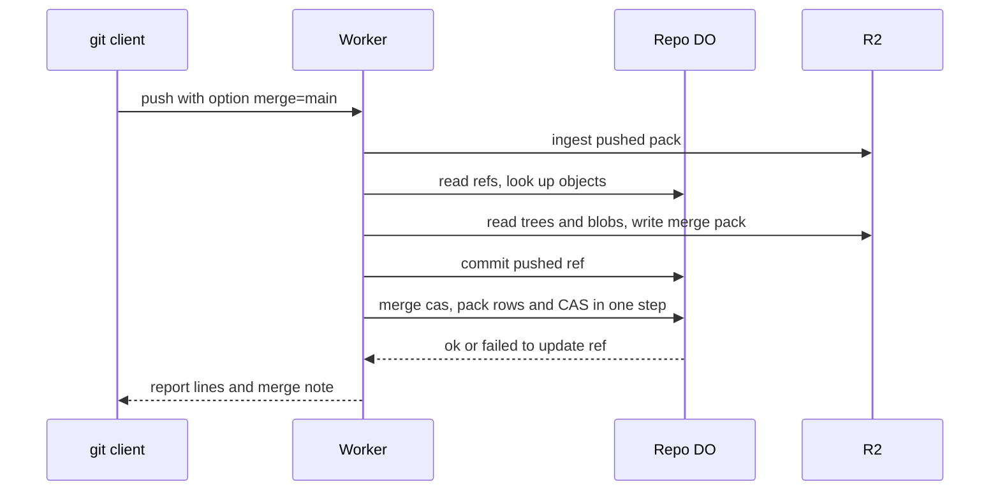

# Server-side three-way merge in the Worker

> Verdict: **risky** · feasibility 4/5 · reliability 3/5 · correctness 2/5 · effort: weeks
> Read the words in [how-to-read.md](../findings/how-to-read.md). Engineers: [proof](../proofs/server-side-merge.md) · [review](../reviews/server-side-merge.md)

## What this idea is

Git is a tool that keeps every version of a set of files, and lets many people share those versions. A repository, or repo, is one project's full set of files and their history. A commit is one saved version of the files, with a note about what changed.

A branch is a named line of commits, like a bookmark that moves forward as you save. A ref is a name that points at one commit. A branch is a ref. A tag is a ref.

A push is sending your new commits to the server. A merge joins two branches into one commit that contains the work of both. Cloudflare Workers are small programs that run on Cloudflare's network close to the user, with no server to manage. A Durable Object, or DO, is a single small program with its own storage that handles one thing at a time. There is one DO for each repo. Think of it like the one librarian who is allowed to update the catalog.

Today a developer pushes a branch and then merges that branch into main in a second step. This idea lets the developer add the option "merge=main" to the push. The Worker then merges the branch into main on the server. The push is rejected only when the two sides changed the same lines of the same file.

Think of it like this. Two editors each mark up a copy of the same chapter. A third editor compares both copies with the original and takes every change that touches a different paragraph. Only when both editors rewrote the same sentence in different ways does the third editor send the chapter back.

## How it works

The second pass writes the design in Rust, against one shared contract that every idea in this set follows. Wasm, or WebAssembly, is a way to run code from other languages, such as Rust, inside a Worker. DO SQLite is the small database inside each Durable Object.

1. The client runs git push with the option "merge=main". The server advertises the push-options feature, and the client echoes it. Each option then rides as one pkt-line after the ref commands. A pkt-line is git's way of framing a message. Each line starts with four characters that give its length. The Worker reads the option lines only when the client echoed the feature, because without the echo that position holds packfile bytes.
2. The Worker runs the normal two-phase push. The objects in the pushed pack land in R2. A packfile, or pack, is one bundle that holds many objects, squeezed to save space. An object is one stored item in git. An object is a file's content, a folder listing, or a commit. R2 is Cloudflare's large file store. It holds the git objects.
3. The Worker checks the option. The merge allows exactly one ref command, no delete, and a target under refs/heads/ that is not the pushed ref. A bad option stops the push with a clear message.
4. The Worker asks the DO for the ref list and finds the current tip of the target.
5. The Worker finds the merge base by walking commit objects. The merge base is the last commit that both branches share. The Worker asks the DO which objects are live, in groups of 1,000, and reads their bytes from R2. The push's own objects count too.
6. Three cases end early. If the target already contains the branch, nothing changes. If the branch already contains the target, the target moves forward with no merge commit. If the target does not exist, the Worker creates it at the branch tip.
7. Otherwise the Worker compares the folder listings of the base, the target, and the branch. A file changed on one side only takes that side. A file changed on both sides is merged line by line. The merge code is a driver the project carries itself, because the ready-made merge library does not build on Wasm. Anything the rules cannot decide is a conflict.
8. The merge output goes to R2 as one normal pack. The Worker holds the pack's rows back instead of posting them. A conflict aborts the upload and stops the push before anything moves.
9. Only after the merge plan proves clean does the Worker commit the pushed ref through the normal commit route.
10. The Worker calls a new DO route for the merge. In one unbroken step the DO writes the pack rows and marks the pack live. The same step checks that the new tip is a known object and runs a compare-and-swap on the target ref. Compare-and-swap, or CAS, means change a value only if it still has the value you expect. If someone changed it first, do nothing and report it.
11. If the compare-and-swap loses, the same step marks the merge pack dead, and a janitor deletes its key later. A janitor is a background task that deletes files nobody points to anymore. The Worker reads the new tip and merges again, at most three times.
12. The report names only the ref the client named. The merge outcome rides a progress note on sideband channel 2. A sideband is a way to send two kinds of data in one stream, like a main channel and a progress channel.

## What the reviewer decided

The reviewer looks for blockers and caveats. A blocker is a problem that stops the idea from working until it is fixed. A caveat is a limit or a condition. The idea works, but only inside this limit.

The verdict is Lands with caveats.

| Score | Value |
|---|---|
| Feasibility | 4 of 5 |
| Reliability | 3 of 5 |
| Correctness | 2 of 5 |

| Score | First pass | Second pass |
|---|---|---|
| Feasibility | 4 of 5 | 4 of 5 |
| Reliability | 3 of 5 | 4 of 5 |
| Correctness | 2 of 5 | 3 of 5 |

Lands with caveats. The idea is sound and can be built. The proof has one or more problems that must be fixed first, and the reviewer described each fix. Think of it like a flight with a runway that needs some repairs before you land. The runway is there. The repairs are known.

For this idea, the second pass is a real step forward. The verdict moved up from Risky to Lands with caveats. The fatal gap of the first pass is closed. Merge objects were invisible to the commit step, and nothing could collect them. Now the pack rows and the ref move share one unbroken step in the DO. The wire story is right too. The option lines are read only on the client's echo, the report is framed in sideband channel 1, and only client-named refs get result lines.

The remaining work is concrete. Three ideas now carry three copies of the merge machinery, and one module must own it. One crash window can still leak a finished pack. The base walk skips one step of git's algorithm. Five calls do not compile as written. The reviewer still expects weeks of effort.

## What changed in the second pass

- The DO did not know the merge objects: fixed. A new DO route writes the pack rows and marks the pack live in one unbroken step, before the compare-and-swap. The DO sees the new tip at once, and the next merge can walk it.
- Abandoned merge objects stayed in R2 forever: partly fixed. A merge pack that loses the compare-and-swap is marked dead in the same step, and the janitor deletes its key later. One window remains. A crash between the upload and the call leaves a finished pack that no row names.
- The status report was not framed for a normal git client: fixed by the contract modules. The wire module frames the report in sideband channel 1, and the option lines are parsed only when the client echoed the feature. The code that joins these pieces to the push route is declared but not shown.
- The merge base search could pick an older shared commit: partly fixed. The walk now uses git's own algorithm with a commit-time heap. The code skips one re-queue step, so out-of-order commit times can still return a false "unrelated histories" answer. The failure direction stays safe.
- Merged files were written before all conflicts were known: fixed. A conflict now aborts the upload and returns an error, and no row for the merge pack ever exists.
- The x-git-user header could be faked: fixed. The merge commit's author is the login name from the auth layer. No client header is read. The commit is still not signed.
- The largest file changed on both sides set the memory limit: fixed. A merged object is capped at 16 MiB, the loaded set at 64 MiB, and the base walk at 100,000 commits. Over a cap the push fails with a limit message, not a fake conflict.
- git warned on the extra status line for main: fixed. The report carries only the ref the client named. The merge outcome rides a progress note on sideband channel 2.
- Folder entries were sorted as text, not bytes: fixed. Entries are now compared as raw bytes, and folders sort as the name followed by a slash.
- A delete or an empty pack reached the merge code unguarded: fixed. The option check rejects a delete, a self-merge, and a push with more than one command before any object is touched.
- An early ok line for the branch could leak when main failed: fixed. The report is built once after the loop. Under the contract each ref moves on its own, so an ok for the branch is a real move.
- The merge base code read a table layout the sibling idea did not have: fixed. Those tables do not exist under the contract. The walk reads commit objects from R2.

## Problems that must be fixed first

### Problem 1: Three copies of the merge machinery drift apart

**What goes wrong.** The tree merge, the base walk, and the line-by-line driver now exist in three ideas, each with different rules. The same driver is registered at two paths with two different signatures. This proof also fails to name one of the siblings it depends on.

**Why it matters.** The copies already disagree. This idea silently accepts a file-turned-folder change, one sibling rejects it with an error, and a third reports a conflict. Each base walk has a different bug.

**How to fix it.** Let one shared module own the driver, the tree merge, and the base walk before the three ideas land.

### Problem 2: A finished merge pack can leak

**What goes wrong.** The Worker starts the merge pack upload before any pack row exists. A crash between the end of the upload and the commit call leaves a completed pack in R2 that no row names.

**Why it matters.** The janitor deletes only packs whose row is marked dead. The R2 rule that removes incomplete uploads does not cover a finished pack. Nothing ever deletes it.

**How to fix it.** Post an empty pack row before the upload starts, the same pattern the push path uses. Or accept the leak and state it plainly.

### Problem 3: The merge base search can miss a real base

**What goes wrong.** The walk marks each commit as queued and never queues it again. Git's algorithm puts a commit back in the queue each time it gains a flag. Here a commit that gains the second flag late is never revisited.

**Why it matters.** When commit times are out of order, the walk can answer "unrelated histories" for branches that do share a base. The push then fails on a false error. The direction stays safe, but the proof's claim to follow git's algorithm is false.

**How to fix it.** Queue a commit again when it gains a flag. Flags only grow, so the walk still ends. Or drop the claim.

### Problem 4: The proof code does not compile

**What goes wrong.** Five calls are verified wrong. The hash function is called with two arguments and takes three. Two iterators each miss an argument. One entry id needs an owning copy. One trait import is missing.

**Why it matters.** Rust code that does not compile cannot run. The fixes are mechanical, but nothing in this idea can be tested until they land.

**How to fix it.** Correct the five calls to match the pinned crate versions.

### Problem 5: A file turned into a folder on both sides merges silently

**What goes wrong.** When the base holds a file and both sides replace it with a folder, the code merges the two folders and drops the base file's content. Git reports a conflict in this case.

**Why it matters.** This is the one place the merge accepts in the dangerous direction. Everywhere else the design reports a conflict when the rules cannot decide.

**How to fix it.** Report a conflict for the case, or check the kind of the base entry before merging the folders.

## Things to know

- After the branch commit succeeds, a merge error still reports ng on a branch that already moved. The only reachable case is a sweep in the small window between the two calls. The report must fall back to the three-attempts note once the results exist.
- Errors other than unpack errors still reach git as HTTP 413 or 500 after the pack was sent. The fix belongs to the sibling idea's receive code.
- When a fetch round repeats, the code can write the same object into the merge pack twice. The duplicates are legal and bounded, but they count against the 10,000-object cap, and a conflict path can appear twice in the message.
- Some error paths abandon the upload without aborting it. The leftover is an incomplete upload that only the unverified R2 cleanup rule can remove.
- The option accepts exactly one option and one ref command, so a push that names two branches with the merge option is rejected whole. The merge's reflog line also stores a made-up push id that joins to nothing.
- Under the contract each ref moves on its own. The branch can report ok while the merge is skipped after three lost races, and a merge can land while the branch's own move failed.
- The Worker reads the whole ref list from the DO on each attempt, up to three times. A late attempt also inherits every object the earlier attempts loaded.
- Several parts are unverified at run time. These are the request path to the DO, some commit and tree field names, the random id source, and real R2 multipart uploads. The line-by-line merge driver is claimed, not built.

## How this idea connects to the others

- The pushed pack is ingested and the pushed ref is committed by [#6 Two-phase push](./two-phase-push.md).
- The ref moves and the new merge route go to the single ref owner from [#1 One Durable Object per repo as the ref authority](./repo-do-ref-authority.md).
- Refs live in DO SQLite and objects live in R2, as in [#2 Refs in DO SQLite, objects in R2](./refs-sqlite-objects-r2.md).
- The Worker unpacks the pushed packfile with [#4 Packfile parsing in a Worker with a streaming inflater](./streaming-pack-parser.md).
- Dead merge packs are swept by the janitor from [#55 GC and repack as a DO alarm](./gc-and-repack-alarm.md).
- The push option is advertised by [#53 The /info/refs?service= entrypoint and pkt-line codec](./info-refs-endpoint.md).
- The author of the merge commit comes from the login layer in [#54 Auth and multi-tenancy: owner/repo routing to DO ids](./auth-and-multitenancy.md).
- The line-by-line merge driver and the tree-merge code are shared with [#18 Server-side rebase and squash as protocol v2 extensions](./server-side-rebase.md).
