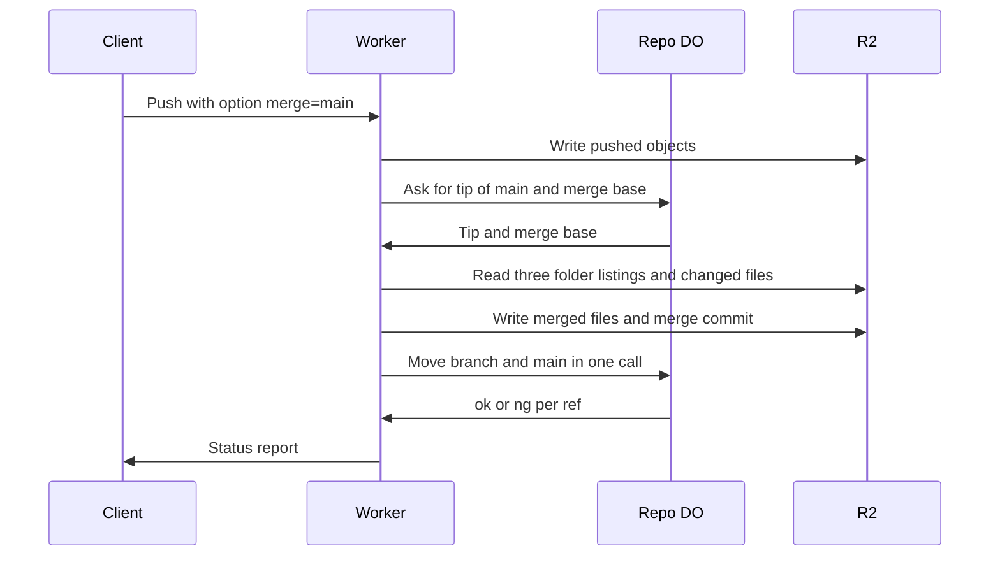

# Server-side three-way merge in the Worker

> Verdict: **risky** · feasibility 4/5 · reliability 3/5 · correctness 2/5 · effort: weeks
> Read the words in [how-to-read.md](../findings/how-to-read.md). Engineers: [proof](../proofs/server-side-merge.md) · [review](../reviews/server-side-merge.md)

## What this idea is

Git is a tool that keeps every version of a set of files, and lets many people share those versions. A repository, or repo, is one project's full set of files and their history. A commit is one saved version of the files, with a note about what changed.

A branch is a named line of commits, like a bookmark that moves forward as you save. A ref is a name that points at one commit. A branch is a ref. A tag is a ref.

A push is sending your new commits to the server. A merge joins two branches into one commit that contains the work of both. Cloudflare Workers are small programs that run on Cloudflare's network close to the user, with no server to manage. A Durable Object, or DO, is a single small program with its own storage that handles one thing at a time. There is one DO for each repo. Think of it like the one librarian who is allowed to update the catalog.

Today a developer pushes a branch and then merges that branch into main in a second step. This idea lets the developer add the option "merge=main" to the push. The Worker then merges the branch into main on the server. The push is rejected only when the two sides changed the same lines of the same file.

Think of it like this. Two editors each mark up a copy of the same chapter. A third editor compares both copies with the original and takes every change that touches a different paragraph. Only when both editors rewrote the same sentence in different ways does the third editor send the chapter back.

## How it works

1. The client runs git push with the option "merge=main". Git sends the option as an extra pkt-line after the ref commands. A pkt-line is git's way of framing a message. Each line starts with four characters that give its length.
2. The Worker runs the normal two-phase push. The objects in the packfile land in R2 under content-addressed keys. An object is one stored item in git. An object is a file's content, a folder listing, or a commit. A packfile, or pack, is one bundle that holds many objects, squeezed to save space. R2 is Cloudflare's large file store. It holds the git objects. Content-addressed means stored under its own fingerprint, so the name tells you what is inside.
3. The Worker asks the repo DO for the current tip of main.
4. The Worker asks the DO for the merge base. The merge base is the last commit that both branches share. The DO finds the merge base by walking the commit graph in DO SQLite. DO SQLite is the small database inside each Durable Object.
5. If main already contains the branch, main does not change. If the branch already contains main, main moves forward to the branch tip with no merge commit.
6. Otherwise the Worker reads three folder listings from R2: the base, main, and the branch. A file changed on only one side is decided without reading its content.
7. A file changed on both sides is read from R2 and merged line by line with a three-way text merge.
8. A real conflict stops the push with the message "ng refs/heads/feature merge conflict" and the list of paths. No ref moves.
9. If there is no conflict, the Worker writes the new folder listings and a merge commit with two parents to R2.
10. The Worker sends two ref commands to the DO in one call: move the branch, and move main with a compare-and-swap. Compare-and-swap, or CAS, means change a value only if it still has the value you expect. If someone changed it first, do nothing and report it. If main moved during the merge, the Worker retries the merge up to three times.

## What the reviewer decided

The reviewer's verdict is Risky.

| Score | Value |
|---|---|
| Feasibility | 4 of 5 |
| Reliability | 3 of 5 |
| Correctness | 2 of 5 |

Risky. The idea can be built. But the proof shows one or more problems the reviewer could not fully solve, or it does a weaker version of the goal. Think of it like a runway you can see on the map, but nobody has checked it for holes.

For this idea, the reviewer says the push option handling and the merge of folder listings are sound. Both use only GA features. GA, or generally available, means a Cloudflare feature that is finished and supported, not a preview. Both refs move in one DO transaction, so the refs can never become two records that disagree.

But the proof code cannot complete a single real merge against the other ideas it depends on. The merge objects are never registered with the DO before the commit step, and the janitor cannot see them. A janitor, also called a sweep or GC, is a background task that deletes files nobody points to anymore. The reviewer sees three blockers. A blocker is a problem that stops the idea from working until it is fixed. The fixes take weeks on top of the push pipeline.

The idea also has caveats. A caveat is a limit or a condition. The idea works, but only inside this limit.

## Problems that must be fixed first

### Problem 1: The DO does not know the merge objects

**What goes wrong.** The two-phase push keeps a list of the objects in each push, called the manifest. The Worker writes the merged files, the folder listings, and the merge commit to R2 outside that manifest. When the DO commits the refs, the DO checks that the new tip of main is a known object. The check fails, so the DO rejects every real merge with "missing necessary objects".

The merge objects are also never added to the DO's tables of objects, commits, and parents. So even with the check removed, the new tip of main cannot be fetched and cannot serve as a merge base later.

**Why it matters.** Only the two easy cases work today: main already contains the branch, or main moves forward with no merge commit. The case the idea exists for never succeeds.

**How to fix it.** Add a step in which the Worker registers the merge objects and their links with the DO before the commit call. Make that step also fill the tables of objects, commits, and parents.

### Problem 2: Abandoned merge objects stay in R2 forever

**What goes wrong.** Some merges are abandoned. A retry lost the CAS three times, a Worker crashed, or a conflict was found after some merged files were already written. In each case the merge objects sit in R2. They are in no manifest, so the janitor the proof relies on cannot find them. They are never deleted.

**Why it matters.** Storage grows with every abandoned merge and never shrinks. The proof claims the janitor sweeps these objects. That claim is false.

**How to fix it.** Put the merge objects into a manifest, or into a second manifest of their own, before writing them. Then the janitor can sweep them when the merge is abandoned.

### Problem 3: The status report is not framed for a normal git client

**What goes wrong.** The server advertises a sideband, so the status report must be wrapped in sideband channel 1. A sideband is a way to send two kinds of data in one stream, like a main channel and a progress channel. The proof does not show that wrapping.

The Worker must also check that the client echoed the push-options feature before reading an option section. Without that check, the Worker reads the start of the packfile as options. Either fault makes a normal git push with the option "merge=main" fail.

**Why it matters.** The idea only works if a normal git push can complete. As written, a normal git push would fail before the merge starts.

**How to fix it.** Wrap every status line in sideband channel 1. Read an option section only when the client echoed the push-options feature.

## Things to know

- The merge base search does not order commits by generation, so in a history with many merges the search can pick an older shared commit. That produces false conflicts, never a silent wrong merge.
- Folder entries are sorted with the JavaScript string compare, not by bytes. File names outside the basic character range produce a listing that git's checker rejects as not sorted.
- The Worker loads the whole of each file that both sides changed into 128 MB of memory, so the largest such file sets the limit. Large files must be refused with a clear message, not reported as conflicts.
- The x-git-user header names the author of the merge commit, and a client can fake that header unless the login layer strips it. The merge commit is not signed.
- The status report includes a line for main, which the client never named, and git warns on that line but does not stop. The outcome for main must instead ride on the branch's line and on a sideband channel 2 message, which the code leaves out.
- The merge base code reads a table layout that does not match the sibling idea's table of parents. A push that deletes a branch, or a push with an empty packfile, reaches the merge code with no guard and crashes.

## How this idea connects to the others

The merge runs after the objects are stored but before the refs move, as in [#6 Two-phase push](./two-phase-push.md).

The Worker unpacks the pushed packfile with [#4 Packfile parsing in a Worker with a streaming inflater](./streaming-pack-parser.md).

The two ref commands go to the single ref owner from [#1 One Durable Object per repo as the ref authority](./repo-do-ref-authority.md).

Refs live in DO SQLite and objects live in R2, as in [#2 Refs in DO SQLite, objects in R2](./refs-sqlite-objects-r2.md).

Merge objects are written under their fingerprint, as in [#5 Content-addressed R2 keys](./content-addressed-r2-keys.md).

The merge base comes from the commit graph in [#56 Want/have negotiation with a commit-graph in SQLite](./want-have-negotiation.md).

The push option is advertised by [#53 The /info/refs?service= entrypoint and pkt-line codec](./info-refs-endpoint.md).

The author of the merge commit comes from the login layer in [#54 Auth and multi-tenancy: owner/repo routing to DO ids](./auth-and-multitenancy.md).
