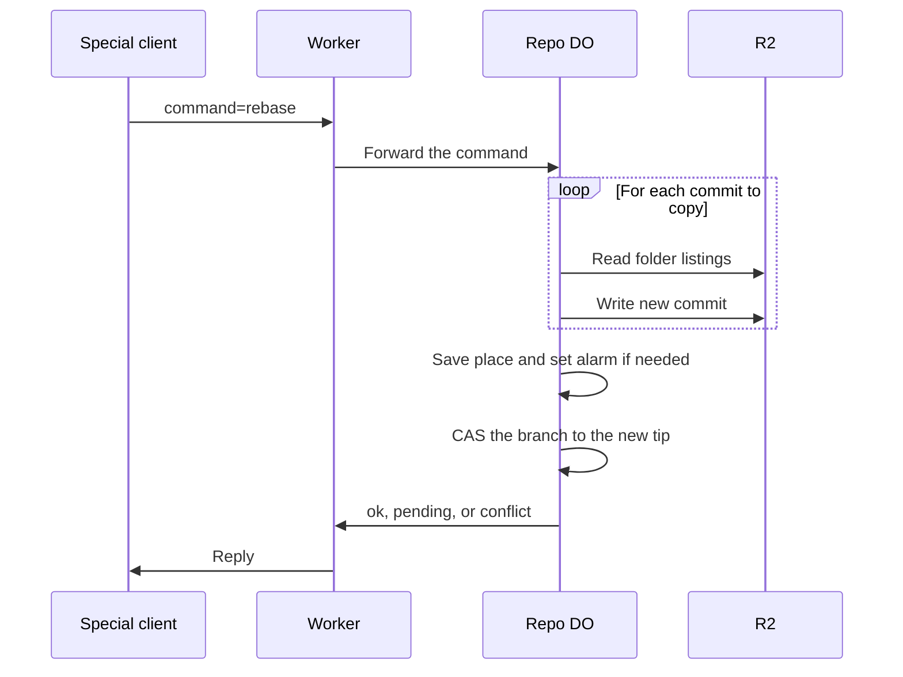

# Server-side rebase and squash as protocol v2 extensions

> Verdict: **risky** · feasibility 4/5 · reliability 2/5 · correctness 2/5 · effort: weeks
> Read the words in [how-to-read.md](../findings/how-to-read.md). Engineers: [proof](../proofs/server-side-rebase.md) · [review](../reviews/server-side-rebase.md)

## What this idea is

Git is a tool that keeps every version of a set of files, and lets many people share those versions. A repository, or repo, is one project's full set of files and their history. A commit is one saved version of the files, with a note about what changed.

A branch is a named line of commits, like a bookmark that moves forward as you save. A ref is a name that points at one commit. A branch is a ref. A tag is a ref.

A rebase takes the commits of one branch and copies them one by one onto the tip of another branch. The history then reads as one straight line. A squash folds all of those commits into one commit. Protocol v2 is the newer, cleaner set of messages git uses to talk to a server. Cloudflare Workers are small programs that run on Cloudflare's network close to the user, with no server to manage.

A Durable Object, or DO, is a single small program with its own storage that handles one thing at a time. There is one DO for each repo. Think of it like the one librarian who is allowed to update the catalog.

Today a developer runs a rebase on their own computer and then pushes the result. This idea adds a rebase command to the server, as an extra feature in the protocol v2 list. A normal git client ignores the extra feature, so nothing changes for old clients. A special client sends the command, and the repo DO does the rebase and moves the branch.

Think of it like this. A band recorded five tracks over an old backing track. Now they want the same five tracks over a new backing track. The studio replays each track over the new backing, one at a time. The studio stops to ask the band only when a track clashes with the new backing.

## How it works

1. The Worker lists the server's features in the protocol v2 advertisement. The list gains two extra lines, rebase=squash and rebase-status. A normal git client ignores lines it does not know.
2. A special client sends command=rebase with the target branch, the branch to move, and the expected tip of that branch. The client can also ask for a squash and give a message.
3. The Worker forwards the command to the repo DO.
4. The DO finds the merge base and the list of commits to copy. The merge base is the last commit that both branches share. The DO reads the commit graph from DO SQLite. DO SQLite is the small database inside each Durable Object.
5. For each commit in the list, the DO merges three folder listings: the commit's parent, the commit, and the current new tip. The DO reads each folder listing from R2. An object is one stored item in git. An object is a file's content, a folder listing, or a commit. R2 is Cloudflare's large file store. It holds the git objects.
6. If a file changed on both sides, the DO reports a conflict with the paths and stops. The proof leaves the line-by-line merge to a later Wasm core. Wasm, or WebAssembly, is a way to run code from other languages, such as Rust, inside a Worker.
7. Otherwise the DO writes a new folder listing and a new commit to R2 under a content-addressed key. A SHA, or hash, is a fingerprint of an object's content. Two objects with the same content have the same fingerprint. Content-addressed means stored under its own fingerprint, so the name tells you what is inside.
8. When the list is longer than one request can handle, the DO saves its place in a job row and sets an alarm. An alarm is a timer inside a Durable Object. A DO has only one alarm at a time. The alarm continues the job later, and the client polls command=rebase-status until the job ends.
9. At the end, the DO moves the branch to the new tip with a compare-and-swap that checks the expected tip again. Compare-and-swap, or CAS, means change a value only if it still has the value you expect. If someone changed it first, do nothing and report it.
10. The client then runs a normal fetch and resets its own branch to the new tip. A fetch is getting commits from the server.

## What the reviewer decided

The reviewer's verdict is Risky.

| Score | Value |
|---|---|
| Feasibility | 4 of 5 |
| Reliability | 2 of 5 |
| Correctness | 2 of 5 |

Risky. The idea can be built. But the proof shows one or more problems the reviewer could not fully solve, or it does a weaker version of the goal. Think of it like a runway you can see on the map, but nobody has checked it for holes.

For this idea, the protocol claim holds. A normal git client of version 2.18 or newer accepts the advertisement and ignores the two extra lines. The reviewer checked that a normal git fetch and a normal git ls-remote do not fail on them. The CAS in the single repo DO stops the refs from becoming two records that disagree. That holds even when a push and a rebase run at the same time.

The input gate is the rule that a Durable Object handles one request at a time while it waits on its own storage. The gate opens when the DO waits on the network instead. So pushes can run between the steps of a rebase, and only the CAS protects the ref. Every Cloudflare feature the proof uses is GA. GA, or generally available, means a Cloudflare feature that is finished and supported, not a preview.

The rebase engine itself is a sketch. The squash path crashes, and the status command has no code behind it. The job queue can starve or strand jobs, and there is no line-by-line file merge. What the proof achieves is a loop that copies commits at the folder level, not a real rebase.

The reviewer sees four blockers. A blocker is a problem that stops the idea from working until it is fixed. The reviewer expects weeks of work to reach a version that can rebase a branch whose files changed on both sides.

The idea also has caveats. A caveat is a limit or a condition. The idea works, but only inside this limit.

## Problems that must be fixed first

### Problem 1: The squash path crashes

**What goes wrong.** For a squash, the job list holds one entry that describes the squash and its message. The step code treats that entry as a commit SHA. The step code asks R2 for the folder listing of a SHA that does not exist. The code throws an error on the first loop.

**Why it matters.** Squash is half of the idea's title. That half cannot run at all.

**How to fix it.** Give the squash its own path. Merge three folder listings once: the merge base, the target tip, and the branch tip. Then write one commit.

### Problem 2: The status command has no handler

**What goes wrong.** A rebase that needs more than one step replies "pending" with a job id. The client is told to poll command=rebase-status. The Worker advertises that command but has no code that answers it.

**Why it matters.** Every long rebase becomes invisible to the client. The client cannot learn whether the job finished, failed, or found a conflict.

**How to fix it.** Write the handler. Make the handler read the job row and reply with ok and the new tip, pending, or conflict and the paths.

### Problem 3: The alarm can starve or strand jobs

**What goes wrong.** The alarm code picks one unfinished job with LIMIT 1. The alarm is set again only from inside the job that ran. When that job finishes, no alarm is set, so a second waiting job never runs. If a step throws an error, the job stays marked as unfinished with no alarm, forever.

**Why it matters.** A stuck job never moves the branch and never reports. The client polls forever. A later rebase on the same repo could wake the stuck job by chance, but nothing guarantees that.

**How to fix it.** After every step, set the alarm again whenever any unfinished job exists. Catch errors in the step code and mark the job as failed.

### Problem 4: The R2 keys do not match the sibling idea

**What goes wrong.** This proof writes compressed objects to keys of the form repos/id/objects/oid. The sibling idea for content-addressed keys writes uncompressed objects to keys of the form objects/sha. The fetch path reads the sibling's layout.

**Why it matters.** The fetch path could fail to read the rebased commits. A rebase that nobody can fetch has no value.

**How to fix it.** Use the same key layout and the same encoding as the sibling idea.

## Things to know

- There is no line-by-line file merge until a merge core lands, either in Wasm or in plain JavaScript. Until then, most real rebases onto a moved main report a conflict.
- The original author, date, and signature of each commit are replaced by a fixed server identity. A normal git rebase keeps the author.
- The DO reads the target tip once when the job starts. A replay that spans several alarm steps lands on a stale target if the target moved.
- A retried or lost step creates new commit SHAs, because the commit body includes the current time. The old objects stay in R2 as lost files with no janitor, and job rows are never deleted.
- The input gate opens while the DO waits on R2, so pushes interleave with the replay and only the final CAS protects the ref. Pushes to the same repo slow down while a job runs, so the step budget must count time, not commits.
- The server speaks only protocol v2, so an older git client gets a not-found error on the first request and cannot clone. That limit comes from the sibling idea, not from this one.

## How this idea connects to the others

The branch moves inside the single ref owner from [#1 One Durable Object per repo as the ref authority](./repo-do-ref-authority.md).

Refs and the commit graph live in DO SQLite, and objects live in R2, as in [#2 Refs in DO SQLite, objects in R2](./refs-sqlite-objects-r2.md).

The extra feature lines ride on the advertisement from [#3 Speak git protocol v2 only, translate v0 at the edge](./protocol-v2-only.md).

New commits must use the key layout from [#5 Content-addressed R2 keys](./content-addressed-r2-keys.md).

The list of commits to copy comes from the commit graph in [#56 Want/have negotiation with a commit-graph in SQLite](./want-have-negotiation.md).

The folder merge is the same one as in [#17 Server-side three-way merge in the Worker](./server-side-merge.md).

A line-by-line file merge waits on [#25 Wasm git core for delta resolution and merge](./wasm-git-core.md).

Folder listings read many times could come from [#9 Tiny in-DO object cache with alarm-driven eviction](./in-do-object-cache.md).
