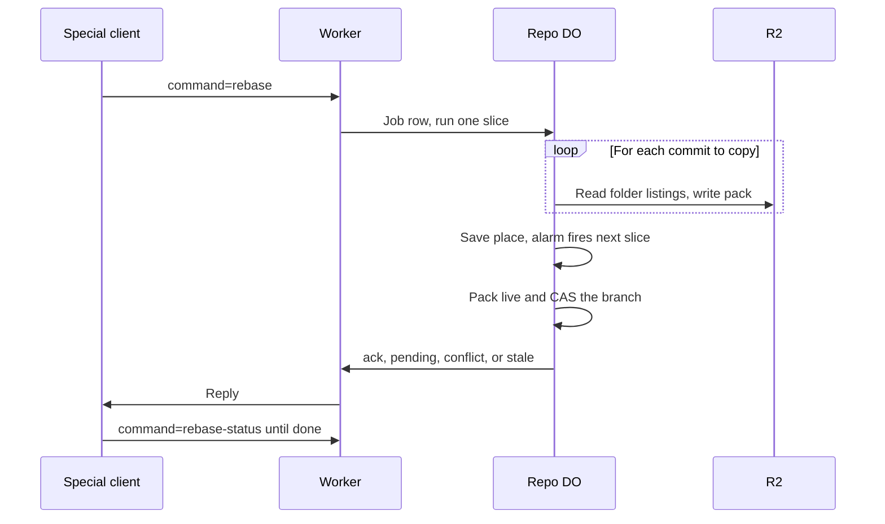

# Server-side rebase and squash as protocol v2 extensions

> Verdict: **risky** · feasibility 4/5 · reliability 2/5 · correctness 2/5 · effort: weeks
> Read the words in [how-to-read.md](../findings/how-to-read.md). Engineers: [proof](../proofs/server-side-rebase.md) · [review](../reviews/server-side-rebase.md)

## What this idea is

Git is a tool that keeps every version of a set of files, and lets many people share those versions. A repository, or repo, is one project's full set of files and their history. A commit is one saved version of the files, with a note about what changed.

A branch is a named line of commits, like a bookmark that moves forward as you save. A ref is a name that points at one commit. A branch is a ref. A tag is a ref.

A rebase takes the commits of one branch and copies them one by one onto the tip of another branch. The history then reads as one straight line. A squash folds all of those commits into one commit. Protocol v2 is the newer, cleaner set of messages git uses to talk to a server. Cloudflare Workers are small programs that run on Cloudflare's network close to the user, with no server to manage.

A Durable Object, or DO, is a single small program with its own storage that handles one thing at a time. There is one DO for each repo. Think of it like the one librarian who is allowed to update the catalog.

Today a developer runs a rebase on their own computer and then pushes the result. This idea adds a rebase command to the server, as an extra feature in the protocol v2 list. A normal git client ignores the extra feature, so nothing changes for old clients. A special client sends the command, and the repo DO does the rebase and moves the branch.

Think of it like this. A band recorded five tracks over an old backing track. Now they want the same five tracks over a new backing track. The studio replays each track over the new backing, one at a time. The studio stops to ask the band only when a track clashes with the new backing.

## How it works

The second pass writes the design in Rust, against one shared contract that every idea in this set follows. Wasm, or WebAssembly, is a way to run code from other languages, such as Rust, inside a Worker. DO SQLite is the small database inside each Durable Object. A packfile, or pack, is one bundle that holds many objects, squeezed to save space. R2 is Cloudflare's large file store. It holds the git objects.

1. The Worker lists the server's features in the protocol v2 advertisement. The list gains two extra lines, rebase and rebase-status. A normal git client ignores lines it does not know.
2. A special client sends command=rebase with the target commit, the branch to move, and the expected tip of that branch. The client can also ask for a squash and give a message.
3. The Worker checks that the caller may write, parses the command, and posts the command to the repo DO. The DO checks the branch name and the expected tip, then writes a job row in DO SQLite.
4. The DO runs the rebase as slices of the shared job runner. An alarm is a timer inside a Durable Object. A DO has only one alarm at a time. The alarm fires the runner, and each slice has a budget of 20 seconds and 400 subrequests. A subrequest is one call from a Worker to another service, such as one read from R2.
5. The first slice finds the merge base and the list of commits to copy. The merge base is the last commit that both branches share. For a squash, the list holds only the branch tip.
6. For each commit, the DO merges three folder listings: the merge base, the commit, and the current new tip. The merge works on folder listings only. A file changed on both sides is a conflict, because no merge library builds inside Wasm yet.
7. Each new commit keeps the author line of the source commit, byte for byte. The committer is the caller's name with the job's start time, so a retried slice writes the same bytes. Signatures are not copied.
8. The DO writes every new object into one pack in R2 and posts the object rows to DO SQLite in batches. The pack stays marked ingesting, so a fetch cannot see the half-written result.
9. When a slice spends 80 percent of its budget, the DO saves its place in the job row, and the alarm fires the runner again. The next slice continues the same upload. When no job row is left, the runner stops.
10. At the end, one step marks the pack live and moves the branch with a compare-and-swap against the expected tip, all in the same span. Compare-and-swap, or CAS, means change a value only if it still has the value you expect. If someone changed it first, do nothing and report it. A lost CAS marks the pack dead and the job stale.
11. A short rebase answers inside the request with ack and the new tip. A long one answers pending with a job id, and the client polls command=rebase-status. Each poll also wakes the runner. The client then runs a normal fetch and resets its own branch.

## What the reviewer decided

The reviewer looks for blockers and caveats. A blocker is a problem that stops the idea from working until it is fixed. A caveat is a limit or a condition. The idea works, but only inside this limit.

The verdict is Lands with caveats.

| Score | Value |
|---|---|
| Feasibility | 4 of 5 |
| Reliability | 4 of 5 |
| Correctness | 3 of 5 |

| Score | First pass | Second pass |
|---|---|---|
| Feasibility | 4 of 5 | 4 of 5 |
| Reliability | 2 of 5 | 4 of 5 |
| Correctness | 2 of 5 | 3 of 5 |

Lands with caveats. The idea is sound and can be built. The proof has one or more problems that must be fixed first, and the reviewer described each fix. Think of it like a flight with a runway that needs some repairs before you land. The runway is there. The repairs are known.

For this idea, the second pass is a real step forward, and the verdict moved up from Risky. All four first-pass blockers are closed. The squash path is a real merge branch, the status command exists, the shared job runner closes the stuck-job hole, and the output is a normal pack instead of loose objects. A retried slice now writes identical bytes, so the lost-objects problem is gone by design rather than by a check.

The protocol claim still holds. A normal git client ignores the two extra feature lines. The final compare-and-swap still stops two records that disagree. Pushes can interleave with a running rebase, and that is now safe because only the last span touches the refs.

What remains is local and mechanical. The job row reads a pack id that nothing stores, which breaks the resume path. The last step never re-checks that the target commit is still stored. Two calls do not match the sibling code, and the author argument and the status reply are not wired. The reviewer still expects weeks of work, because the file-level merge waits on the sibling merge idea, which has no second-pass proof.

## What changed in the second pass

- The squash path crashes: fixed. A squash is now its own branch of the code. The copy list holds only the branch tip, and the DO runs one merge of the base, the target, and the tip, then writes one commit with the given message.
- The status command has no handler: partly fixed. The command is now parsed, and the DO has a status route that reads the job row. Each poll also wakes the job runner. The Worker code that frames the reply is not written yet.
- The alarm can starve or strand jobs: fixed. There is no private alarm anymore. The rebase rides the shared job runner, which drains the whole job table, retries errors with backoff, and is woken by every request and every poll. One piece of the same problem survives at the row level: a job that errors forever sits at the front of the line until the janitor fails it.
- The R2 keys do not match the sibling idea: fixed. Loose objects are gone. The rebase writes one normal pack in the repo's packs folder, and the fetch path serves the pack like any pushed pack.
- No line-by-line file merge: still open. No merge library builds inside Wasm, so a file changed on both sides still reports a conflict. The named fix is a small text-merge driver that waits on the sibling merge idea, which has no second-pass proof.
- Author and date are replaced: partly fixed. Each new commit now keeps the author line of the source commit, byte for byte, and the committer is the caller. But the optional author argument for a squash is stored and never used, and signatures are still dropped.
- A long replay lands on a stale target: fixed. The target commit is pinned when the job starts, which is a legal rebase result. A client that needs the newest target reads the refs again and retries on stale.
- Retried or lost steps leave lost files with no janitor: fixed. All output lives in one pack, which a fetch cannot see until the last step and which is marked dead on failure, so the janitor's normal sweep removes the key.
- The step budget counts commits, not time: fixed. Each slice now stops at 80 percent of a 20-second budget with 400 subrequests, checked between commits.
- The claim that the DO serializes every push against a rebase: fixed. The input gate opens while the DO waits on R2, so pushes interleave with the replay. Only the last span touches the refs, and that span is atomic.
- The merge-commit policy is unstated: fixed. The copy list drops merge commits, which is what a normal git rebase does by default.
- A retried step mints different object ids: fixed. The committer time is the job's start time, so a retried slice writes identical bytes instead of new objects.
- A v0 or v1 client gets a not-found answer: fixed by the contract modules. The version-checked router from the protocol-v2-only idea now owns the dispatch, and only v2 requests reach the rebase command.

## Problems that must be fixed first

### Problem 1: Resume reads a pack id that is never stored

**What goes wrong.** The job table has no column for the pack id, and nothing writes one. But the slice code reads a pack id from the row. Every slice after the first mints a fresh pack id, while the saved place still points at the first upload. The resume call then names a key that does not own that upload.

**Why it matters.** Every rebase longer than one slice fails or writes a key with no pack row. That is exactly the long-rebase path the job runner exists for.

**How to fix it.** Use the job id as the pack id, as the code's own comment says, or add the column to the table.

### Problem 2: The last step does not re-check the target is still stored

**What goes wrong.** The last step marks the pack live and moves the branch in one span, but never re-checks that the target commit is still stored live. If the ref that named the target moved and the janitor swept its pack during a long replay, the new pack goes live pointing at deleted objects.

**Why it matters.** A live pack that names dead objects breaks the storage rule. The damage stays hidden until a later clone checks the objects.

**How to fix it.** Add one liveness check on the target commit inside the final span.

### Problem 3: The object rows are missing their position in the pack

**What goes wrong.** The code builds object rows with a helper that exists in no sibling idea, and the helper never records each object's position in the pack. Every other idea writes the position as a field named idx.

**Why it matters.** The storage contract requires the position, and the mark phase of garbage collection reads it. Rows without the position cannot be read or marked correctly.

**How to fix it.** Write the rows with the same record shape the sibling ideas use, with a counter for the position.

### Problem 4: The hash function is called with the wrong shape

**What goes wrong.** The code calls the hash function with two arguments. The pinned library version and every sibling idea call it with three, where the first argument names the hash kind. As written, the code does not compile.

**Why it matters.** Rust code that does not compile blocks the whole crate until one side changes. The same wrong call exists in one sibling idea, so the contract must record the right form.

**How to fix it.** Add the hash-kind argument to both calls, and write the canonical signature into the shared contract.

## Things to know

- A crash between the pack finishing and the last step is a dead end. The resume path tries to continue an upload that is already complete, fails, and the job retries for about three hours until the janitor marks it failed. A check on the key before resuming would recover the job in one slice.
- A job that errors forever sits at the front of the line and blocks later rebase jobs for up to one hour. Skipping a failing row, or counting attempts per row, would fix this.
- Several helper functions are named but never shown, including the driver that replays one commit. A memory cap is declared but no check is visible, and a merge re-run can leave extra folder listings in the pack.
- The optional author argument is stored but never read. The Worker-side reply that frames command=rebase-status is not written.
- The caller's name goes into the committer header unchecked. A name with a newline or a closing angle bracket writes a broken commit. One validation line closes this.
- Asking for the status of a job id that does not exist returns a server error instead of a clean answer.
- Two ideas this one depends on have no second-pass proof yet: the alarm dispatcher and the server-side merge. The resume call on the pack writer is also only a proposed addition to the contract.
- Several parts are unverified at run time: the JSON path from the Worker to the DO, re-uploading a part of a storage upload on real R2, and the random id source.
- The rebase writes no push row, so the reflog entry with a made-up push id is the only audit trail.

## How this idea connects to the others

- The branch moves inside the single ref owner from [#1 One Durable Object per repo as the ref authority](./repo-do-ref-authority.md).
- The job row, the pack rows, and the object rows live in DO SQLite and R2, as in [#2 Refs in DO SQLite, objects in R2](./refs-sqlite-objects-r2.md).
- The extra feature lines and the command parsing ride on [#3 Speak git protocol v2 only, translate v0 at the edge](./protocol-v2-only.md).
- The objects inside the pack are read through [#4 Packfile parsing in a Worker with a streaming inflater](./streaming-pack-parser.md).
- The pack writer, the object rows, and the JSON path to the DO come from [#6 Two-phase push](./two-phase-push.md).
- The file-level merge waits on [#17 Server-side three-way merge in the Worker](./server-side-merge.md).
- The shared job runner and the janitor sweeps come from [#55 GC and repack as a DO alarm](./gc-and-repack-alarm.md).
