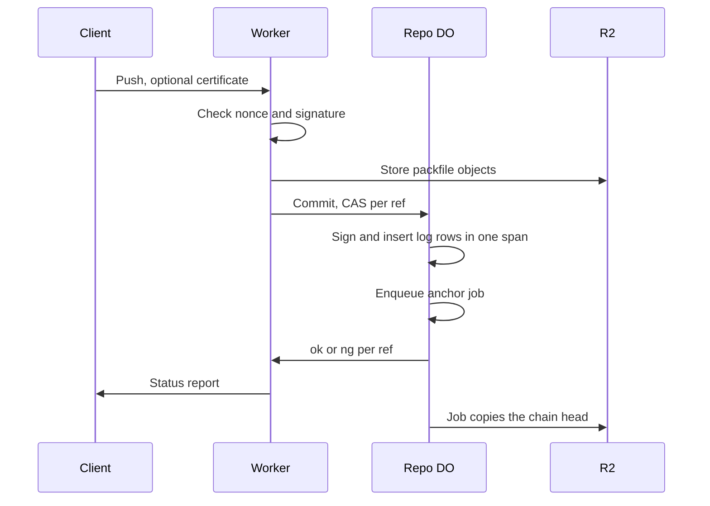

# Signed refs by default with append-only DO reflog

> Verdict: **lands with caveats** · feasibility 4/5 · reliability 2/5 · correctness 3/5 · effort: weeks
> Read the words in [how-to-read.md](../findings/how-to-read.md). Engineers: [proof](../proofs/signed-reflog.md) · [review](../reviews/signed-reflog.md)

## What this idea is

Git is a tool that keeps every version of a set of files, and lets many people share those versions. A repository, or repo, is one project's full set of files and their history. A commit is one saved version of the files, with a note about what changed. A ref is a name that points at one commit. A branch is a ref. A tag is a ref.

A push is sending your new commits to the server. A reflog is a log of every move of a ref: which ref, from which commit, to which commit, and when. Cloudflare Workers are small programs that run on Cloudflare's network close to the user, with no server to manage. A Durable Object, or DO, is a single small program with its own storage that handles one thing at a time. There is one DO for each repo. Think of it like the one librarian who is allowed to update the catalog.

Today a server can change or delete the record of a ref move, and nobody can tell. This idea writes one row to a log for every ref move, in the same database step as the move itself. Each row carries a fingerprint that includes the previous row, and a signature made with a key that belongs to the repo. A changed, removed, or inserted row breaks the chain, so anyone can detect tampering.

Think of it like this. A ship's logbook has numbered pages. Each entry starts by copying a short summary of the entry before, and the captain signs each line. A torn page or a changed line is visible to anyone who reads the book.

## How it works

The second pass writes the design in Rust, against one shared contract that every idea in this set follows. Wasm, or WebAssembly, is a way to run code from other languages, such as Rust, inside a Worker. DO SQLite is the small database inside each Durable Object.

1. The Worker receives a push. The ref commands arrive as pkt-lines. A pkt-line is git's way of framing a message. Each line starts with four characters that give its length.
2. For a signed push, git sends the certificate block before any command line. The ref commands sit inside the certificate body. The Worker pulls the commands out of the body, as git's own server does.
3. The Worker streams the packfile to R2. A packfile, or pack, is one bundle that holds many objects, squeezed to save space. An object is one stored item in git. An object is a file's content, a folder listing, or a commit. R2 is Cloudflare's large file store. It holds the git objects.
4. When a certificate arrives, the Worker checks the nonce. A nonce is a one-time number the client must send back. The nonce is a timestamp plus a stamp made from a secret seed, so the check needs no stored row and two advertisements cannot collide. When the repo lists allowed signing keys, the Worker also checks the SSH signature. A failed check ends the push with a report that marks every ref ng, and the DO stores the raw certificate on the push row.
5. The Worker calls commit on the repo DO. The DO does a compare-and-swap on each ref inside one sync span. Compare-and-swap, or CAS, means change a value only if it still has the value you expect. If someone changed it first, do nothing and report it. A sync span is one stretch of code with no waits, so no other request can run in the middle.
6. For each ref that moved, the DO builds a text line inside the same span. The line holds the ref name, the old and new commits, the push id, the pusher, the time, and the previous row's fingerprint. The DO takes a SHA-256 fingerprint of the line. A SHA, or hash, is a fingerprint of an object's content. Two objects with the same content have the same fingerprint.
7. The DO signs the fingerprint with an Ed25519 key and inserts the row. Ed25519 is a standard way to sign a value, so anyone with the public key can check the signature. The seed of the key lives in DO SQLite, and the DO mints the seed on first use. Signing is plain Rust math with no waits, so the chain head cannot move between the read and the write.
8. A database rule says the previous fingerprint must be unique. A leftover fork becomes an error, and the error discards the whole span. No ref can move without a signed row.
9. Database triggers refuse any update or delete on the log table, so normal code can only add rows.
10. When a ref moves, the same span enqueues an anchor job. A job is a short task the DO runs later from a queue. The job writes two files to R2. One file is a fixed copy of the latest row. The head file names the latest row and the public key.
11. When the head file names a different public key, the job sets a broken flag instead of writing. The flag makes every later commit fail. A wiped DO that mints a new key cannot keep signing on a new chain.
12. A web request to the reflog path returns one page of the chain plus the public key of the repo. The caller picks a starting row and a page size. Anyone can fetch the chain in pieces and check the chain offline.

## What the reviewer decided

The reviewer looks for blockers and caveats. A blocker is a problem that stops the idea from working until it is fixed. A caveat is a limit or a condition. The idea works, but only inside this limit.

The verdict is Lands with caveats.

| Score | Value |
|---|---|
| Feasibility | 4 of 5 |
| Reliability | 4 of 5 |
| Correctness | 3 of 5 |

| Score | First pass | Second pass |
|---|---|---|
| Feasibility | 4 of 5 | 4 of 5 |
| Reliability | 2 of 5 | 4 of 5 |
| Correctness | 3 of 5 | 3 of 5 |

Lands with caveats. The idea is sound and can be built. The proof has one or more problems that must be fixed first, and the reviewer described each fix. Think of it like a flight with a runway that needs some repairs before you land. The runway is there. The repairs are known.

For this idea, the second pass improved. Reliability moved from 2 of 5 to 4 of 5, and feasibility and correctness held. Both first-pass blockers are closed in the design. Signing now runs inside the commit step with no waits, so the two-pushes collision cannot happen again. The parser now follows the real order git uses for a signed push.

Correctness stayed at 3 of 5 because two one-line bugs still make every signed push fail. The remaining work is implementation detail: two small fixes, one code move into the shared wire module, one unregistered secret, and one contract line.

## What changed in the second pass

- Two pushes at the same time both passed the CAS: fixed. Signing is synchronous Rust inside the commit step's one span, with no waits. The input gate never opens between the read of the last row and the write. A unique rule on the previous fingerprint turns any leftover fork into an error that discards the whole span.
- A signed push was parsed in the wrong shape: partly fixed. The design now reads the certificate block first and pulls the commands out of the certificate body, the way git sends a signed push. Two one-line bugs in the new code still reject every real certificate, and the bugs are the new blockers below.
- The certificate checker was only declared: partly fixed. The code now checks an SSH signature end to end, but a decode bug stops the check before the check runs. Certificates made with GPG and repos with no key list stay stored but unchecked.
- The key sat beside the log, and the copies in R2 could be overwritten: partly fixed. The head copy now carries the public key, and a mismatch sets a broken flag that fails every later commit. The seed still sits in DO storage and the copies can still be overwritten. The log detects tampering but does not prevent tampering.
- The alarm was armed outside the transaction: partly fixed. The anchor job is now a row write inside the commit step, so a crash leaves a queued job that a later run picks up. A push that lands while an anchor job is running can still lose the job's re-arm until the next push.
- The reflog request had no paging, no key id, and a stored nonce: fixed. The request now returns one page at a time, every row carries a key id, and the nonce is a stateless stamp that costs no storage write.

## Problems that must be fixed first

### Problem 1: The certificate parser rejects the last line of every certificate

**What goes wrong.** The parser splits the certificate body on line breaks. Every real certificate ends with a line break, so the split produces one empty item at the tail. The parser treats the empty item as a broken command and returns an error. Every signed push fails inside the header parse.

**Why it matters.** The design is right but the code rejects the exact input git sends. A normal git push with the signed option fails every time. That is the case the idea exists for.

**How to fix it.** Skip empty lines when the body is split, or trim the last line break first. The fix is one line.

### Problem 2: The signature check feeds the marker line to the decoder

**What goes wrong.** The check cuts the armored signature starting at the begin marker, so the cut text includes the marker line itself. The base64 decoder rejects the dashes. Every SSH-signed certificate errors out before the check runs. The bug only bites when a repo lists allowed keys, which is the only case where the check matters.

**Why it matters.** A repo that configures allowed signers rejects every signed push. That is the main case the feature exists for.

**How to fix it.** Start the decode after the marker line's own line break. The fix is one line.

### Problem 3: The pieces do not compile together

**What goes wrong.** The certificate type and the body parser live in the edge code, but the shared wire module must name the certificate type. The contract forbids the wire module from importing edge code. The check function wants raw key bytes and the begin step returns key text, with no convert step between the two. The width of the random seed function is pinned nowhere.

**Why it matters.** Rust code with mismatched types does not compile. Nothing in this idea can build or be tested until the signatures agree.

**How to fix it.** Move the certificate type and the body parser into the wire module. Decode each allowed key once before the check. Pin the random seed function to return 32 bytes.

## Things to know

- A push that lands while an anchor job is running loses the job's re-arm. The newest rows then wait for the next push before a copy reaches R2. When the platform kills the job mid-run, the job row stays marked running forever, and every later anchor is skipped.
- The broken flag has no way to be cleared. Once set, the repo refuses every push forever, even when the flag came from a mistake such as an old head file put back by hand. The repo needs an operator procedure before this ships.
- A rejected certificate leaves the push row open until the push times out, and the early report does not drain the client's request body. On some connections the client sees a reset instead of the report.
- The four new Rust crates are outside the checked dependency list. All four are plain math and are expected to build for Wasm on day one, but the build is unverified. The signing crate must keep its default features so no random source is pulled in.
- The new log columns have no default value, and the unique rule cannot be added to a table that already has rows. A fresh repo is fine. An existing deployment must rebuild the table or add defaults.
- The key id is always 1, and the reflog request returns only the current public key. Key rotation is possible but the tooling stays out of scope. Several small pieces are unverified at run time, including the database triggers, the JSON path to the DO, and the random source binding.

## How this idea connects to the others

- The commit step and the compare-and-swap on refs come from [#1 One Durable Object per repo as the ref authority](./repo-do-ref-authority.md).
- The log table and the push rows live in DO SQLite, and the objects live in R2, as in [#2 Refs in DO SQLite, objects in R2](./refs-sqlite-objects-r2.md).
- The push that moves the refs is the push from [#6 Two-phase push](./two-phase-push.md).
- The certificate parsing and the pkt-line code build on [#53 The /info/refs?service= entrypoint and pkt-line codec](./info-refs-endpoint.md).
- The pusher's name comes from the login layer in [#54 Auth and multi-tenancy: owner/repo routing to DO ids](./auth-and-multitenancy.md).
- The copies in R2 could live in a bucket that keeps old versions, as in [#21 Snapshots via R2 object versioning of ref state](./r2-versioned-snapshots.md).
