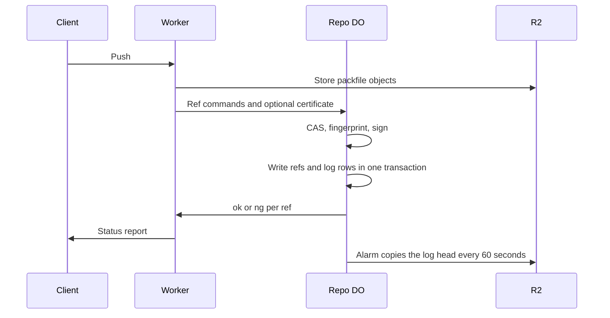

# Signed refs by default with append-only DO reflog

> Verdict: **lands with caveats** · feasibility 4/5 · reliability 2/5 · correctness 3/5 · effort: weeks
> Read the words in [how-to-read.md](../findings/how-to-read.md). Engineers: [proof](../proofs/signed-reflog.md) · [review](../reviews/signed-reflog.md)

## What this idea is

Git is a tool that keeps every version of a set of files, and lets many people share those versions. A repository, or repo, is one project's full set of files and their history. A commit is one saved version of the files, with a note about what changed. A ref is a name that points at one commit. A branch is a ref. A tag is a ref.

A push is sending your new commits to the server. A reflog is a log of every move of a ref: which ref, from which commit, to which commit, and when. Cloudflare Workers are small programs that run on Cloudflare's network close to the user, with no server to manage. A Durable Object, or DO, is a single small program with its own storage that handles one thing at a time. There is one DO for each repo. Think of it like the one librarian who is allowed to update the catalog.

Today a server can change or delete the record of a ref move, and nobody can tell. This idea writes one row to a log for every ref move, in the same database step as the move itself. Each row carries a fingerprint that includes the previous row, and a signature made with a key that belongs to the repo. A changed, removed, or inserted row breaks the chain, so anyone can detect tampering.

Think of it like this. A ship's logbook has numbered pages. Each entry starts by copying a short summary of the entry before, and the captain signs each line. A torn page or a changed line is visible to anyone who reads the book.

## How it works

1. The Worker receives a push. The Worker reads the ref commands, which arrive as pkt-lines, and streams the packfile to R2. A pkt-line is git's way of framing a message. Each line starts with four characters that give its length. A packfile, or pack, is one bundle that holds many objects, squeezed to save space. An object is one stored item in git. An object is a file's content, a folder listing, or a commit. R2 is Cloudflare's large file store. It holds the git objects.
2. The Worker calls the repo DO with the ref commands. If the client used git push with the signed option, the Worker also passes the push certificate.
3. The DO checks each ref with a compare-and-swap. Compare-and-swap, or CAS, means change a value only if it still has the value you expect. If someone changed it first, do nothing and report it.
4. For each ref that passes, the DO builds a text line. The line holds the ref name, the old commit, the new commit, the pusher, the time, and the previous row's fingerprint. The DO takes a SHA-256 fingerprint of that text. A SHA, or hash, is a fingerprint of an object's content. Two objects with the same content have the same fingerprint.
5. The DO signs the fingerprint with an Ed25519 key that lives in DO SQLite. DO SQLite is the small database inside each Durable Object. The DO creates the key on first use.
6. In one database transaction, the DO updates the refs and inserts one log row per moved ref.
7. Database triggers refuse any update or delete on the log table, so normal code can only add rows.
8. Every 60 seconds an alarm copies the latest row's number, fingerprint, and signature to R2. An alarm is a timer inside a Durable Object. A DO has only one alarm at a time. The copy makes a wiped or rewritten log detectable.
9. A web request to the reflog path returns the chain and the repo's public key, so anyone can check the chain offline.

## What the reviewer decided

The reviewer's verdict is Lands with caveats.

| Score | Value |
|---|---|
| Feasibility | 4 of 5 |
| Reliability | 2 of 5 |
| Correctness | 3 of 5 |

Lands with caveats. The idea is sound and can be built. The proof has one or more problems that must be fixed first, and the reviewer described each fix. Think of it like a flight with a runway that needs some repairs before you land. The runway is there. The repairs are known.

For this idea, the reviewer says the signed and chained log is sound. The log row lands in the same transaction as the ref move, and the copy to R2 is cheap. Every Cloudflare feature the proof uses is GA. GA, or generally available, means a Cloudflare feature that is finished and supported, not a preview. Anyone can check the chain offline.

But the proof code has two blockers. A blocker is a problem that stops the idea from working until it is fixed. Two pushes at the same time can both pass the CAS, which breaks the promise the whole design rests on. The input gate is the rule that a Durable Object handles one request at a time while it waits on its own storage. The gate opens when the DO waits on the network instead. The proof relies on the gate while the DO waits on something that is not storage.

The described handling of a signed push does not match what git sends, so a normal git push with the signed option would fail. The reviewer says both fixes take days. Full checking of push certificates adds one to two weeks, partly because GPG certificates need a library that runs in Wasm. Wasm, or WebAssembly, is a way to run code from other languages, such as Rust, inside a Worker.

The idea also has caveats. A caveat is a limit or a condition. The idea works, but only inside this limit.

## Problems that must be fixed first

### Problem 1: Two pushes at the same time both pass the CAS

**What goes wrong.** The proof reads the current ref and the last log row, then waits for the signing function, then writes in a transaction. The signing function is not storage, so the input gate opens while the DO waits for it. A second push then runs, reads the same old ref and the same last row, and also passes the CAS. Both pushes commit.

**Why it matters.** The second push silently overwrites the first ref move, and the first pusher never hears "fetch first". The log now has two rows that point at the same previous row. The chain has forked, and a row-by-row check accepts both rows. The design promises exactly the opposite.

**How to fix it.** Read the current ref and the last log row again inside the transaction, and stop on any change. Or add a database rule that the previous fingerprint must be unique, so a fork becomes an error. Or make each push wait for the one before it inside the DO.

### Problem 2: A signed push is parsed in the wrong shape

**What goes wrong.** When the server offers push certificates, git does not send the ref commands first. The first pkt-line is the word push-cert plus the client's feature list. The ref commands come after that, inside the certificate body, followed by a push-cert-end line. The proof describes a parser that expects a ref command on the first line. That parser sees push-cert as a broken command and rejects the push.

**Why it matters.** A normal git push with the signed option would fail every time. That is the exact case the idea exists for.

**How to fix it.** Read the push-cert line first. Then read the ref commands from inside the certificate body, as git's own server does.

## Things to know

- The function that checks a push certificate is only declared, so signed pushes are checked for the one-time nonce but not for the signature. Certificates made with GPG need an OpenPGP library that runs in Wasm.
- The signing key sits beside the log, the append-only rule binds only normal code, and the copies in R2 can be overwritten. The log shows tampering but does not prevent tampering, and a wiped DO silently creates a new key.
- The alarm is set outside the transaction, and only when rows were written. A crash between the commit and the alarm leaves the repo with no copy in R2 for as long as no new push arrives.
- The reflog web request has no paging, and there is no key id column for key rotation. The nonce code writes to storage on every push advertisement and can collide with a push.

## How this idea connects to the others

The log rows are written by the single ref owner from [#1 One Durable Object per repo as the ref authority](./repo-do-ref-authority.md).

The refs and the log live in DO SQLite, and the objects live in R2, as in [#2 Refs in DO SQLite, objects in R2](./refs-sqlite-objects-r2.md).

The push that moves the refs is the push from [#6 Two-phase push](./two-phase-push.md).

The pusher's name comes from the login layer in [#54 Auth and multi-tenancy: owner/repo routing to DO ids](./auth-and-multitenancy.md).

The copies in R2 could live in a bucket that keeps old versions, as in [#21 Snapshots via R2 object versioning of ref state](./r2-versioned-snapshots.md).
