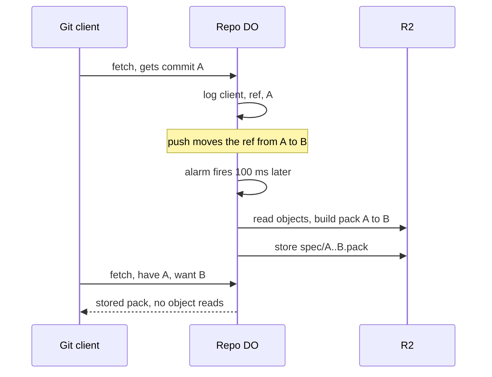

# Speculative packs

> Verdict: **risky** · feasibility 3/5 · reliability 4/5 · correctness 2/5 · effort: weeks
> Read the words in [how-to-read.md](../findings/how-to-read.md). Engineers: [proof](../proofs/speculative-packs.md) · [review](../reviews/speculative-packs.md)

## What this idea is

Git is a tool that keeps every version of a set of files, and lets many people share those versions. A commit is one saved version of the files, with a note about what changed. A fetch is getting commits from the server. A clone gets everything for the first time.

When a client fetches, the server writes down which commit it handed out. When that branch later moves, the server predicts the client's next fetch. A branch is a named line of commits, like a bookmark that moves forward as you save.

The prediction is exact, because git itself decides what the client sends next. The client will say "I have the old tip" and "I want the new tip". So the server builds that packfile ahead of time, in a timer, and stores the pack. A packfile, or pack, is one bundle that holds many objects, squeezed to save space. An object is one stored item in git. An object is a file's content, a folder listing, or a commit.

The next matching fetch is answered from the stored pack with no other work.

Think of it like this. A bakery notes that a regular customer buys the same loaf every morning. The baker bakes that loaf before the customer arrives. If a different customer comes in, the baker bakes to order as usual.

## How it works

1. The repo's Durable Object answers a fetch and logs the client, the ref, and the delivered commit in DO SQLite. A repository, or repo, is one project's full set of files and their history. A Durable Object, or DO, is a single small program with its own storage that handles one thing at a time. There is one DO for each repo. Think of it like the one librarian who is allowed to update the catalog. A ref is a name that points at one commit. A branch is a ref. A tag is a ref. DO SQLite is the small database inside each Durable Object.
2. A push moves the ref from commit A to commit B. A push is sending your new commits to the server. The DO records the move and sets an alarm 100 milliseconds out. An alarm is a timer inside a Durable Object. A DO has only one alarm at a time.
3. The alarm finds the most common delivered commits for that ref over the last 7 days, at most 8 of them.
4. For each old commit A, the DO builds the pack from A to B once. The DO walks the commit graph in DO SQLite, then reads each object from R2 with one range read. R2 is Cloudflare's large file store. It holds the git objects.
5. The DO stores the pack in R2 under "spec/A..B.pack". When the pack is 4 MB or smaller, the DO also stores the pack in 1 MB chunks in DO SQLite.
6. A later fetch that has A and wants B is answered from the stored pack. The DO wraps the pack in the fixed protocol v2 reply, with no object reads. Protocol v2 is the newer, cleaner set of messages git uses to talk to a server.
7. Any other fetch takes the normal path.

## What the reviewer decided

The reviewer looks for blockers and caveats. A blocker is a problem that stops the idea from working until it is fixed. A caveat is a limit or a condition. The idea works, but only inside this limit. The reviewer's verdict is "Risky."

| Score | Out of 5 |
|---|---|
| Feasibility | 3 |
| Reliability | 4 |
| Correctness | 2 |

Risky means the following. The idea can be built. But the proof shows one or more problems the reviewer could not fully solve, or it does a weaker version of the goal. Think of it like a runway you can see on the map, but nobody has checked it for holes.

For this idea, the core insight is sound. In protocol v2, the server can say "ready". The fetch reply is then a fixed wrapper around one pack that depends only on A and B. So building that pack ahead of time is legitimate. The worst failure is a normal miss, with no data loss and no case where two records disagree.

Every Cloudflare feature used is GA. GA, or generally available, means a Cloudflare feature that is finished and supported, not a preview.

But as written, the proof does not work with any real git client, because of a bug in the sideband framing. A sideband is a way to send two kinds of data in one stream, like a main channel and a progress channel. The stored pack is also looked up by the wrong key.

The pack build in the alarm hits a hard platform limit on subrequests. A subrequest is one call from a Worker to another service, such as one read from R2. Each request may make at most 1,000 subrequests. Cloudflare Workers are small programs that run on Cloudflare's network close to the user, with no server to manage.

The reviewer found three blockers and seven caveats. The reviewer expects weeks of work, and only after three other ideas exist. With the blockers fixed, the idea lands as a modest win for clients that track one branch and fetch full history. One blocker mentions pkt-lines. A pkt-line is git's way of framing a message. Each line starts with four characters that give its length.

One caveat mentions the input gate. The input gate is the rule that a Durable Object handles one request at a time while it waits on its own storage. The gate opens when the DO waits on the network instead. Another caveat mentions SHA-1. A SHA, or hash, is a fingerprint of an object's content. Two objects with the same content have the same fingerprint.

## Problems that must be fixed first

### Problem 1: Every reply breaks git

**What goes wrong.** The sideband writer emits an empty pkt-line, "0004", before every data frame. The proof calls that line a placeholder, but the line is in the real reply path. Git reads an empty frame as a protocol error, "no band designator", and stops. Every hit reply and every miss reply fails.

**Why it matters.** No normal git command can get data from this server while the bug exists. A normal git fetch fails, and a normal git clone fails.

**How to fix it.** Remove the empty pkt-line placeholder. Emit each frame as its length, the band byte, and the data.

### Problem 2: The lookup uses only the first wanted commit

**What goes wrong.** The lookup keys on the first commit the client wants. A default git fetch wants every branch that moved. The stored pack covers only one branch. The client accepts the pack, then checks that all objects arrived and fails with "remote did not send all necessary objects".

**Why it matters.** A normal git fetch fails whenever more than one branch moved. Only a client that tracks exactly one branch gets a correct answer.

**How to fix it.** Key the lookup on the full sorted set of wanted commits. Or serve a stored pack only when the client wants exactly that one commit.

### Problem 3: Building a pack exceeds the subrequest limit

**What goes wrong.** The alarm reads each object with one R2 range read. Each of those reads is a subrequest, and an alarm run counts as one request. A pack with more than 1,000 objects throws an error in the middle of the build.

**Why it matters.** Any large ref move cannot be built ahead of time. The failure is not clean either, because the failure happens in the middle of the build.

**How to fix it.** Merge neighbouring ranges into fewer reads, using the pack index. Then one read covers many objects.

## Things to know

- A protocol v2 fetch carries no ref names and no client identity. The ref must come from matching the wanted commit against the refs table, and the client identity from the login or IP address.
- Shallow fetches and partial fetches must bypass the stored packs. That rule removes most CI runners, which fetch with depth 1, so mirrors and agent DOs are the real beneficiaries.
- The miss path always sends an acknowledgment section with "ready", even with no matches. When no common base was found and the client did not send "done", the server must send NAK and a flush instead.
- The input gate does not keep the alarm's R2 waits apart from fetches and pushes, and the alarm deletes every pending row for the ref. So a newer move inserted during the build is silently dropped, and the fix is to delete by ref and new commit.
- Building a 32 MB pack makes two or three copies in memory, close to the 128 MB DO limit. The cap must drop to about 10 MB, and the alarm must build one pack per run and then set itself again.
- Joining two stored packs, A to B and B to C, is claimed but is not in the code. The claim is plausible, but the join costs a full SHA-1 pass over both packs.
- The whole value depends on the negotiation idea, the pack index from the pack parser, and the ref-moved hook from two-phase push. The pack builder itself is a stub.

## How this idea connects to the others

This idea needs [#56 Want/have negotiation with a commit-graph in SQLite](./want-have-negotiation.md), because the commit walk that picks the objects for A to B comes from there.

This idea needs [#4 Packfile parsing in a Worker with a streaming inflater](./streaming-pack-parser.md), because the pack index that maps an object to an R2 range comes from there.

This idea needs [#2 Refs in DO SQLite, objects in R2](./refs-sqlite-objects-r2.md), because refs live in the DO and objects live in R2.

This idea needs [#1 One Durable Object per repo as the ref authority](./repo-do-ref-authority.md), because that DO sees every ref move and every fetch.

This idea needs [#3 Speak git protocol v2 only, translate v0 at the edge](./protocol-v2-only.md), because the fixed reply shape exists only in protocol v2.

This idea needs [#6 Two-phase push](./two-phase-push.md), because the ref-moved hook after the ref update starts the alarm.
