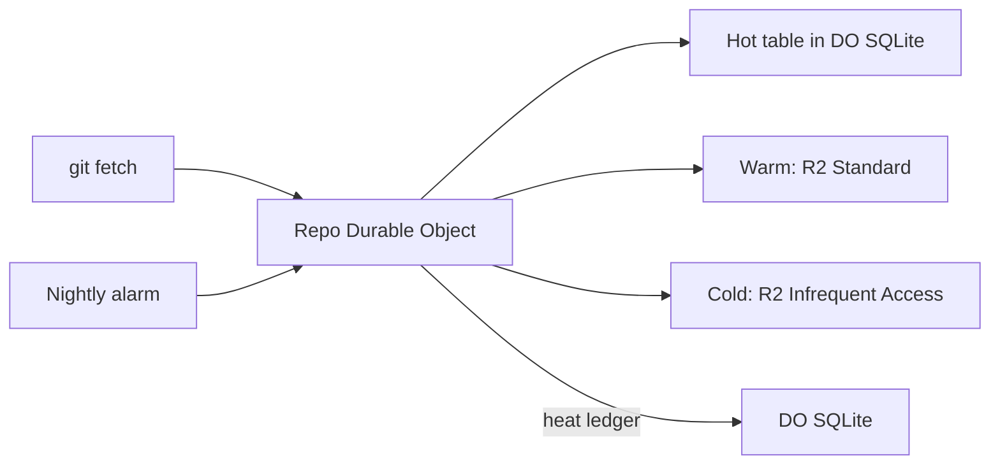

# Storage tiering by heat

> Verdict: **lands with caveats** · feasibility 4/5 · reliability 3/5 · correctness 3/5 · effort: weeks
> Read the words in [how-to-read.md](../findings/how-to-read.md). Engineers: [proof](../proofs/storage-tiering.md) · [review](../reviews/storage-tiering.md)

## What this idea is

git is a tool that keeps every version of a set of files, and lets many people share those versions. A repository is one project's full set of files and their history. This idea sorts the stored pieces of a repository by how often people read them. Pieces that people read often stay in fast storage that costs more. Pieces that nobody has read for a long time move to slow storage that costs less.

Think of it like this. A kitchen keeps salt and oil on the counter, flour in the cupboard, and the holiday cake tins in the attic. You reach for the counter many times a day. You climb to the attic once a year.

## How it works

1. A commit is one saved version of the files, with a note about what changed. An object is one stored item in git. An object is a file's content, a folder listing, or a commit.
2. R2 is Cloudflare's large file store. It holds the git objects. Every object stays in R2 for good. R2 holds the one true copy.
3. A SHA, also called a hash, is a fingerprint of an object's content. Two objects with the same content have the same fingerprint. Each object in R2 is content-addressed. Content-addressed means stored under its own fingerprint, so the name tells you what is inside.
4. A Durable Object, or DO, is a single small program with its own storage that handles one thing at a time. There is one DO for each repo. Think of it like the one librarian who is allowed to update the catalog. DO SQLite is the small database inside each Durable Object. The DO keeps a heat ledger in DO SQLite. The ledger records when each object was last read, and how many times.
5. Fetch means getting commits from the server. A clone gets everything for the first time. Every read for a fetch goes through the DO, and the DO updates the ledger on each read. A packfile is one bundle that holds many objects, squeezed to save space. The DO serves each read from one of three places.
6. Hot place. Packfile entries under 512 KB that people read go into a hot table in DO SQLite. Entries are stored in packfile form, so the DO can copy them straight into a fetch reply. Some entries are deltas. A delta is a stored object written as "the same as that other object, with these changes".
7. Warm place. The DO reads the object from R2 at the standard price.
8. Cold place. The DO reads the object from R2 at the Infrequent Access price, which is lower for storage. The read call is the same as for warm. There is no wait to restore a cold object.
9. An alarm is a timer inside a Durable Object. A DO has only one alarm at a time. Once a night, the alarm runs a nightly job. The nightly job deletes hot rows that nobody has read for a while. R2 still has the bytes, so the delete is safe.
10. The nightly job also moves large packfiles to cold storage. Only packfiles of 1 MB or more, untouched for 45 days, move. The nightly job handles at most 50 packfiles a night.
11. Cloudflare Workers are small programs that run on Cloudflare's network close to the user, with no server to manage. The Workers tool for R2 has no call to copy an object or change its storage class. So to move a packfile, the DO reads the whole packfile from R2 and writes it back as cold.
12. If a cold packfile is read three times in one hour, the DO writes it back as warm. Infrequent Access bills each object for at least 30 days. The three-reads rule stops packfiles from moving back and forth.

## What the reviewer decided

The reviewer decided that this idea lands with caveats.

| Score | Value |
|---|---|
| Feasibility | 4 of 5 |
| Reliability | 3 of 5 |
| Correctness | 3 of 5 |

Feasibility asks if Cloudflare can run the idea today. Reliability asks if the idea keeps data safe when things fail. Correctness asks if the idea does what its title says.

Lands with caveats. The idea is sound and can be built. The proof has one or more problems that must be fixed first, and the reviewer described each fix. Think of it like a flight with a runway that needs some repairs before you land. The runway is there. The repairs are known.

A blocker is a problem that stops the idea from working until it is fixed. A caveat is a limit or a condition. The idea works, but only inside this limit. For this idea, the reviewer found two blockers and six caveats.

R2 keeps the only true copy, so the idea cannot lose repository data. GA means a Cloudflare feature that is finished and supported, not a preview. Every Cloudflare feature the proof uses is GA. But the proof code has two bugs that stop the nightly job from working as written. The reviewer expects the fixes to take weeks.

## Problems that must be fixed first

### Problem 1: The nightly job gets stuck

**What goes wrong.** The nightly job picks a packfile, reads the packfile from R2, and writes the packfile back as cold. Then the nightly job updates the ledger. If the DO crashes between the write and the ledger update, R2 says cold and the ledger says warm. The alarm runs again. The code sees that R2 already has the cold class, and returns early without updating the ledger. The nightly job picks its 50 packfiles with no order and no rule to skip stuck ones, so the same packfiles come up every night.

**Why it matters.** Once 50 stuck packfiles exist, no other packfile ever moves to cold storage again. The savings stop for the whole repository. The ledger no longer matches the truth in R2. The stuck packfiles also never count as cold, so the rule that moves cold packfiles back to warm cannot see them.

**How to fix it.** Update the ledger before the early return. Order the nightly job by last read time. Page through the list so the same keys are not picked twice.

### Problem 2: Moving a large packfile does not fit inside an alarm

**What goes wrong.** The Workers tool for R2 has no call to copy an object or change its storage class. So the DO streams the whole packfile through itself, with one read and one write. A packfile can be 1 GB. An alarm must finish inside 15 minutes of clock time. Fifty packfiles of that size per night cannot fit.

**Why it matters.** Large packfiles are the only objects the idea moves to cold storage. If the move cannot run, the idea saves nothing.

**How to fix it.** Use the S3 copy call with a storage class header from a plain Worker. That call needs signed credentials inside the Worker. The proof only mentions this path in passing, so the path must be built.

## Things to know

- The proof achieves a weaker version of the idea, with a 512 KB read cache and only packfiles of 1 MB or more going cold. Single small objects never move, because the proof's own cost sums show that moving them loses money.
- Infrequent Access is no longer a preview, so the proof is out of date on that point. But Infrequent Access bills each object for at least 30 days, so a packfile that moves back and forth costs extra money.
- GC is a background task that deletes files nobody points to anymore. The nightly job can read a packfile, GC can delete that packfile, and then the nightly job writes the packfile back as cold. The deleted packfile is now a billed cold file with no ledger row. The single DO does not prevent this collision, because both alarms pause while they wait on R2.
- The heat ledger lives only in DO SQLite. If the DO is rebuilt from R2, the ledger is empty and every object counts as warm. The rescan that would rebuild the ledger is not written.
- Adding an entry to the hot table happens on every read, with no cap on total bytes. One `git log -p` command, which prints every past change, churns the hot table.
- Delta entries that find their base by a distance inside the old packfile break when copied into a new packfile. A normal git fetch then fails. Entries must name their base by fingerprint instead. Also, one R2 read per object on a large fetch stalls the download for minutes, so some git clients and proxies give up.

## How this idea connects to the others

This idea needs [#5 Content-addressed R2 keys](./content-addressed-r2-keys.md), because writing the same bytes back to the same key is then safe to repeat.

This idea needs [#2 Refs in DO SQLite, objects in R2](./refs-sqlite-objects-r2.md), which puts every object in R2 as the one true copy.

This idea needs [#1 One Durable Object per repo as the ref authority](./repo-do-ref-authority.md), which gives the single DO that keeps the heat ledger.

This idea needs [#9 Tiny in-DO object cache with alarm-driven eviction](./in-do-object-cache.md), which is the cache design the hot table copies.

This idea needs [#7 Precomputed pack slices for clone](./precomputed-clone-pack.md), which builds the large packfiles that this idea moves to cold storage.

This idea needs [#55 GC and repack as a DO alarm](./gc-and-repack-alarm.md), which deletes unused objects, and whose alarm can collide with the nightly job here.
