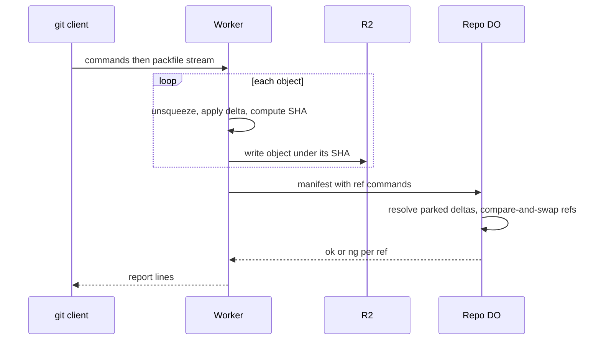

# Packfile parsing in a Worker with a streaming inflater

> Verdict: **lands with caveats** · feasibility 4/5 · reliability 3/5 · correctness 3/5 · effort: weeks
> Read the words in [how-to-read.md](../findings/how-to-read.md). Engineers: [proof](../proofs/streaming-pack-parser.md) · [review](../reviews/streaming-pack-parser.md)

## What this idea is

git is a tool that keeps every version of a set of files, and lets many people share those versions. A repository, or repo, is one project's full set of files and their history. A commit is one saved version of the files, with a note about what changed. A branch is a named line of commits, like a bookmark that moves forward as you save.

A ref is a name that points at one commit. A branch is a ref. A tag is a ref.

An object is one stored item in git. An object is a file's content, a folder listing, or a commit. A push is sending your new commits to the server. A push arrives as one packfile. A packfile is one bundle that holds many objects, squeezed to save space.

This idea reads the packfile while the bytes still arrive, one object at a time. Each object is unsqueezed, given its SHA, and written to R2. A SHA is a fingerprint of an object's content. Two objects with the same content have the same fingerprint. R2 is Cloudflare's large file store. It holds the git objects.

Only after every object is stored does the server move the refs.

Think of it like this. A parcel truck arrives with one long roll of shrink-wrapped boxes. A worker cuts one box free, unwraps it, labels it, and shelves it before cutting the next one. The worker never needs a table large enough for the whole roll.

## How it works

Cloudflare Workers are small programs that run on Cloudflare's network close to the user, with no server to manage. A delta is a stored object written as "the same as that other object, with these changes".

1. A push arrives at a Worker. The Worker reads the command lines, which are pkt-lines. A pkt-line is git's way of framing a message. Each line starts with four characters that give its length.
2. The Worker then walks the packfile object by object. Each object starts with a small header that gives its type and its size.
3. The Worker unsqueezes one object at a time. The web DecompressionStream cannot do that, because it cannot say where one object ends. The proof uses inflateSync from node:zlib instead, which reports how many bytes it consumed.
4. If the object is a delta, the Worker applies the delta to its base object. Deltas whose base is not yet known are parked in a pending folder in R2.
5. The Worker computes the SHA of each finished object and writes the object to R2 under that SHA.
6. The Worker sends a small manifest to the repo's Durable Object. A Durable Object, or DO, is a single small program with its own storage that handles one thing at a time. There is one DO for each repo. Think of it like the one librarian who is allowed to update the catalog.
7. The DO resolves the parked deltas and moves each ref with a compare-and-swap in one transaction in DO SQLite. Compare-and-swap, or CAS, means change a value only if it still has the value you expect. If someone changed it first, do nothing and report it. DO SQLite is the small database inside each Durable Object.
8. The DO sets an alarm to clean the pending folder. An alarm is a timer inside a Durable Object. A DO has only one alarm at a time. The Worker sends the report lines back to git.

## What the reviewer decided

The reviewer looks for blockers and caveats. A blocker is a problem that stops the idea from working until it is fixed. A caveat is a limit or a condition. The idea works, but only inside this limit.

The verdict is Lands with caveats.

| Score | Value |
|---|---|
| Feasibility | 4 of 5 |
| Reliability | 3 of 5 |
| Correctness | 3 of 5 |

Lands with caveats. The idea is sound and can be built. The proof has one or more problems that must be fixed first, and the reviewer described each fix. Think of it like a flight with a runway that needs some repairs before you land. The runway is there. The repairs are known.

For this idea, the mechanism is sound and every building block is GA on Cloudflare today. GA, or generally available, means a Cloudflare feature that is finished and supported, not a preview. The proof is right that DecompressionStream cannot unsqueeze one object at a time, and the swap to node:zlib is correct. Whether node:zlib reports consumed bytes inside Workers is not yet verified, but a fallback exists.

The proof as written breaks on three points, and each fix takes under a day. The reviewer expects a working push server in about two weeks.

## Problems that must be fixed first

### Problem 1: A push with no packfile crashes the parser

**What goes wrong.** A push that only deletes a branch sends the command lines and then nothing. There is no packfile at all. The parser demands 12 bytes of pack header and throws "bad PACK header".

**Why it matters.** A normal git push that deletes a branch would fail. The client never receives the report lines.

**How to fix it.** After the command lines, check whether any bytes remain. If none remain, skip the pack parser and go straight to the ref update.

### Problem 2: The hash helper copies data through an array

**What goes wrong.** The sha1 helper joins the header and the body by spreading both into a JavaScript array. That copy uses about ten times the memory of the original bytes. A 10 MB file becomes about 100 MB of memory.

**Why it matters.** A Worker has 128 MB of memory. A normal git push that contains one file of a few MB would run out of memory and fail.

**How to fix it.** Create one byte array of the right size and copy the header and the body into it directly.

### Problem 3: Refs move without checking the tip exists

**What goes wrong.** The proof text says the DO checks that each new tip exists in R2. The code does not do that check. A cleanup task that treats the objects folder as loose files can delete objects of a push in progress. The push then moves the ref, and the ref points at deleted objects.

**Why it matters.** A ref that points at nothing breaks the repo. The next fetch of that branch fails. A fetch is getting commits from the server. A clone gets everything for the first time.

**How to fix it.** Ask R2 whether each new tip exists before moving the ref. Also refuse to move refs while the cleanup task holds the repo.

## Things to know

- The consumed-byte count from node:zlib was verified on Node 22, but not inside Workers. The fallback is a JavaScript unsqueezer such as pako or fflate, about one day of work.
- Workers cap the request body at 100 MB on Free and Pro plans, 200 MB on Business, and 500 MB on Enterprise. That cap limits push size before CPU does, and the proof leaves it out.
- A delta whose base was parked in the pending folder is stored with an empty base and can never be resolved. Such a delta is rare in packs that git makes, but one breaks every delta that builds on it.
- The Worker writes objects to R2 one after another and reads one base from R2 for each delta. A push of 10,000 objects takes minutes, so writes need bounded concurrency and a per-push cache of bases.
- When the unsqueeze window is too small, the Worker retries from the start of the object. That costs up to twice the CPU on large objects, so the CPU limit must be raised to its maximum of 300 seconds.
- The proof leaves out the checksum over the whole packfile. Cloudflare's DigestStream for SHA-1 solves that without holding the whole pack in memory.
- The cleanup alarm for the pending folder is set only when a push commits. A push that crashes before the manifest leaves pending files in place until a later push.
- The command parser and the pack parser each open their own reader on the body. Bytes the first parser read past the end of the commands are lost unless both parsers share one window.

## How this idea connects to the others

- The command parsing and the pkt-line code come from [#53 The /info/refs?service= entrypoint and pkt-line codec](./info-refs-endpoint.md).
- The object names in R2 come from [#5 Content-addressed R2 keys](./content-addressed-r2-keys.md).
- The pending folder, the manifest, and the cleanup alarm come from [#6 Two-phase push](./two-phase-push.md).
- The compare-and-swap on refs comes from [#1 One Durable Object per repo as the ref authority](./repo-do-ref-authority.md).
- The refs table and the object store come from [#2 Refs in DO SQLite, objects in R2](./refs-sqlite-objects-r2.md).
