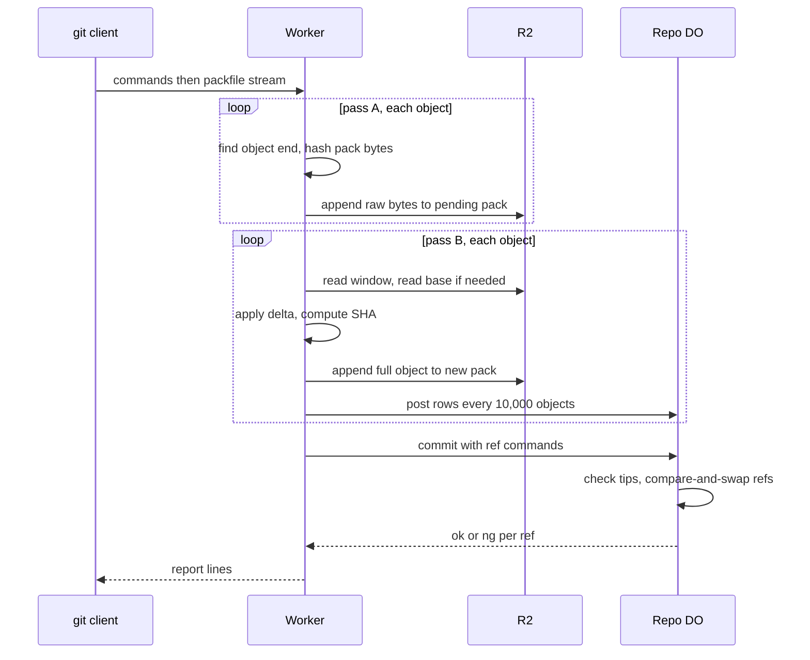

# Packfile parsing in a Worker with a streaming inflater

> Verdict: **lands with caveats** · feasibility 4/5 · reliability 3/5 · correctness 3/5 · effort: weeks
> Read the words in [how-to-read.md](../findings/how-to-read.md). Engineers: [proof](../proofs/streaming-pack-parser.md) · [review](../reviews/streaming-pack-parser.md)

## What this idea is

git is a tool that keeps every version of a set of files, and lets many people share those versions. A repository, or repo, is one project's full set of files and their history. A commit is one saved version of the files, with a note about what changed. A branch is a named line of commits, like a bookmark that moves forward as you save.

A ref is a name that points at one commit. A branch is a ref. A tag is a ref.

An object is one stored item in git. An object is a file's content, a folder listing, or a commit. A push is sending your new commits to the server. A push arrives as one packfile. A packfile is one bundle that holds many objects, squeezed to save space.

This idea reads the packfile while the bytes still arrive, one object at a time. The Worker saves the raw pack to R2 first, then reads it back and rebuilds every object in full. R2 is Cloudflare's large file store. It holds the git objects. Each finished object gets a SHA. A SHA is a fingerprint of an object's content. Two objects with the same content have the same fingerprint.

Only after every object is stored does the server move the refs.

Think of it like this. A parcel truck arrives with one long roll of shrink-wrapped boxes. A worker cuts one box free, unwraps it, labels it, and shelves it before cutting the next one. The worker never needs a table large enough for the whole roll.

## How it works

Cloudflare Workers are small programs that run on Cloudflare's network close to the user, with no server to manage. The second pass writes the parser in Rust and runs it as Wasm. Wasm, or WebAssembly, is a way to run code from other languages, such as Rust, inside a Worker. The parser follows a shared contract that every idea in this set uses. A delta is a stored object written as "the same as that other object, with these changes".

1. A push arrives at a Worker. The Worker reads the command lines, which are pkt-lines. A pkt-line is git's way of framing a message. Each line starts with four characters that give its length.
2. If no packfile follows the commands, the push goes straight to the ref update. The parser never starts.
3. Pass A reads the pack header and then walks the pack object by object. Each object starts with a small header that gives its type and its size.
4. Pass A finds where each squeezed object ends. A resumable unsqueezer from the gix-zlib library reports how many bytes it consumed, and its state survives waiting for more bytes. Nothing is unsqueezed twice.
5. While walking, pass A copies the raw bytes to R2 in 8 MiB parts and computes the checksum of the whole pack. It records the position and size of each object in a small list.
6. Pass A checks the 20-byte trailer against the checksum. A mismatch fails the push before anything is visible.
7. Pass B reads the saved pack back in 8 MiB windows. For each delta, pass B looks for the base object in a 48 MiB cache. On a miss, pass B reads the base back from the pack, or from the repo.
8. Pass B applies each delta with the gix-pack library and computes the SHA of the full object. It writes every object in full to a new pack in R2, so a reader never needs a base.
9. Every 10,000 objects, the Worker posts the rows to the repo's Durable Object. A Durable Object, or DO, is a single small program with its own storage that handles one thing at a time. There is one DO for each repo. Think of it like the one librarian who is allowed to update the catalog.
10. When both passes finish, the Worker asks the DO to commit. The DO checks that each new tip exists and moves each ref with a compare-and-swap. Compare-and-swap, or CAS, means change a value only if it still has the value you expect. If someone changed it first, do nothing and report it.
11. The Worker sends the report lines back to git. A crash at any step leaves nothing visible. A janitor deletes the leftovers later. A janitor is a background task that deletes files nobody points to anymore.

## What the reviewer decided

The reviewer looks for blockers and caveats. A blocker is a problem that stops the idea from working until it is fixed. A caveat is a limit or a condition. The idea works, but only inside this limit.

The verdict is Lands with caveats.

| Score | Value |
|---|---|
| Feasibility | 4 of 5 |
| Reliability | 3 of 5 |
| Correctness | 4 of 5 |

| Score | First pass | Second pass |
|---|---|---|
| Feasibility | 4 of 5 | 4 of 5 |
| Reliability | 3 of 5 | 3 of 5 |
| Correctness | 3 of 5 | 4 of 5 |

Lands with caveats. The idea is sound and can be built. The proof has one or more problems that must be fixed first, and the reviewer described each fix. Think of it like a flight with a runway that needs some repairs before you land. The runway is there. The repairs are known.

For this idea, the second pass is better than the first. Every library call was checked against the real source of the pinned Rust crates. The resumable unsqueezer removes the retry that could double CPU time. The pack checksum is now real code. The walk-throughs for a crash and for two pushes at once both hold under the contract's rules. No byte on the wire breaks git 2.43 to 2.47.

Two blockers remain. One is a memory problem in pass B that takes about a day to fix. The other is a set of four small changes that the shared contract must accept. The reviewer expects a working pack parser in two to three weeks.

## What changed in the second pass

- A push with no packfile crashes the parser. Fixed. The two-phase push code now checks for pack bytes before calling the parser. A push that only deletes a branch never enters the parser, and a pack with zero objects runs the loop zero times.
- The hash helper copies data through an array. Fixed. The Rust code hashes each chunk in place as the chunk arrives, and computes each object's SHA over the data without a copy. No JavaScript arrays exist.
- Refs move without checking the tip exists. Fixed. The repo DO code now looks up each new tip in the same step as the compare-and-swap. When a tip is absent, the DO refuses with "missing necessary objects". The DO also rejects the commit if the janitor ran in between.

## Problems that must be fixed first

### Problem 1: Pass B copies a large object four times

**What goes wrong.** The contract allows one object of up to 32 MiB. For one such object that does not squeeze, pass B holds four copies of 32 MiB at once. The window holds one, a copy of the entry holds one, the small synthetic pack holds one, and the output holds one. That is 128 MB before the 48 MiB cache and the output part are counted. With a delta on top, the base adds another copy.

**Why it matters.** A Worker has 128 MB of memory. The contract's own first-day test pushes one 32 MiB file with a delta. That test fails as written.

**How to fix it.** Pass a borrowed slice of the window into the delta step instead of a copy. Build the synthetic pack only for the base. Then either lower the object cap to 16 MiB or write the described cache adapter that lets gix-pack read the window directly. The fix takes about a day.

### Problem 2: Four changes to the shared contract must be accepted

**What goes wrong.** The proof deviates from the shared contract in four places. Pass B takes an extra parameter to post rows in batches. A new raw writer type and a budget parameter appear on the store functions. The base reader takes pairs of SHA and location instead of locations alone. Pass A does not use the contract's named iterator, because that iterator cannot wait for more body bytes mid-object.

**Why it matters.** Three of the four changes fix errors in the contract itself. A list of 2,000,000 rows cannot fit in memory. A location alone carries no SHA. The contract's claim about the iterator is false. But the proof cannot land against the contract file as it stands.

**How to fix it.** Write the four changes back into the contract. Update sections 1.2, 1.4, 2.4, and 6.4 so every sibling proof codes against the same signatures.

## Things to know

- The cache evicts the oldest entry first, not the least used. A thin pack with many deltas against one external base late in the pack re-reads that base once per miss. A thin pack is a packfile that contains deltas against objects the server already has.
- A crash mid-push leaves a half-finished multipart upload in R2, because only the dead Worker knew its upload id. An R2 lifecycle rule must abort such uploads after a set time.
- The pack row is inserted on the first row post, before the count and byte totals are known. The contract has no function to update those totals later.
- Each delta application re-squeezes the base at level 0, which costs a copy and a checksum of the base. A 30 MiB base with hundreds of deltas costs seconds of CPU. The fix is described, not written.
- Five things are not yet verified at runtime. They are level-0 squeeze on Wasm, the 5 MiB part rules of real R2, the subrequest ceiling, cold start, and the 128 MB joint bound. A subrequest is one call from a Worker to another service, such as one read from R2.
- The fixes for a delete-only push and for the tip check live in two other proofs. This idea depends on those proofs shipping the quoted lines.

## How this idea connects to the others

- The command parsing and the pkt-line code come from [#53 The /info/refs?service= entrypoint and pkt-line codec](./info-refs-endpoint.md).
- The pending pack, the row posts, and the commit step come from [#6 Two-phase push](./two-phase-push.md).
- The refs table and the pack store come from [#2 Refs in DO SQLite, objects in R2](./refs-sqlite-objects-r2.md).
- The compare-and-swap on refs and the tip check come from [#1 One Durable Object per repo as the ref authority](./repo-do-ref-authority.md).
- The janitor that deletes leftovers from a crashed push comes from [#55 GC and repack as a DO alarm](./gc-and-repack-alarm.md).
