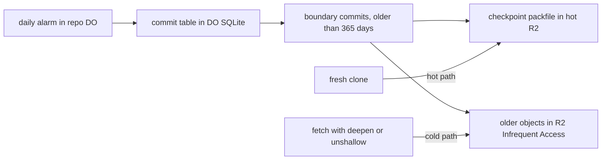

# Time-boxed history with cold-storage checkpoints

> Verdict: **lands with caveats** · feasibility 3/5 · reliability 3/5 · correctness 3/5 · effort: weeks
> Read the words in [how-to-read.md](../findings/how-to-read.md). Engineers: [proof](../proofs/time-boxed-history.md) · [review](../reviews/time-boxed-history.md)

## What this idea is

Git is a tool that keeps every version of a set of files, and lets many people share those versions. A commit is one saved version of the files, with a note about what changed. Old projects carry years of commits, and a new clone must download all of them. A fetch is getting commits from the server. A clone gets everything for the first time. The idea as stated was to squash commits older than one year into a few checkpoints. That is impossible, because every commit carries the fingerprint of its parent. Instead, the server hides history older than one year from a fresh clone and keeps every old object in cheaper storage. Anyone who wants the old history can still ask for it.

Think of it like this. A museum shows the last year of exhibits in the main hall. Older items sit in the basement archive. A visitor sees the main hall at once. A visitor who asks for an older item waits while staff fetch it from the basement.

## How it works

1. Once a day, an alarm fires inside the Durable Object for the repository. A repository is one project's full set of files and their history. A Durable Object is a single small program with its own storage that handles one thing at a time. There is one DO for each repo. Think of it like the one librarian who is allowed to update the catalog. An alarm is a timer inside a Durable Object. A DO has only one alarm at a time.
2. The alarm walks the commit table in DO SQLite. DO SQLite is the small database inside each Durable Object.
3. The alarm picks boundary commits. A boundary commit is older than 365 days but is a parent of a newer commit or is the tip of a branch. A branch is a named line of commits, like a bookmark that moves forward as you save.
4. The alarm builds one checkpoint packfile that holds every object above and including the boundary commits. A packfile is one bundle that holds many objects, squeezed to save space. An object is one stored item in git. An object is a file's content, a folder listing, or a commit. The alarm writes the checkpoint packfile to hot R2. R2 is Cloudflare's large file store. It holds the git objects.
5. The alarm writes each object below the boundary again with the Infrequent Access storage class. That class costs less per month but charges for each read.
6. A fresh clone arrives over protocol v2. Protocol v2 is the newer, cleaner set of messages git uses to talk to a server. The DO answers with a shallow-info section that lists the boundary commits. Then the DO streams the checkpoint packfile straight from R2 through sideband framing. A sideband is a way to send two kinds of data in one stream, like a main channel and a progress channel.
7. If a client asks for deeper history, the DO takes the cold path. The DO reads the old objects from Infrequent Access storage and builds a packfile on the fly.

## What the reviewer decided

The verdict is: lands with caveats.

| Score | Value |
|---|---|
| Feasibility | 3 of 5 |
| Reliability | 3 of 5 |
| Correctness | 3 of 5 |

Lands with caveats. The idea is sound and can be built. The proof has one or more problems that must be fixed first, and the reviewer described each fix. Think of it like a flight with a runway that needs some repairs before you land. The runway is there. The repairs are known.

For this idea, the verdict means the following. A server that hides old history from a fresh clone is a real mechanism that the git protocol allows. Git clients have handled such servers since version 1.9. A fresh clone becomes one stream from R2 with no object walk. The delivered feature is a weaker version of the stated squash, because the squash is impossible. The proof has two blockers. A blocker is a problem that stops the idea from working until it is fixed. As written, a normal `git clone` fails after any push, and a normal `git push` fails from any clone made through the boundary. Both fixes are small and local. The reviewer also listed six caveats. A caveat is a limit or a condition. The idea works, but only inside this limit. Some Cloudflare building blocks are not GA. GA means a Cloudflare feature that is finished and supported, not a preview. The reviewer estimates the work at weeks on top of the pack builder ideas.

## Problems that must be fixed first

### Problem 1: A clone fails after any push

**What goes wrong.** The hot path serves the last checkpoint packfile to every fresh clone. The hot path never checks that the checkpoint's tips match the refs the client asked for. A ref is a name that points at one commit. A branch is a ref. A tag is a ref. After a push, the branch tip is newer than the checkpoint. A push is sending your new commits to the server. The client asks for the new tip and receives a packfile without it.

**Why it matters.** A normal `git clone` fails with the message "remote did not send all necessary objects". Every fresh clone fails from the moment of the push until the next daily alarm.

**How to fix it.** Serve the hot path only when the checkpoint's tips equal the current refs. Otherwise fall back to the cold path, or top up the checkpoint with a small extra packfile.

### Problem 2: A push from a shallow clone is rejected

**What goes wrong.** A clone made through the boundary is a shallow clone. Git always sends lines that start with the word shallow before the ref update commands when it pushes from a shallow clone. The proof's receive code expects the first line to be a ref update command.

**Why it matters.** A normal `git push` fails for every user who cloned after the boundary was set. The proof says such pushes are fine but never handles the extra lines.

**How to fix it.** Parse and skip the leading shallow lines in the push receiver before reading the ref update commands.

## Things to know

- The stated goal, squashing commits older than a year, is impossible without rewriting every later SHA. A SHA is a fingerprint of an object's content. Two objects with the same content have the same fingerprint. The delivered feature is a shallow boundary set by the server. The git protocol allows a server to send shallow-info when the server itself is shallow. That is a different feature from a squash.
- R2 Infrequent Access is still labelled beta and has no service guarantee. Each object is billed for at least 30 days, and every deep fetch pays a fee per gigabyte read. The reviewer recommends a cold packfile, and the proof leaves that out.
- The proof claims 15 minutes of processing time per alarm. The real limit is 5 minutes. When the limit kills the alarm, the DO constructor sets the alarm again every 60 seconds with no failure count. A large repo then burns R2 writes and processing time without end.
- A mirror clone and backup tools silently receive a shallow mirror. A push of that mirror to another server fails the connectivity check. The product text must say so.
- Old checkpoint packfiles are never deleted. The alarm rebuilds the checkpoint every day even when there was no push. Moving old file objects to cold storage needs a full walk of the hot folder trees on every alarm. Otherwise shared file objects get moved to cold storage and read back at Infrequent Access prices.
- The fetch parser drops the client's shallow, deepen-not, and deepen-relative lines. The libgit2 library from version 1.7 works. The JGit and gitoxide clients handle shallow-info only in part and need a fallback to the cold path based on the client's user agent.

## How this idea connects to the others

- This idea answers fetch requests using the negotiation from [#56 Want/have negotiation with a commit-graph in SQLite](./want-have-negotiation.md).
- This idea builds and streams its checkpoint packfile with the builder from [#7 Precomputed pack slices for clone](./precomputed-clone-pack.md).
- This idea runs inside the same alarm as [#55 GC and repack as a DO alarm](./gc-and-repack-alarm.md).
- This idea keeps refs in DO SQLite and objects in R2, from [#2 Refs in DO SQLite, objects in R2](./refs-sqlite-objects-r2.md).
- This idea writes objects to R2 under their fingerprint, from [#5 Content-addressed R2 keys](./content-addressed-r2-keys.md).
- This idea moves old objects between storage classes with [#50 Storage tiering by heat](./storage-tiering.md).
