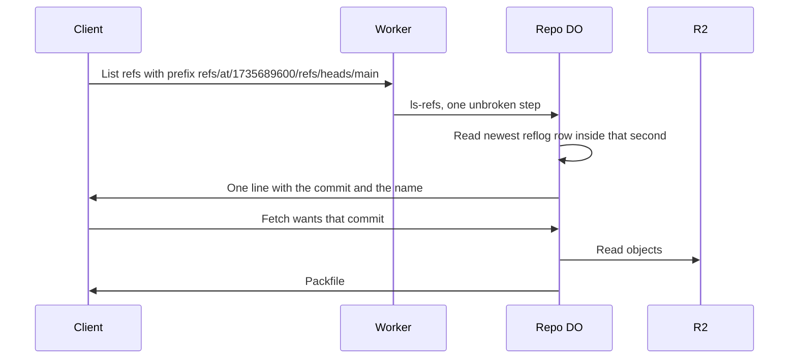

# Time-travel refs

> Verdict: **lands with caveats** · feasibility 4/5 · reliability 4/5 · correctness 4/5 · effort: days
> Read the words in [how-to-read.md](../findings/how-to-read.md). Engineers: [proof](../proofs/time-travel-refs.md) · [review](../reviews/time-travel-refs.md)

## What this idea is

Git is a tool that keeps every version of a set of files, and lets many people share those versions. A repository, or repo, is one project's full set of files and their history. A commit is one saved version of the files, with a note about what changed.

A branch is a named line of commits, like a bookmark that moves forward as you save. A ref is a name that points at one commit. A branch is a ref. A tag is a ref.

A push is sending your new commits to the server. A fetch is getting commits from the server. A clone gets everything for the first time. A reflog is a log of every move of a ref: which ref, from which commit, to which commit, and when.

A Durable Object, or DO, is a single small program with its own storage that handles one thing at a time. There is one DO for each repo. Think of it like the one librarian who is allowed to update the catalog.

Today only your own computer can answer "where did main point last Tuesday". This idea lets the server answer that question. A client fetches a ref with a name like refs/at/1735689600/main, where the number is a time in seconds. The server looks in the reflog and answers with the commit that main pointed at, at that time.

Think of it like this. A museum keeps a guest book with a date on every line. To learn who was there on a given day, you read down the book to that date.

## How it works

The second pass writes the design in Rust, against one shared contract that every idea in this set follows. Cloudflare Workers are small programs that run on Cloudflare's network close to the user, with no server to manage. Wasm, or WebAssembly, is a way to run code from other languages, such as Rust, inside a Worker. DO SQLite is the small database inside each Durable Object.

1. Every push that moves a ref writes one reflog row inside the same unbroken step as the move. The shared contract already writes this row, with the name, the old commit, the new commit, and a time in milliseconds. The step never waits on the network, so the row and the move land together or not at all.
2. The row's time is stamped as the larger of now and the last row's time plus one millisecond. The times can never tie or go backwards, even when the DO restarts on a skewed clock.
3. A client runs a fetch for refs/at/1735689600/refs/heads/main. Git sends that name as a ref prefix in a protocol v2 request. Protocol v2 is the newer, cleaner set of messages git uses to talk to a server. The server never offers the ref-in-want feature, so the client must resolve the name at list time and then ask for the commit itself.
4. The Worker routes the request to the repo DO. The DO reads the time and the name, then runs one DO SQLite read for the newest reflog row of that name inside that second. The read never waits on R2 or the network, so the answer is always consistent with the ref moves.
5. A short name like main resolves in git's own order. The stored name is tried first, then the tag, then the branch. A row whose new commit is zero means the ref was deleted at that instant, so the DO answers nothing.
6. The DO answers with one pkt-line that holds the commit and the requested name. A pkt-line is git's way of framing a message. Each line starts with four characters that give its length. The shared wire module writes the line and measures bytes, so a non-ASCII name cannot break the frame. Nothing is written, so the ref exists only in the answer.
7. The client asks for that commit with a normal fetch. The fetch path accepts any live object, so the refs/at/ name is never needed again. An object is one stored item in git. An object is a file's content, a folder listing, or a commit. The objects come from R2 as always. R2 is Cloudflare's large file store. It holds the git objects.
8. A request for the bare prefix refs/at/ lists tip moves, newest first, capped at 1,000 rows. A digit prefix such as refs/at/1735 scopes the list to that window.
9. Every reflog tip counts as a live root for the janitor, so a resolvable answer keeps its objects. A janitor, also called a sweep or GC, is a background task that deletes files nobody points to anymore. Expiry runs as one job kind on the shared alarm dispatcher. Once a day, one statement deletes old rows but keeps the newest row per name. An alarm is a timer inside a Durable Object. A DO has only one alarm at a time.

## What the reviewer decided

The reviewer's verdict is Lands with caveats.

| Score | Value |
|---|---|
| Feasibility | 4 of 5 |
| Reliability | 4 of 5 |
| Correctness | 4 of 5 |

| Score | First pass | Second pass |
|---|---|---|
| Feasibility | 4 of 5 | 4 of 5 |
| Reliability | 4 of 5 | 4 of 5 |
| Correctness | 4 of 5 | 3 of 5 |

Lands with caveats. The idea is sound and can be built. The proof has one or more problems that must be fixed first, and the reviewer described each fix. Think of it like a flight with a runway that needs some repairs before you land. The runway is there. The repairs are known.

The second pass stayed flat on feasibility and reliability and moved down on correctness. The design is better than the first pass. Both first-pass blockers are closed by the contract rather than by new code, and the log and the refs still commit or vanish together inside one unbroken step. The deduction is for two one-line bugs with real consequences. The daily expiry job never runs again after its first run. The list of tip moves prints times in seconds, so two moves in one second advertise one name for two different commits.

For this idea, the reviewer says the mechanism is still sound. The name refs/at/1735689600/refs/heads/main is a valid ref name. A deleted ref correctly answers nothing. Every host call the code uses exists in the worker library, and none of them waits on the network.

The reviewer found no path that loses data. But the proof has three blockers. A blocker is a problem that stops the idea from working until it is fixed. Two of the fixes are one line each. The fixes take days.

The idea also has caveats. A caveat is a limit or a condition. The idea works, but only inside this limit.

## What changed in the second pass

- The fetch could carry the ref name instead of a commit: fixed by the contract modules. The server never offers the ref-in-want feature, and the fetch parser rejects a want-ref line as unknown. The client resolves the name at list time and asks for the commit itself, which the server accepts like any other live object.
- The expiry alarm overwrote the janitor's alarm: fixed. Expiry is now one job kind on the shared alarm dispatcher, and nothing in this module sets the alarm itself.
- The server clock could go backwards and pick the wrong row: fixed. Each reflog time is stamped inside the commit step as the larger of now and the last time plus one millisecond. The times only increase, even across a restart on a skewed clock.
- The bare refs/at/ list had no limit: fixed. The list is capped at 1,000 rows, newest first. A digit prefix such as refs/at/1735 scopes the list to that window.
- An expired row could leave a named commit with no objects: fixed. Every reflog tip counts as a live root for the janitor, and expiry keeps the newest row per name, so a resolvable answer keeps its objects. A small gap remains, because a row can expire and the full sweep chain can finish between the list and the fetch.
- The pkt-line length counted characters, not bytes: fixed by the contract modules. The packet lines come from a shared library that measures bytes, so a name with non-ASCII characters can no longer break the frame.
- Two moves of one ref in one second produce the same advertised name: still open. The stored times are now in milliseconds and unique, but the list prints only the seconds part. Two moves in one second still advertise one name, and that name resolves to the newer move.
- A deleted branch could silently answer as a same-named tag: fixed. A short name now resolves in git's own order, the stored name first, then the tag, then the branch. A name like refs/at/1735689600/refs/heads/main picks the branch exactly.
- A time-travel ref at an annotated tag shows no peeled commit: still open. Peeling needs the tag object from R2, and the list step never waits on R2. Git treats the missing line as no annotation, not an error.
- Two list options a client can send were ignored: fixed. A client can ask for symbolic refs and for unborn branches. The shared list writer answers both, and real git accepted them in a test.
- An edge copy of the refs must forward refs/at/ to the DO: fixed for now. No edge copy exists yet. If the replicated-refs idea lands, its edge list needs a one-line guard so a refs/at/ prefix falls through to the DO.

## Problems that must be fixed first

### Problem 1: The daily expiry job never runs again

**What goes wrong.** The expiry job books its next run from inside its own run, while its job row is still marked running. The jobs table allows at most one waiting or running row per kind, so the booking is refused. The daily run silently stops after the first run.

**Why it matters.** Old reflog rows keep growing and their commits stay live forever. Expiry restarts only when the DO cold-starts and boot books the job again. Retention then depends on restarts instead of a schedule.

**How to fix it.** Return a reschedule result that carries the next day's time, instead of booking a new job inside the run. The fix is one line.

### Problem 2: The list collapses two moves in one second into one name

**What goes wrong.** Reflog times are stored in milliseconds, but the advertised names print only the seconds. Two moves of one ref inside one second advertise the same name with two different commits. The shared name then resolves to the newer move.

**Why it matters.** The server advertises a name and commit pair that the name itself cannot fetch back. A client that asks for the earlier move gets the newer commit, which is a wrong answer on the wire.

**How to fix it.** Print the full millisecond time in the advertised name. The name parser already accepts 13-digit times, so the fix is one line.

### Problem 3: Four edits to shared code sit outside the registry

**What goes wrong.** The feature needs four small edits inside functions the contract already owns. These are the list hook, the read-only check and the time stamp in the commit step, the janitor roots, and booking the expiry job at boot. The registry rule covers additions such as new routes and job kinds, not edits to existing bodies.

**Why it matters.** As written, the module cannot compile against the contract. Each edit is declared and small, but the contract must absorb them before the feature exists.

**How to fix it.** Add the four edits to the contract, or fold each edit into the code of the idea that owns the function.

## Things to know

- The reflog index serves exact lookups but not the bare list. Every bare refs/at/ listing is a full scan plus a sort, capped at 1,000 rows. That is fine at a 90-day scale. A second index on the time alone would serve the list.
- A millisecond prefix in a list request returns nothing, because every advertised name carries the time in seconds. An exact lookup with a millisecond time still works.
- A stale advertisement can still fail. A row can expire and the whole janitor chain can finish between the list and the fetch. Then the fetch fails with not our ref, and the client retries with a fresh list. That needs a ten-minute chain inside a window of seconds.
- If the replicated-refs idea lands, its edge list answers a refs/at/ prefix from its KV snapshot as a hit and returns nothing. The request then never reaches the DO. KV is Cloudflare's small, fast, world-wide store for simple values. The edge list needs a one-line prefix guard.
- Two pieces of mechanical drift are shared with the sibling ideas. The expiry run function is declared sync where the siblings use async, and the module assumes helper visibility that the sibling declares private.
- The added test scenario claims both moves get unique names. That holds only when the two pushes land in different seconds.
- A time-travel ref for HEAD resolves to nothing, because HEAD is a symbolic name with no reflog of its own. A bare short name that exists as both a tag and a branch resolves to the tag. That is git's own order.

## How this idea connects to the others

The reflog row is written inside the commit step of [#1 One Durable Object per repo as the ref authority](./repo-do-ref-authority.md).

The refs and the reflog live in DO SQLite, and the objects live in R2, as in [#2 Refs in DO SQLite, objects in R2](./refs-sqlite-objects-r2.md).

The synthetic ref rows ride the list-refs path of [#3 Speak git protocol v2 only, translate v0 at the edge](./protocol-v2-only.md).

Expiry runs as one job kind on the shared dispatcher from [#55 GC and repack as a DO alarm](./gc-and-repack-alarm.md).
