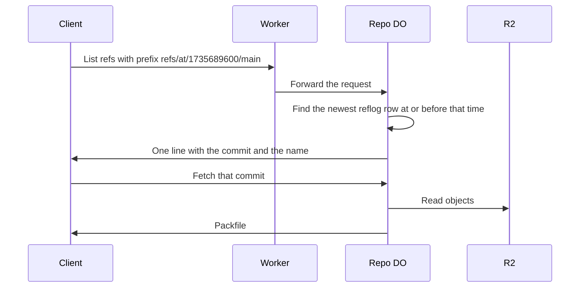

# Time-travel refs

> Verdict: **lands with caveats** · feasibility 4/5 · reliability 4/5 · correctness 4/5 · effort: days
> Read the words in [how-to-read.md](../findings/how-to-read.md). Engineers: [proof](../proofs/time-travel-refs.md) · [review](../reviews/time-travel-refs.md)

## What this idea is

Git is a tool that keeps every version of a set of files, and lets many people share those versions. A repository, or repo, is one project's full set of files and their history. A commit is one saved version of the files, with a note about what changed.

A branch is a named line of commits, like a bookmark that moves forward as you save. A ref is a name that points at one commit. A branch is a ref. A tag is a ref.

A push is sending your new commits to the server. A fetch is getting commits from the server. A clone gets everything for the first time. A reflog is a log of every move of a ref: which ref, from which commit, to which commit, and when.

A Durable Object, or DO, is a single small program with its own storage that handles one thing at a time. There is one DO for each repo. Think of it like the one librarian who is allowed to update the catalog.

Today only your own computer can answer "where did main point last Tuesday". This idea lets the server answer that question. A client fetches a ref with a name like refs/at/1735689600/main, where the number is a time in seconds. The server looks in the reflog and answers with the commit that main pointed at, at that time.

Think of it like this. A museum keeps a guest book with a date on every line. To learn who was there on a given day, you read down the book to that date.

## How it works

1. Every time a push moves a ref, the repo DO writes a reflog row in the same database transaction as the move. The row lands in DO SQLite. DO SQLite is the small database inside each Durable Object.
2. A client runs a fetch for refs/at/1735689600/main. Git sends that name as a ref prefix in a protocol v2 request. Protocol v2 is the newer, cleaner set of messages git uses to talk to a server.
3. The Worker routes the request to the repo DO. Cloudflare Workers are small programs that run on Cloudflare's network close to the user, with no server to manage.
4. The DO reads the time from the name. The DO selects the newest reflog row for refs/heads/main whose time is at or before that time.
5. The DO answers with one pkt-line that holds the commit from that row and the requested name. A pkt-line is git's way of framing a message. Each line starts with four characters that give its length. Nothing is written, so the ref exists only in the answer.
6. The client asks for that commit with a normal fetch request. The DO serves the objects from R2 as always. An object is one stored item in git. An object is a file's content, a folder listing, or a commit. R2 is Cloudflare's large file store. It holds the git objects.
7. A request for the bare prefix refs/at/ lists every reflog row as a ref, so a client can see the whole history of tip moves.
8. The commits named in the reflog count as live for the janitor, so their objects stay until the reflog rows expire. A janitor, also called a sweep or GC, is a background task that deletes files nobody points to anymore. An alarm expires old rows. An alarm is a timer inside a Durable Object. A DO has only one alarm at a time.

## What the reviewer decided

The reviewer's verdict is Lands with caveats.

| Score | Value |
|---|---|
| Feasibility | 4 of 5 |
| Reliability | 4 of 5 |
| Correctness | 4 of 5 |

Lands with caveats. The idea is sound and can be built. The proof has one or more problems that must be fixed first, and the reviewer described each fix. Think of it like a flight with a runway that needs some repairs before you land. The runway is there. The repairs are known.

For this idea, the reviewer says the mechanism is sound. The reflog row and the ref move commit together, so the log and the refs can never disagree. The name refs/at/1735689600/main is a valid ref name. Protocol v2 lets the server answer with a ref that is not stored, and the client then asks for a plain commit. Every Cloudflare feature the proof uses is GA. GA, or generally available, means a Cloudflare feature that is finished and supported, not a preview.

The reviewer found no path that loses data. But the proof has two blockers. A blocker is a problem that stops the idea from working until it is fixed. The fixes take days.

The idea also has caveats. A caveat is a limit or a condition. The idea works, but only inside this limit.

## Problems that must be fixed first

### Problem 1: The fetch command can carry the ref name instead of a commit

**What goes wrong.** A protocol v2 server can offer a feature called ref-in-want. When the server offers that feature, git version 2.19 or newer sends the ref name inside the fetch request, as want-ref, instead of a commit. The proof only handles the list-refs request. The fetch handler does not know the refs/at/ names, so a normal git fetch of a time-travel ref would fail.

**Why it matters.** Most protocol v2 servers offer ref-in-want by default. With that default, the idea does not work with a normal git client.

**How to fix it.** Make the fetch handler also resolve refs/at/ names and answer with a wanted-refs section. Or do not offer ref-in-want.

### Problem 2: The expiry alarm overwrites the janitor's alarm

**What goes wrong.** A DO has only one alarm. The proof's alarm code sets the next alarm 24 hours ahead. The janitor idea sets the same alarm for its own schedule. Whichever code runs last wins, and the other schedule is lost.

**Why it matters.** Either the reflog never expires, or the janitor never runs. Both outcomes break a promise of the design.

**How to fix it.** Write one dispatcher for the alarm. Make the dispatcher keep both schedules and run whichever is due.

## Things to know

- The pkt-line writer measures a string by its JavaScript length, not by its byte length. A ref name with non-ASCII characters in the refs/at/ list therefore produces a broken pkt-line.
- Two moves of the same ref in the same second produce two lines with the same name and different commits in the refs/at/ list. A normal git fetch with a wildcard on refs/at/ complains, so the name must include the row number or the list must drop duplicates.
- The time is the server's clock at the moment of the move, with no rule that time never goes backwards. Clock drift across DO restarts can make the lookup pick the wrong row.
- After the reflog rows expire and the janitor runs, the server can still name a commit whose objects are gone. History that was force-pushed away is exactly what users want to see and exactly what gets removed.
- The bare refs/at/ list has no limit and can reach tens of thousands of lines on a busy repo. The list needs a cap, or a required time prefix.
- The lookup tries a branch, then a tag, then the raw name, so a deleted branch silently answers with a same-named tag. A time-travel ref that points at an annotated tag also does not return the peeled commit.
- Ref copies at the edge in KV must send refs/at/ requests to the owning DO. KV is Cloudflare's small, fast, world-wide store for simple values.

## How this idea connects to the others

The reflog is written by the single ref owner from [#1 One Durable Object per repo as the ref authority](./repo-do-ref-authority.md).

The refs and the reflog live in DO SQLite, and the objects live in R2, as in [#2 Refs in DO SQLite, objects in R2](./refs-sqlite-objects-r2.md).

The answer with an unstored ref depends on [#3 Speak git protocol v2 only, translate v0 at the edge](./protocol-v2-only.md).

The expiry alarm and the object cleanup must share one alarm with [#55 GC and repack as a DO alarm](./gc-and-repack-alarm.md).
