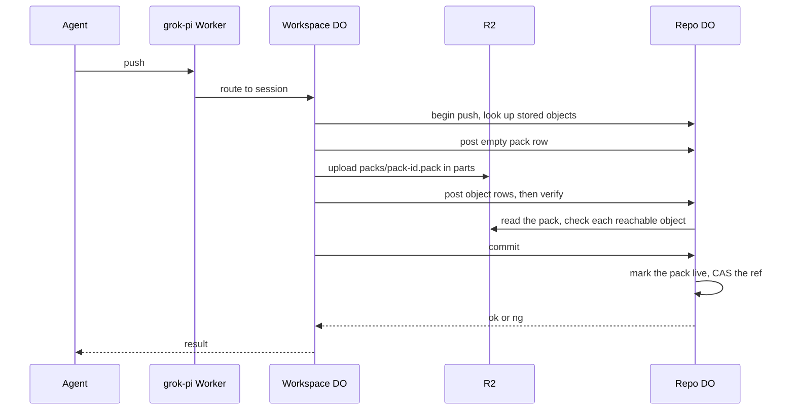

# Push from a sibling workspace DO over RPC, no HTTP

> Verdict: **lands with caveats** · feasibility 4/5 · reliability 3/5 · correctness 3/5 · effort: weeks
> Read the words in [how-to-read.md](../findings/how-to-read.md). Engineers: [proof](../proofs/tui-rpc-push.md) · [review](../reviews/tui-rpc-push.md)

## What this idea is

Git is a tool that keeps every version of a set of files, and lets many people share those versions. A repository, or repo, is one project's full set of files and their history. A push is sending your new commits to the server. A commit is one saved version of the files, with a note about what changed.

Normally a push travels over the web as a long stream of git messages. In this idea, an agent workspace that already runs on Cloudflare skips that stream. The workspace writes its files straight into the shared file store. Then the workspace asks the repo's keeper to move the branch with one direct call. A branch is a named line of commits, like a bookmark that moves forward as you save.

Think of it like this. Two cooks work in the same kitchen. One cook hands a finished plate to the other cook by hand. Nobody boxes the plate, mails the plate across town, and unboxes the plate again.

## How it works

The second pass writes the design in Rust, against one shared contract that every idea in this set follows. Wasm, or WebAssembly, is a way to run code from other languages, such as Rust, inside a Worker. Cloudflare Workers are small programs that run on Cloudflare's network close to the user, with no server to manage. A packfile, or pack, is one bundle that holds many objects, squeezed to save space.

1. An agent asks the workspace to push. The request reaches the grok-pi Worker. The Worker routes the request to the workspace's Durable Object. A Durable Object, or DO, is a single small program with its own storage that handles one thing at a time. There is one DO for each repo. Think of it like the one librarian who is allowed to update the catalog.
2. The workspace DO calls the repo DO's begin route with a fresh push id. The call is a small JSON request on an internal route, not a git message. The repo DO records the open push in DO SQLite. DO SQLite is the small database inside each Durable Object.
3. The workspace DO reads its files from DO SQLite and computes the SHA of each file's content. An object is one stored item in git. An object is a file's content, a folder listing, or a commit. A SHA, or hash, is a fingerprint of an object's content. Two objects with the same content have the same fingerprint.
4. The workspace DO sorts the files by path in byte order. The workspace DO builds one folder listing for each folder, deepest first. The workspace DO builds one commit on top, naming the branch's current commit as the parent.
5. The workspace DO asks the repo DO, in groups of 1,000, which of these SHAs are already stored. A stored object is not written again. A push that changes one file writes one blob plus the folder listings above it.
6. The workspace DO picks a fresh pack id and posts an empty pack row to the repo DO, marked ingesting. Only then does the upload start.
7. The workspace DO writes every new object into one pack in R2, uploaded in parts. R2 is Cloudflare's large file store. It holds the git objects. The pack holds only full objects, with no deltas. A delta is a stored object written as "the same as that other object, with these changes".
8. The workspace DO posts the object rows and the real pack size to the repo DO, in groups of 10,000 rows. The pack is durable in R2 before its rows are final.
9. The workspace DO calls the repo DO's verify route, which is new in this pass. The repo DO walks every object the new commit can reach. Each object must exist in a live pack or in this push's pack. Every commit, folder listing, and tag the route reads must parse. Every folder listing must be in git order.
10. If an object is missing or does not parse, the route reports the miss and the push stops. The commit route is never called.
11. The workspace DO calls the repo DO's commit route with the branch name, the old commit, and the new commit. A ref is a name that points at one commit. A branch is a ref. A tag is a ref.
12. The repo DO marks the pack live and moves the ref with compare-and-swap. Compare-and-swap, or CAS, means change a value only if it still has the value you expect. If someone changed it first, do nothing and report it. The repo DO replies with ok or ng.
13. The janitor covers the crash cases. A janitor is a background task that deletes files nobody points to anymore. A push left open expires after one hour. Its keys are deleted one hour later.

## What the reviewer decided

The reviewer looks for blockers and caveats. A blocker is a problem that stops the idea from working until it is fixed. A caveat is a limit or a condition. The idea works, but only inside this limit. The reviewer's verdict is "Lands with caveats."

| Score | Out of 5 |
|---|---|
| Feasibility | 4 |
| Reliability | 4 |
| Correctness | 4 |

| Score | First pass | Second pass |
|---|---|---|
| Feasibility | 4 | 4 |
| Reliability | 3 | 4 |
| Correctness | 3 | 4 |

Lands with caveats means the following. The idea is sound and can be built. The proof has one or more problems that must be fixed first, and the reviewer described each fix. Think of it like a flight with a runway that needs some repairs before you land. The runway is there. The repairs are known.

For this idea, the second pass is a real step forward. Both first-pass blockers are closed by the shape of the design, not by a check at run time. The workspace now builds real nested folder listings, and a new route on the repo DO walks every reachable object itself. One push costs about 20 calls instead of about 20,000, and crashes are covered by the shared contract's timers. Reliability and correctness each moved from 3 to 4, and feasibility stayed at 4. The verdict did not change.

The remaining work is small and local. The row posting breaks at the advertised size of 10,000 files. Two shared functions must match their sibling callers before the code compiles. The verify route still trusts a few fields the caller posted. The one honest concession is the transport. The workspace calls the repo DO on internal routes, not with a typed function call, because typed calls are still experimental in the Rust worker library.

The reviewer still expects weeks of work before the idea lands. The new route is days of work, but landing needs the two-phase push and the ref authority ideas first. A normal git client can never use this path, so the proof adds two test scenarios instead.

## What changed in the second pass

- Folders made the repo invalid: fixed. The workspace now builds one folder listing for each folder, deepest first, with entries in byte order. The verify route re-reads every reachable listing and rejects out-of-order entries, so a bad listing cannot reach a live ref.
- Large pushes hit the subrequest limit: fixed. The per-file writes and checks are gone, so a 10,000-file push costs about 20 calls. A new counting bug in the row posting still fails a push at that size, listed as Problem 1 below.
- Objects could be deleted before the ref moved: fixed by the contract modules. The push row exists from the begin call, and the pack row is marked ingesting before any byte reaches R2. The janitor deletes only packs of expired pushes, and only after a grace window.
- A lost reply made a retry report stale: partly fixed. A retried commit gets a clear ng answer, and the workspace can read the refs to confirm the ref already points at the new commit. That confirmation is described in words, not yet in code.
- No check that the new commit builds on the old one: still open. The compare-and-swap checks only that the old commit still matches. The contract builds no ancestry check, the same exposure as the normal push path.
- Binary files, the executable flag, and symbolic links were lost: fixed. Each file entry now carries raw bytes and a mode, and the tree builder writes the mode it was given.
- The repo DO trusted the caller's list of objects: partly fixed. The verify route walks every reachable object against stored bytes and index rows, and a missing object stops the push. The route is advisory and still trusts the posted size, offset, and kind of each object.
- Every push rewrote every file: fixed. One upload carries the whole push, and a stored-object check skips every object already in R2. A push that changes one file writes one blob plus the folder listings above it.

## Problems that must be fixed first

### Problem 1: The row posting breaks at the advertised size

**What goes wrong.** The proof numbers each object row by the length of the full row list. The proof also posts rows in groups of 10,000 and then posts the whole list again at the end. A push of 10,000 files makes about 10,002 rows. The final post is refused because it holds too many rows.

**Why it matters.** Either reading is broken. If the list keeps every row, the push fails after the pack is already durable in R2. If the grouped posts empty the list, later rows get numbers that start over. The cleanup task's marks then land on the wrong objects.

**How to fix it.** Keep a cursor that records how many rows were already posted. Post only the new tail of the list each time.

### Problem 2: The commit reply type cannot be read back

**What goes wrong.** The workspace reads the commit call's reply as JSON. The reply type holds borrowed text. Rust cannot fill borrowed text from a JSON reply, so the call does not compile. The sibling's own push code has the same defect.

**Why it matters.** The whole crate stays broken until the type changes. Nobody can test anything before it lands.

**How to fix it.** Change the reply type to hold owned text that can be decoded from JSON. Record the change in the shared contract.

### Problem 3: One shared function has three shapes

**What goes wrong.** The pack writer's create function is called three different ways across the proofs. One proof passes a borrowed key, one passes an owned key, and one leaves out the size hint.

**Why it matters.** Rust code with mismatched function shapes does not compile. The crate stays broken until one shape wins.

**How to fix it.** Pick one shape for create. Change the other proofs to match. Record the chosen shape in the shared contract.

## Things to know

- The verify route trusts the rows the workspace posted. It never re-hashes the stored bytes against the claimed fingerprint, and it uses the posted kind to pick which objects to open. A wrong offset or a wrong kind can land a ref that serves bad bytes. The fixes are one line each.
- The verify route is advisory. The commit route does not require it, so a buggy workspace can skip the check and land a push that points at a missing object. Making the check mandatory is a small contract change the proof leaves out.
- The title's promise is now weaker, and the proof says so. The workspace calls the repo DO with JSON requests on internal routes, not with a typed function call, because typed calls between DOs are still experimental. There is still no git web endpoint, no git message framing, and no edge hop.
- A retry of the same push inside the same millisecond fails with an internal error instead of ok, because the commit is already stored. The case is narrow.
- A file list that holds both a path and a file inside that path slips past the order check. The result is a repo that git's own check command rejects.
- The reference code never inspects the per-ref results inside the commit reply. The difference between ok and ng, and the retry confirmation, exist in words only.
- Several parts are unverified at run time. These are the JSON request body path, the random id source, and the binding that lets the workspace Worker reach the repo DO. Also unverified are real R2 uploads in parts, the bucket rule that removes incomplete uploads, and some field names in the git object library. The local test setup does not enforce the subrequest limit. A subrequest is one call from a Worker to another service, such as one read from R2.

## How this idea connects to the others

- The begin and commit routes, and the compare-and-swap on the ref, come from [#1 One Durable Object per repo as the ref authority](./repo-do-ref-authority.md).
- The push lifecycle, the index posts, and the object rows come from [#6 Two-phase push](./two-phase-push.md).
- Refs live in the repo DO's database and objects live in packs in R2, from [#2 Refs in DO SQLite, objects in R2](./refs-sqlite-objects-r2.md).
- The pack key the workspace writes under, and the pack writer itself, come from [#5 Content-addressed R2 keys](./content-addressed-r2-keys.md).
- The janitor that expires a crashed push and deletes its keys runs as one job slice of the alarm dispatcher from [#55 GC and repack as a DO alarm](./gc-and-repack-alarm.md).
