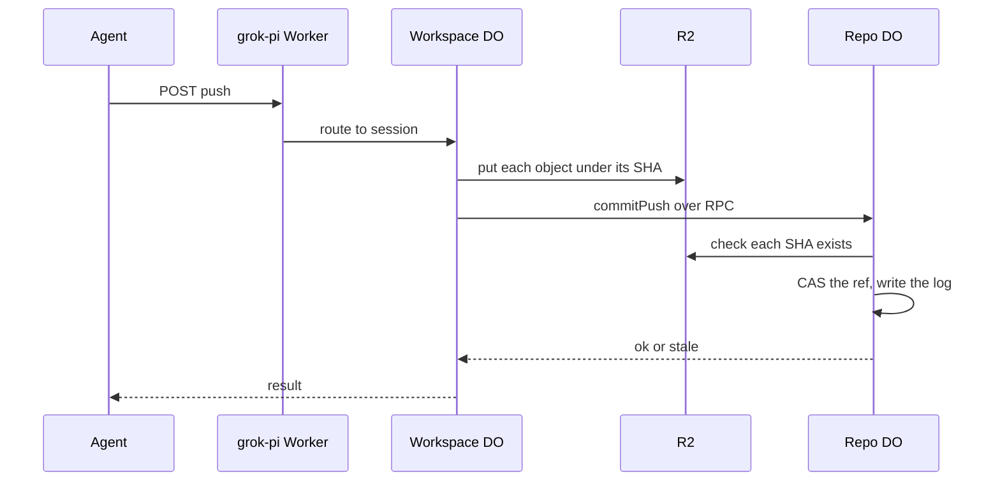

# Push from a sibling workspace DO over RPC, no HTTP

> Verdict: **lands with caveats** · feasibility 4/5 · reliability 3/5 · correctness 3/5 · effort: weeks
> Read the words in [how-to-read.md](../findings/how-to-read.md). Engineers: [proof](../proofs/tui-rpc-push.md) · [review](../reviews/tui-rpc-push.md)

## What this idea is

Git is a tool that keeps every version of a set of files, and lets many people share those versions. A repository, or repo, is one project's full set of files and their history. A push is sending your new commits to the server. A commit is one saved version of the files, with a note about what changed.

Normally a push travels over the web as a long stream of git messages. In this idea, an agent workspace that already runs on Cloudflare skips that stream. The workspace writes its files straight into the shared file store. Then the workspace asks the repo's keeper to move the branch with one direct function call. A branch is a named line of commits, like a bookmark that moves forward as you save.

Think of it like this. Two cooks work in the same kitchen. One cook hands a finished plate to the other cook by hand. Nobody boxes the plate, mails the plate across town, and unboxes the plate again.

## How it works

1. An agent asks the workspace to push. The request reaches the grok-pi Worker. Cloudflare Workers are small programs that run on Cloudflare's network close to the user, with no server to manage.
2. The Worker routes the request to the workspace's Durable Object. A Durable Object, or DO, is a single small program with its own storage that handles one thing at a time. There is one DO for each repo. Think of it like the one librarian who is allowed to update the catalog.
3. The workspace DO reads its files from DO SQLite. DO SQLite is the small database inside each Durable Object.
4. The workspace DO turns each file into a git object. An object is one stored item in git. An object is a file's content, a folder listing, or a commit.
5. The workspace DO computes the SHA of each object. A SHA, or hash, is a fingerprint of an object's content. Two objects with the same content have the same fingerprint.
6. The workspace DO writes each object to R2 under a content-addressed key. R2 is Cloudflare's large file store. It holds the git objects. Content-addressed means stored under its own fingerprint, so the name tells you what is inside.
7. The workspace DO writes every object in full. The workspace DO does not build a packfile and does not use deltas. A packfile, or pack, is one bundle that holds many objects, squeezed to save space. A delta is a stored object written as "the same as that other object, with these changes".
8. The workspace DO builds one folder listing and one commit, and writes both to R2.
9. The workspace DO calls the repo DO with a direct function call, called RPC. The call carries the branch name, the old commit, the new commit, and the list of SHAs. No git message format is used on this path.
10. The repo DO checks that each SHA exists in R2. Each check is one subrequest. A subrequest is one call from a Worker to another service, such as one read from R2. Each request may make at most 1,000 subrequests.
11. The repo DO moves the ref with compare-and-swap. A ref is a name that points at one commit. A branch is a ref. A tag is a ref. Compare-and-swap, or CAS, means change a value only if it still has the value you expect. If someone changed it first, do nothing and report it.
12. The repo DO writes one line to its log of ref changes and replies with the result.

## What the reviewer decided

The reviewer looks for blockers and caveats. A blocker is a problem that stops the idea from working until it is fixed. A caveat is a limit or a condition. The idea works, but only inside this limit. The reviewer's verdict is "Lands with caveats."

| Score | Out of 5 |
|---|---|
| Feasibility | 4 |
| Reliability | 3 |
| Correctness | 3 |

Lands with caveats means the following. The idea is sound and can be built. The proof has one or more problems that must be fixed first, and the reviewer described each fix. Think of it like a flight with a runway that needs some repairs before you land. The runway is there. The repairs are known.

For this idea, the core mechanism is sound. Every Cloudflare feature used is GA. GA, or generally available, means a Cloudflare feature that is finished and supported, not a preview. The reviewer walked through crashes and through two writers pushing at once. The reviewer found no data loss and no case where two records disagree.

But the proof is a snapshot commit builder, not a full push. The proof builds one commit from the current files and cannot carry a longer history. The reviewer found two blockers and seven caveats.

The reviewer expects about two weeks of work before the idea lands. One caveat concerns the janitor. A janitor, also called a sweep or GC, is a background task that deletes files nobody points to anymore.

## Problems that must be fixed first

### Problem 1: Folders make the repo invalid

**What goes wrong.** The proof puts each file's full path into one flat folder listing. Git requires one listing for each folder, nested inside its parent listing. Any path that contains a slash breaks that rule. Git's own check command, git fsck, rejects the result with the error "fullPathname".

**Why it matters.** Almost every real workspace has at least one folder. So the proof cannot make a valid repo for a real workspace. The flat listing is not a small shortcut. The flat listing is wrong for every real case.

**How to fix it.** Build one listing for each folder, starting from the deepest folder. Sort the entries by byte order, not by text order. Sort a folder name as if the name ends with a slash. Give each folder entry the mode 040000. Do this work before the idea lands, not after.

### Problem 2: Large pushes hit the subrequest limit

**What goes wrong.** The workspace DO makes one R2 write for each file. The repo DO then makes one R2 check for each file. Each of these calls is a subrequest. A push of about 1,000 files fails in both DOs.

**Why it matters.** The proof mentions splitting the work across alarms but does not design the split. An alarm is a timer inside a Durable Object. A DO has only one alarm at a time. Without a design, a workspace with many files cannot push at all.

**How to fix it.** Design the split before the idea lands. Spread the writes across several alarm runs. Check many SHAs with one list call, or keep a table of known objects in DO SQLite.

## Things to know

- Objects sit in R2 with no ref pointing at them until the ref moves. If the janitor deletes them in that gap, the ref then points at deleted objects, so the janitor needs a grace window.
- If the repo DO saves the ref but the reply is lost, a retry gets the answer "stale". The caller must treat "stale" as success when the ref already points at the new commit.
- The compare-and-swap checks only that the old commit still matches, not that the new commit builds on the old one. So a stale caller with a matching parent overwrites history with no warning.
- The proof stores each file's content as text, which corrupts binary files. The proof also loses the executable flag and symbolic links.
- The repo DO trusts the caller's list of SHAs and never checks that the list covers the whole folder tree. A caller with a bug can publish a ref that points at missing objects.
- Each push costs one full R2 write per file, with no delta and no cache to skip unchanged files.
- The RPC message size limit of about 32 MB is not a problem, because only SHAs cross the call. File bytes go to R2 instead.

## How this idea connects to the others

This idea needs [#1 One Durable Object per repo as the ref authority](./repo-do-ref-authority.md), because the repo DO is the only place that moves a ref.

This idea needs [#2 Refs in DO SQLite, objects in R2](./refs-sqlite-objects-r2.md), because refs live in the repo DO's database and objects live in R2.

This idea needs [#5 Content-addressed R2 keys](./content-addressed-r2-keys.md), because both DOs must agree on where each object lives.

This idea needs [#6 Two-phase push](./two-phase-push.md), because the RPC call enters the same second phase that a normal push uses after unpacking.
