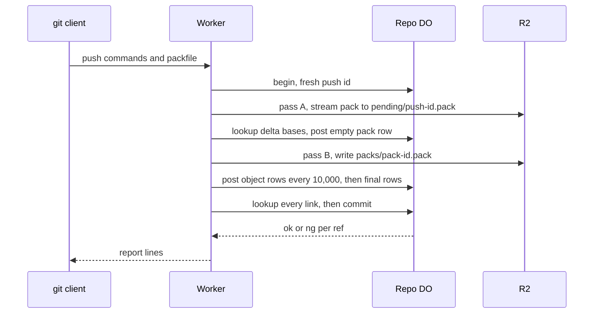

# Two-phase push

> Verdict: **lands with caveats** · feasibility 4/5 · reliability 3/5 · correctness 3/5 · effort: weeks
> Read the words in [how-to-read.md](../findings/how-to-read.md). Engineers: [proof](../proofs/two-phase-push.md) · [review](../reviews/two-phase-push.md)

## What this idea is

git is a tool that keeps every version of a set of files, and lets many people share those versions. A repository, or repo, is one project's full set of files and their history. A commit is one saved version of the files, with a note about what changed. A branch is a named line of commits, like a bookmark that moves forward as you save.

A ref is a name that points at one commit. A branch is a ref. A tag is a ref.

A push is sending your new commits to the server. An object is one stored item in git. An object is a file's content, a folder listing, or a commit.

This idea splits a push into two phases. Phase one stores the pushed objects in R2 as one bundle. R2 is Cloudflare's large file store. It holds the git objects.

Phase two asks the repo's Durable Object to check that nothing is missing and then move the refs, all at once or not at all. A Durable Object, or DO, is a single small program with its own storage that handles one thing at a time. There is one DO for each repo. Think of it like the one librarian who is allowed to update the catalog. If the server crashes between the phases, a janitor cleans up the leftovers. A janitor is a background task that deletes files nobody points to anymore.

Think of it like this. A mover first carries every box into the new house. Only when all boxes are inside does the owner sign the form that says the move is done. If the truck breaks down halfway, the boxes on the pavement are collected later and nobody has signed anything.

## How it works

The second pass writes the design in Rust, against one shared contract that every idea in this set follows. Cloudflare Workers are small programs that run on Cloudflare's network close to the user, with no server to manage. Wasm, or WebAssembly, is a way to run code from other languages, such as Rust, inside a Worker. DO SQLite is the small database inside each Durable Object. A packfile, or pack, is one bundle that holds many objects, squeezed to save space.

1. A push arrives at a Worker. The Worker calls begin on the DO. The DO records an open push with a fresh random push id in DO SQLite.
2. The Worker reads the command lines. Then the Worker looks at what follows. No pack means a delete-only push. A 32-byte pack with zero objects means a new ref at a known commit. Both cases skip to step 9.
3. Pass A streams the real pack into R2 under pending/push-id.pack. This name belongs to this push alone. No other push can ever write the same name.
4. The Worker collects the fingerprints of the base objects that the pack's deltas depend on. A delta is a stored object written as "the same as that other object, with these changes". A SHA is a fingerprint of an object's content. The Worker asks the DO, in groups of 1,000, which bases are already live.
5. The Worker picks a fresh random pack id and posts an empty pack row to the DO, marked ingesting. Only then does the Worker start the upload of packs/pack-id.pack.
6. Pass B reads the pending pack back, resolves every delta, and writes a normal pack to packs/pack-id.pack. Every 10,000 objects, the Worker posts the object rows to the DO. The DO refuses the rows if the push is no longer open.
7. The Worker finishes the upload. Then the Worker posts the last rows and the real pack size to the DO. The pack is durable before its rows are final.
8. The Worker looks up every link out of the pack, in groups of 1,000. A link is a pointer from a commit to a tree, or from a tree to its entries. One missing target ends the push with an unpack error and an ng line for every ref.
9. The Worker calls commit on the DO. The DO checks that the push is still open, marks the pack live, and does a compare-and-swap on each ref. Compare-and-swap, or CAS, means change a value only if it still has the value you expect. If someone changed it first, do nothing and report it. The Worker sends the report lines to git.
10. The janitor runs as one slice of a job in the DO. An alarm is a timer inside a Durable Object. A DO has only one alarm at a time. The janitor marks a push expired after one hour open. In the same step, the janitor marks the ingesting pack of an expired push dead and drops its object rows.
11. One hour after a row was marked, the janitor deletes the R2 keys of dead packs and finished pushes. One delete call removes at most 400 keys. Nothing that was marked in this slice is deleted in this slice.

## What the reviewer decided

The reviewer looks for blockers and caveats. A blocker is a problem that stops the idea from working until it is fixed. A caveat is a limit or a condition. The idea works, but only inside this limit.

The verdict is Lands with caveats.

| Score | Value |
|---|---|
| Feasibility | 4 of 5 |
| Reliability | 4 of 5 |
| Correctness | 4 of 5 |

| Score | First pass | Second pass |
|---|---|---|
| Feasibility | 4 of 5 | 4 of 5 |
| Reliability | 3 of 5 | 4 of 5 |
| Correctness | 3 of 5 | 4 of 5 |

Lands with caveats. The idea is sound and can be built. The proof has one or more problems that must be fixed first, and the reviewer described each fix. Think of it like a flight with a runway that needs some repairs before you land. The runway is there. The repairs are known.

For this idea, the second pass is a real step forward. All three first-pass blockers are closed. Two of them are closed by the shape of the design, not by a check at run time. The crash path and the janitor path now walk clean with concrete numbers. A push expires at one hour, its keys are deleted at two hours, and one delete call removes up to 400 keys. Every Cloudflare call the code uses exists in the worker library, including the multi-key delete.

The remaining work is small and local. Two function signatures must match the sibling ideas. One error mapping must be added at the edge. One janitor line must go or the contract must change. The reviewer still expects weeks before a normal git client can push, because this idea waits on the parser, wire, and jobs ideas.

## What changed in the second pass

- The janitor and a new push collide: fixed. Every push writes its own pending/push-id.pack and every pack gets its own packs/pack-id.pack, with fresh random ids. No two pushes can share a key. The janitor also deletes only rows marked dead or finished at least one hour earlier, longer than any request can live.
- The DO reports ok for refs it did not move: fixed. This idea's code never decides ref outcomes. The commit code in idea #1 does one compare-and-swap per ref and reports each result on its own.
- No sideband and no gzip, so no normal git client can finish a push: fixed by the contract modules. The wire module frames the report lines in sideband channel 1. The body reader unsqueezes gzip before the pack parser sees it.
- A crash before the manifest leaks objects: fixed. There is no manifest anymore. The pack row is posted before the upload starts. An upload error aborts the upload. The janitor deletes the pending key of every finished push.
- The expiry check ran before an await: fixed. The index route reads the push state in the same sync span as its writes. The janitor's expiry is one UPDATE statement. The commit route in idea #1 does the same.
- A connectivity failure threw an HTTP 500 from the DO: fixed for the missing-object case. The Worker now returns an unpack error from the edge, and the wire module turns that into a 200 report with ng for every ref.
- Still open: the same error path for other errors. A too-large object, too many links, a spent budget, or a conflict still reaches the client as HTTP 413 or 500. That happens after the pack was sent. The proof says the sibling idea must catch these errors, but no shown code does.

## Problems that must be fixed first

### Problem 1: Function signatures do not match the sibling ideas

**What goes wrong.** The run function in this idea takes six arguments. The receive-pack code in idea #1 calls the run function with seven arguments. The post function of the index sink takes three arguments here. The parser in idea #4 calls the post function with two arguments.

**Why it matters.** Rust code with mismatched signatures does not compile. The whole crate stays broken until one side changes. The fix is mechanical, but nobody can test anything before it lands.

**How to fix it.** Pick one signature for run and one for post. Change either this idea or the sibling idea to match. Record the chosen signatures in the shared contract.

### Problem 2: Some errors after the header reach git as HTTP 413 or 500

**What goes wrong.** The contract has a rule for any error after the command lines are parsed. That error must become a 200 response with an unpack line and an ng line per ref. The receive-pack code in idea #1 only catches the unpack error. A limit error, a budget error, or a conflict error falls through to a plain HTTP error.

**Why it matters.** A push with a 32 MB object, or with more than 1,000,000 links, fails after the client has sent the whole pack. git prints "RPC failed, HTTP 413" and "the remote end hung up unexpectedly". The user does not learn what went wrong. A push that expired while still uploading hits the same path and shows an HTTP 500.

**How to fix it.** Add the limit, budget, and conflict errors to the error arm at the edge, next to the unpack error. Map each to a 200 report with a clear unpack message and an ng line for every ref.

### Problem 3: The janitor deletes push rows the contract keeps

**What goes wrong.** After the janitor deletes a pending key, the janitor deletes the push row too. The contract deletes only the pack row. The contract has no rule for deleting a push row. The push row holds the result and the principal, which are the only record of a rejected push.

**Why it matters.** The janitor changes the life of a table that the contract does not let it change. Once a rejected push row is gone, nobody can see who pushed or why the push failed. The reflog covers ok moves only.

**How to fix it.** Either remove the DELETE line for push rows, or add a swept_at column to the pushes table in the contract. With a swept_at column, the janitor marks the row swept and keeps the row.

## Things to know

- The new limit of 1,000,000 links per push sits below the parser's cap of 2,000,000 entries. The limit is checked only at each 10,000-row post. A batch of large trees can hold far more than 20 MB of links between checks. The combined memory bound is admitted and not enforced.
- The multi-key delete in the store module must wrap the delete_multiple function of the worker library. That function exists, so the proof's fallback to 300 keys per slice is a one-word rename, not a risk.
- No route marks a push rejected when the unpack fails. A failed push keeps its object rows, its ingesting pack row, and its pending key for two hours. The added test scenario expects the pack to be dead after the next janitor run, which holds only after the clock passes the one-hour timeout. Add an abort route or fix the scenario.
- Several parts are unverified at run time. These are the JSON request path to the DO, the DO error decoding, and the random id source. Also unverified are real R2 multipart uploads with 5 MB parts and the R2 rule that removes incomplete uploads. The subrequest limit in production and the gzip stream path are unverified too. A subrequest is one call from a Worker to another service, such as one read from R2.
- Between the passes, the Worker looks up every delta base, including bases inside the pack. The contract asks only for bases outside the pack. The extra lookups are harmless and stay within the budget formula.
- The missing-object message reads "unpack missing object", where the contract says "unpack error missing object". The wire format still works either way.

## How this idea connects to the others

- The commit route and the compare-and-swap on refs come from [#1 One Durable Object per repo as the ref authority](./repo-do-ref-authority.md).
- The pack index, the object rows, and the R2 keys come from [#2 Refs in DO SQLite, objects in R2](./refs-sqlite-objects-r2.md).
- The two-pass pack reading and the delta resolving come from [#4 Packfile parsing in a Worker with a streaming inflater](./streaming-pack-parser.md).
- The janitor runs as one job slice of the alarm dispatcher from [#55 GC and repack as a DO alarm](./gc-and-repack-alarm.md).
- The command parsing and the pkt-line code come from [#53 The /info/refs?service= entrypoint and pkt-line codec](./info-refs-endpoint.md).
