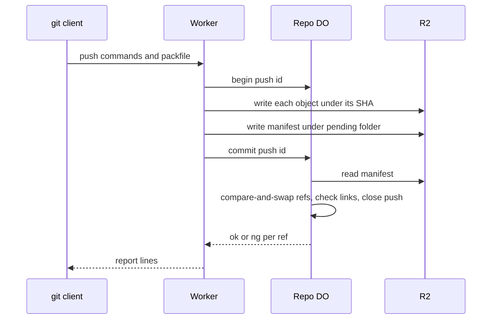

# Two-phase push

> Verdict: **lands with caveats** · feasibility 4/5 · reliability 3/5 · correctness 3/5 · effort: weeks
> Read the words in [how-to-read.md](../findings/how-to-read.md). Engineers: [proof](../proofs/two-phase-push.md) · [review](../reviews/two-phase-push.md)

## What this idea is

git is a tool that keeps every version of a set of files, and lets many people share those versions. A repository, or repo, is one project's full set of files and their history. A commit is one saved version of the files, with a note about what changed. A branch is a named line of commits, like a bookmark that moves forward as you save.

A ref is a name that points at one commit. A branch is a ref. A tag is a ref.

A push is sending your new commits to the server. An object is one stored item in git. An object is a file's content, a folder listing, or a commit.

This idea splits a push into two phases. Phase one stores every object in R2. R2 is Cloudflare's large file store. It holds the git objects.

Phase two asks the repo's Durable Object to check that nothing is missing and then move the refs, all at once or not at all. A Durable Object, or DO, is a single small program with its own storage that handles one thing at a time. There is one DO for each repo. Think of it like the one librarian who is allowed to update the catalog. If the server crashes between the phases, a janitor cleans up the leftovers. A janitor is a background task that deletes files nobody points to anymore.

Think of it like this. A mover first carries every box into the new house. Only when all boxes are inside does the owner sign the form that says the move is done. If the truck breaks down halfway, the boxes on the pavement are collected later and nobody has signed anything.

## How it works

Cloudflare Workers are small programs that run on Cloudflare's network close to the user, with no server to manage. A SHA is a fingerprint of an object's content. Two objects with the same content have the same fingerprint. DO SQLite is the small database inside each Durable Object.

1. A push arrives at a Worker. The Worker calls begin on the DO. The DO records an open push id in DO SQLite and sets the janitor alarm. An alarm is a timer inside a Durable Object. A DO has only one alarm at a time.
2. The Worker reads the command lines and then unpacks the packfile object by object. A packfile is one bundle that holds many objects, squeezed to save space.
3. The Worker writes each object to R2 under objects/SHA. That name is content-addressed. Content-addressed means stored under its own fingerprint, so the name tells you what is inside.
4. The Worker collects a manifest. The manifest lists every SHA and the links between objects, such as commit to tree and tree to entries.
5. The Worker writes the manifest to R2 under pending/pushId/manifest.json.
6. The Worker calls commit on the DO. The DO reads the manifest and does a compare-and-swap on each ref. Compare-and-swap, or CAS, means change a value only if it still has the value you expect. If someone changed it first, do nothing and report it.
7. The DO checks from the manifest links and its own objects index that no object is missing. The DO reads no object bytes from R2.
8. In one transaction, the DO records the new objects, moves the refs, and closes the push. The Worker sends the report lines to git.
9. If a push stays open past its timeout, the alarm deletes its objects, unless another open push or a committed push claims them.

## What the reviewer decided

The reviewer looks for blockers and caveats. A blocker is a problem that stops the idea from working until it is fixed. A caveat is a limit or a condition. The idea works, but only inside this limit.

The verdict is Lands with caveats.

| Score | Value |
|---|---|
| Feasibility | 4 of 5 |
| Reliability | 3 of 5 |
| Correctness | 3 of 5 |

Lands with caveats. The idea is sound and can be built. The proof has one or more problems that must be fixed first, and the reviewer described each fix. Think of it like a flight with a runway that needs some repairs before you land. The runway is there. The repairs are known.

For this idea, the design has the right shape and uses only GA building blocks. GA, or generally available, means a Cloudflare feature that is finished and supported, not a preview. The compare-and-swap inside one DO, the safe-to-repeat writes, and the manifest-driven cleanup are all correct in outline. The proof as written loses data when the janitor collides with a new push, and reports success for refs it never moved. Both fixes are small.

The remaining gaps sit in sibling ideas, but they must be closed before any normal git client can push. The reviewer expects weeks of work.

## Problems that must be fixed first

### Problem 1: The janitor and a new push collide

**What goes wrong.** The janitor alarm builds its list of lost files, then waits on R2. While the DO waits on the network, the input gate opens. The input gate is the rule that a Durable Object handles one request at a time while it waits on its own storage. The gate opens when the DO waits on the network instead. A new push begins and writes an object with the same SHA as a lost file. The janitor then deletes that object, after the new write.

The new push commits and records the SHA in its index, but R2 no longer has the bytes.

**Why it matters.** That outcome is silent data loss. Nobody notices until the next clone reports a missing object. A fetch is getting commits from the server. A clone gets everything for the first time.

**How to fix it.** Let the janitor stop and re-arm when any push began after the janitor started. Or record every deleted SHA in a table, and let commit compare the manifest against that table and write those objects again.

### Problem 2: The DO reports success for refs it did not move

**What goes wrong.** When one ref fails its compare-and-swap, commit returns early before any write. The result list still says ok for the other refs. Those refs did not move.

**Why it matters.** A normal git push of two branches, where one is stale, prints ok for the other branch. The client believes the push landed when it did not.

**How to fix it.** Either apply the refs that passed, or report ng for every ref with all-or-nothing rules.

### Problem 3: No normal git client can finish a push

**What goes wrong.** The report lines are sent without sideband. Sideband is a way to send two kinds of data in one stream, like a main channel and a progress channel. If the server advertised side-band-64k, git reads the first byte as a channel number and stops with "protocol error: bad band #117". Also, the git client compresses the body of a small push with gzip. The Worker never decompresses it.

**Why it matters.** A normal git push would fail. Small pushes fail at the first pkt-line, and all pushes fail at the report lines. A pkt-line is git's way of framing a message. Each line starts with four characters that give its length.

**How to fix it.** Wrap the report lines in sideband channel 1, or never advertise side-band-64k for push. Check the Content-Encoding header and decompress gzip bodies before parsing.

## Things to know

- A crash before the manifest is written leaks objects for good, because the janitor never lists the bucket. Only idea #55 can recover them, unless the manifest is written in chunks as objects stream.
- The commit code checks the push timeout before it waits on R2, not inside the transaction. A cleanup at the 15-minute boundary can run in between.
- When a link check fails, the DO throws an error and the client gets an HTTP 500. The client expects an "unpack error" pkt-line instead.
- The Worker hashes each whole object in memory and squeezes it again, so a file near 100 MB passes the 128 MB memory limit. Object boundaries need an unsqueezer written in JavaScript or in another compiled language, from idea #4.
- A delete-only push sends no packfile, so the parser must accept an empty body after the flush line. Push always uses the old v0 protocol, whatever idea #3 does for fetch.
- One R2 write per object and one JSON manifest cap a push at about 100,000 objects. The proof admits this limit.

## How this idea connects to the others

- The compare-and-swap on refs comes from [#1 One Durable Object per repo as the ref authority](./repo-do-ref-authority.md).
- The refs table and the object store come from [#2 Refs in DO SQLite, objects in R2](./refs-sqlite-objects-r2.md).
- The object-by-object unpacking comes from [#4 Packfile parsing in a Worker with a streaming inflater](./streaming-pack-parser.md).
- The safe-to-repeat object names come from [#5 Content-addressed R2 keys](./content-addressed-r2-keys.md).
- The command parsing and the pkt-line code come from [#53 The /info/refs?service= entrypoint and pkt-line codec](./info-refs-endpoint.md).
