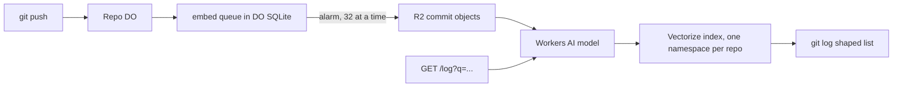

# Commit graph in Vectorize for semantic git log

> Verdict: **lands with caveats** · feasibility 4/5 · reliability 3/5 · correctness 2/5 · effort: weeks
> Read the words in [how-to-read.md](../findings/how-to-read.md). Engineers: [proof](../proofs/vectorized-commit-graph.md) · [review](../reviews/vectorized-commit-graph.md)

## What this idea is

Git is a tool that keeps every version of a set of files, and lets many people share those versions. A commit is one saved version of the files, with a note about what changed. The normal git log command lists commits in time order, and you can only search the notes for exact words. This idea lets you search commits by meaning. You type "the change that fixed the login timeout" and the server returns the commits that match best.

Think of it like this. A librarian who shelves books by topic, not by title, can answer "books about lonely whales" even when no title contains those words. The server turns each commit note into a point on a topic map, and your question becomes a point on the same map. The closest points are the answers.

## How it works

1. A push arrives. A push is sending your new commits to the server. The Durable Object for the repository moves the refs. A repository is one project's full set of files and their history. A Durable Object is a single small program with its own storage that handles one thing at a time. There is one DO for each repo. Think of it like the one librarian who is allowed to update the catalog. A ref is a name that points at one commit. A branch is a ref. A tag is a ref. A branch is a named line of commits, like a bookmark that moves forward as you save.
2. The DO adds the SHA of each new commit to a queue table in DO SQLite and sets an alarm. A SHA is a fingerprint of an object's content. Two objects with the same content have the same fingerprint. An object is one stored item in git. An object is a file's content, a folder listing, or a commit. DO SQLite is the small database inside each Durable Object. An alarm is a timer inside a Durable Object. A DO has only one alarm at a time.
3. The alarm takes 32 commits from the queue.
4. For each commit, the DO reads the commit object from R2 and unpacks it. R2 is Cloudflare's large file store. It holds the git objects. The DO reads the note, the time, and the parent from the object.
5. The DO compares the commit's folder listing with the parent's folder listing to find the names of changed files.
6. The DO sends the note plus the file names to Workers AI. Workers AI is a Cloudflare service that runs AI models. The model returns one list of numbers for each commit. That list is called a vector.
7. The DO stores the vectors in one shared Vectorize index. Vectorize is Cloudflare's store for vectors. Each repo gets its own namespace in the index. Each vector carries the SHA, the time, and the subject line.
8. The DO deletes the 32 commits from the queue and sets the alarm again.
9. A user sends a search question to a web endpoint. The DO turns the question into a vector, asks Vectorize for the closest commits, and looks up those commits in its own commit table. The DO prints the result in the same shape as git log, ordered by match score.

## What the reviewer decided

The verdict is: lands with caveats.

| Score | Value |
|---|---|
| Feasibility | 4 of 5 |
| Reliability | 3 of 5 |
| Correctness | 2 of 5 |

Lands with caveats. The idea is sound and can be built. The proof has one or more problems that must be fixed first, and the reviewer described each fix. Think of it like a flight with a runway that needs some repairs before you land. The runway is there. The repairs are known.

For this idea, the verdict means the following. Every Cloudflare building block is GA. GA means a Cloudflare feature that is finished and supported, not a preview. The work runs in an alarm after the push has finished, so refs and objects are never at risk. A normal git command such as clone, push, or fetch is not affected. A fetch is getting commits from the server. A clone gets everything for the first time. The proof has two blockers. A blocker is a problem that stops the idea from working until it is fixed. As written, the proof stores nothing in the index at all. The reviewer also listed six caveats. A caveat is a limit or a condition. The idea works, but only inside this limit. The biggest caveat is that the idea title cannot be delivered. There is no `git log --semantic` in a normal git client, and the proof does not index file changes. What lands is a search endpoint over commit notes and changed file names. The reviewer estimates the work at weeks.

## Problems that must be fixed first

### Problem 1: Every vector id is too long

**What goes wrong.** The proof builds each vector id from the DO id, a colon, and the SHA. That id is 105 bytes long. Vectorize allows at most 64 bytes for an id. Vectorize rejects every write.

**Why it matters.** As written, nothing is ever stored in the index. Every search returns nothing.

**How to fix it.** Use the bare SHA as the id. The namespace already separates one repo from another, so the DO id is not needed in the id.

### Problem 2: One bad commit blocks the queue forever

**What goes wrong.** The code that reads the commit and computes changed files sits outside the error handler that counts retries. The push step can add SHAs of folder listings and tags to the queue, not only commits. When one SHA is missing from R2 or is not a commit, the whole alarm throws. The retry count never goes up. The next alarm selects the same 32 rows and throws again.

**Why it matters.** The queue for that repo is stuck forever. No later push in that repo is ever indexed.

**How to fix it.** Wrap the work for each SHA in its own error handler and raise that SHA's retry count on failure. Move a SHA to a dead-letter state after five tries. Add only commit objects to the queue.

## Things to know

- The stated goal cannot be reached, and the proof admits it. A normal git client cannot run `git log --semantic`, because git log runs on your own computer. The proof also does not index file changes. What lands is a server-side search endpoint over commit notes plus changed file names.
- The search does not check whether a commit is still reachable from a branch. There is no delete path at all. Commits from force pushes, deleted branches, and deleted repos stay searchable. Vectorize cannot delete a whole namespace at once, so deletion must list the SHAs from the commit table and delete them by id.
- Vectorize applies writes with a delay. A search a few seconds after a push misses the newest commits. A search returns at most 100 results, and there is no way to ask for the next page.
- One shared index allows at most 50,000 namespaces and 5 million vectors. The index must be split across several indexes, and the proof does not design that split.
- Indexing an imported history runs in one single-threaded DO alarm at 32 commits per batch, and the alarm competes with pushes. Workers AI charges for every commit and for every search question, and the proof has no cache for question vectors.
- The model in the proof is in beta in the Workers AI catalog. Pin the model bge-base-en-v1.5 if only GA features are allowed. If objects are stored in packfiles, the R2 key the proof assumes no longer exists. A packfile is one bundle that holds many objects, squeezed to save space.

## How this idea connects to the others

- This idea needs one Durable Object per repository to own the refs, from [#1 One Durable Object per repo as the ref authority](./repo-do-ref-authority.md).
- This idea keeps refs in DO SQLite and objects in R2, from [#2 Refs in DO SQLite, objects in R2](./refs-sqlite-objects-r2.md).
- This idea learns which commits are new from the pack parsing in [#4 Packfile parsing in a Worker with a streaming inflater](./streaming-pack-parser.md).
- This idea reads commit objects from R2 by their fingerprint, from [#5 Content-addressed R2 keys](./content-addressed-r2-keys.md).
- This idea starts its work after the second phase of the push in [#6 Two-phase push](./two-phase-push.md).
- This idea reads and writes the commit table from [#56 Want/have negotiation with a commit-graph in SQLite](./want-have-negotiation.md).
- This idea can expose its search as a command from [#32 Agent-native protocol v2 commands](./agent-native-commands.md).
