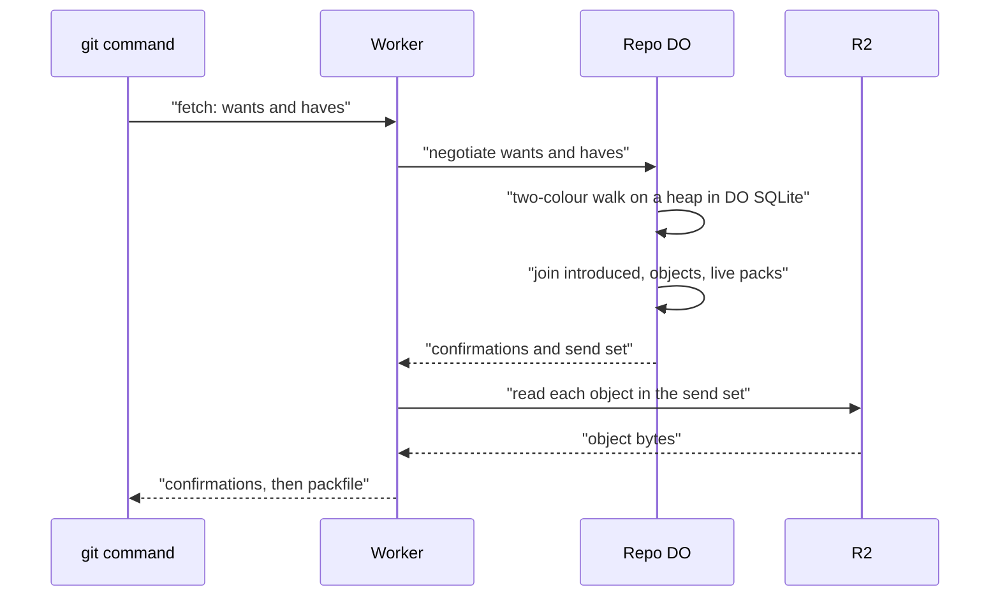

# Want/have negotiation with a commit-graph in SQLite

> Verdict: **lands with caveats** · feasibility 4/5 · reliability 3/5 · correctness 3/5 · effort: weeks
> Read the words in [how-to-read.md](../findings/how-to-read.md). Engineers: [proof](../proofs/want-have-negotiation.md) · [review](../reviews/want-have-negotiation.md)

## What this idea is

git is a tool that keeps every version of a set of files, and lets many people share those versions. A commit is one saved version of the files, with a note about what changed. When you ask a server for new commits, the server must work out which commits you lack. git does that with a short exchange, where you name the commits you want and the commits you already have. This idea answers that question from a small table of commits and their parents inside the server's own database. The server never has to read each commit from the large file store.

Think of it like this. A friend asks which episodes of a series they have missed. You do not watch the series again. You look at the episode list, find the last one they saw, and read off everything after it.

## How it works

The second pass writes the design in Rust, against one shared contract that every idea in this set follows. A repository, or repo, is one project's full set of files and their history. A Durable Object, or DO, is a single small program with its own storage that handles one thing at a time. There is one DO for each repo. Think of it like the one librarian who is allowed to update the catalog. DO SQLite is the small database inside each Durable Object. Cloudflare Workers are small programs that run on Cloudflare's network close to the user, with no server to manage. Wasm, or WebAssembly, is a way to run code from other languages, such as Rust, inside a Worker. A new module adds two tables to DO SQLite and fills them during each push.

1. The commits table holds each commit, its generation number, its root folder listing, and a list of its parents. A generation number is one more than the highest number among a commit's parents, so every parent has a lower number than its children. The introduced table lists, for each commit, the objects that first appear in that commit.
2. Push means sending your new commits to the server. An object is one stored item in git. An object is a file's content, a folder listing, or a commit. While a push stores the new objects, the Worker feeds every commit and folder listing it decodes into a graph builder in memory.
3. After the new objects are stored and checked, and before any ref moves, the Worker posts the graph rows. A ref is a name that points at one commit. A branch is a ref. A tag is a ref. The Worker first sorts the new commits so every parent comes before its children, then computes each generation number.
4. Parents the DO already knows contribute their stored numbers through a new route on the DO. The Worker fills the introduced rows with a diff that descends only where a commit's entry differs from every parent's entry at the same name. The rows reach the DO in batches of 10,000.
5. Fetch means getting commits from the server. A clone gets everything for the first time. Protocol v2 is the newer, cleaner set of messages git uses to talk to a server. A fetch sends a protocol v2 message with a list of wanted commits and a list of commits the client has. The Worker forwards that message to the DO of the repository.
6. A branch is a named line of commits, like a bookmark that moves forward as you save. The wanted commits are usually the tips of branches. The DO confirms each commit the client has, if that commit has a row in the commits table.
7. The DO then walks the history in two colours, the same way git does. The walk keeps its queue in a heap ordered by generation number, so each step costs almost nothing. Commits the client has, and all their parents, are painted as not needed. The walk stops when every queued commit is painted as not needed. A walk that passes 200,000 steps ends the fetch with a clear limit error.
8. One database join per group of 90 commits lists every object those commits brought in. All of that used DO SQLite only, with no read from the large file store to decide what to send.
9. Every hole falls back. A want with no commits row, a parent row missing during the walk, or a commit with no introduced rows sends the fetch to a slower path. That path reads the commits themselves from the object store. Requests for a shallow fetch or a folder listing take the fallback too.
10. A packfile is one bundle that holds many objects, squeezed to save space. Sideband is a way to send two kinds of data in one stream, like a main channel and a progress channel. The shared wire module writes the confirmations, a divider, and then the packfile in sideband frames of 65,515 bytes.
11. R2 is Cloudflare's large file store. It holds the git objects. Only now does the Worker read R2, once per object in the send set. A failed read during the stream becomes one error frame in the sideband, and the stream ends.
12. A fresh clone goes to the ready-made packfile of idea #7 when a plan exists. A protocol v2 client resends its full list of commits it has on every round, so each request stands alone.

## What the reviewer decided

The reviewer decided that this idea is risky.

| Score | Value |
|---|---|
| Feasibility | 4 of 5 |
| Reliability | 3 of 5 |
| Correctness | 3 of 5 |

| Score | First pass | Second pass |
|---|---|---|
| Feasibility | 4 of 5 | 4 of 5 |
| Reliability | 3 of 5 | 3 of 5 |
| Correctness | 3 of 5 | 3 of 5 |

Feasibility asks if Cloudflare can run the idea today. Reliability asks if the idea keeps data safe when things fail. Correctness asks if the idea does what its title says.

Risky. The idea can be built. But the proof shows one or more problems the reviewer could not fully solve, or it does a weaker version of the goal. Think of it like a runway you can see on the map, but nobody has checked it for holes.

A blocker is a problem that stops the idea from working until it is fixed. A caveat is a limit or a condition. The idea works, but only inside this limit. For this idea, the reviewer found three blockers and six caveats.

The scores stayed flat, but the verdict moved down from lands with caveats to risky. The second pass closed all three first-pass blockers, and the folder-listing diff that fills the introduced table is now spelled out instead of skipped. But the reviewer found two reachable holes. Each can serve a pack that is missing objects the client needs, and git accepts such a pack without a complaint. That is the one failure the proof argues cannot happen. The fixes are small and mechanical, so the idea is one more pass away, not a redesign.

The work that remains is real. The order of the graph posts must change, the walk must track which commits it already handled, and two helpers must move into the shared module. A named repair job must also backfill old repositories before the graph earns anything on them. The speed of the large join over millions of rows is still unmeasured, and that measurement decides whether the idea pays. The reviewer still expects weeks.

## What changed in the second pass

- Sideband frames too large for git: fixed by the contract modules. The shared wire module now frames the pack in sideband pieces of 65,515 bytes, the size git accepts.
- Pushed commits arrive out of order: fixed. The Worker computes generation numbers only after every commit in the push is known, with a sort that puts every parent before its children.
- The walk is too slow on medium repositories: fixed. The queue is now a heap ordered by generation number with a hard stop at 200,000 steps, but the fix assumes parents always carry lower numbers, which the write path cannot always deliver.
- The folder-listing diff for the introduced table was skipped: fixed. The diff descends only where a commit's entry differs from every parent's entry, and it reads old folder listings in grouped rounds.
- The send list crossed the DO call cap and needed batching: fixed. The send set never leaves the DO, every list of values is batched at 90, and a fresh clone still goes to the ready-made packfile first.
- A failed read during the pack stream left the client hanging: fixed by the contract modules. A mid-stream failure now sends one error frame and ends the stream.
- The ref move and the commit record were not one transaction: partly fixed. The rows are posted before the commit step, but a crash mid-post can still leave partial rows the count check cannot see, which is problem 1 below.
- The stop rule stayed looser than git's own rule: still open. The shared contract keeps the same rule, and a larger pack than needed stays legal.
- Objects stored outside the push path were invisible to fetch forever: fixed. Under the contract every object enters through the same push path, which feeds the graph builder.
- The walk ran in JavaScript and could hit the CPU cap: fixed. The walk is now Rust over the DO's own database, and a fresh clone's send set is one join instead of a walk.
- Whether negotiation depended on the pack format: fixed. All stored packs now hold full objects, so the question no longer applies.

## Problems that must be fixed first

### Problem 1: A crash can leave half-written rows nothing detects

**What goes wrong.** The Worker posts all commit rows first, then the introduced rows in batches of 10,000. The only coverage check counts whether each commit has at least one introduced row. A crash in the middle leaves a commit with half its set, and nothing ever deletes graph rows. A fetch can also see this state between two batches, with no crash at all.

**Why it matters.** A fetch that reaches such a commit gets a pack that is missing objects. git accepts the pack and moves the refs, and the damage shows only when the client checks the files. The hole is permanent, because no later push rewrites those rows.

**How to fix it.** Post the introduced batches first and the commit rows last. Then a commit row proves the whole set is there, and the count check is enough. Or store the expected row count for each commit and check that.

### Problem 2: The walk can stop early when a parent's number is not lower

**What goes wrong.** The walk keeps a count of queued commits that can still matter. Painting a commit as not needed drops the count by one. A commit that was already handled gets counted down a second time. That needs a child handled after its parent. A later push can cause that by writing the parent's row with an equal or higher generation number.

**Why it matters.** When the count reaches zero too early, the walk stops while a commit that matters is still queued. That commit's objects never reach the pack. The client again gets a pack that is missing objects and accepts it.

**How to fix it.** Record which commits were already handled and skip the second countdown. The generation numbers themselves cannot be repaired, because a child's row can predate its parent's row.

### Problem 3: The code does not compile against its siblings

**What goes wrong.** The new module imports two helpers from the shared edge module, but those helpers live inside the push code. The module also calls a marking method that is private in a sibling module.

**Why it matters.** Rust code that cannot find its imports does not compile. Nothing in the crate can be tested until the helpers move.

**How to fix it.** Move the two helpers into the shared edge module and make the marking method visible inside the crate. The proof already names these write-backs.

## Things to know

- The push builder builds one JSON value per commit before batching starts, and the memory cap counts only the raw bytes. The real memory use runs two to three times higher. A push near the cap can run the Worker out of memory mid-post, which is the crash that leaves the permanent hole of problem 1.
- On repositories whose history predates this feature, every fetch that reaches an unrecorded ancestor takes the slow fallback. The graph earns nothing until a repair job fills in old history, and that job is named but not built.
- The join picks one location row per object when two live packs hold the same object. The database happens to fill that pick from one row, but the proof's argument does not cover a mixed pick. A test must pin the behavior.
- A graph post for a push that is no longer open reaches the client as a plain HTTP error, not a report the client can read. The error mapping at the edge is still missing in the sibling idea.
- The two tables never shrink. A repository with five million objects needs about 350 MB of DO SQLite for them. A cleanup idea is named for later.
- Several pieces are unverified on day one. These are the names of the parsing calls in the git library, the shape of the count query, and the request bodies sent to the DO. One helper on the pinned toolchain is unverified too. The unmeasured piece is the speed of the large join over millions of rows, which decides whether the idea pays.

## How this idea connects to the others

This idea needs [#1 One Durable Object per repo as the ref authority](./repo-do-ref-authority.md), which is the DO that holds the tables and moves the refs.

This idea needs [#2 Refs in DO SQLite, objects in R2](./refs-sqlite-objects-r2.md), which places the tables in DO SQLite and the objects in R2.

This idea needs [#6 Two-phase push](./two-phase-push.md), whose second phase feeds the graph builder and posts the rows.

This idea needs [#4 Packfile parsing in a Worker with a streaming inflater](./streaming-pack-parser.md), which decodes each pushed commit and folder listing.

This idea needs [#10 Shallow and partial clone as first-class filters](./partial-clone-filters.md), which owns the send set, the read planner, and the pack writer.

This idea needs [#7 Precomputed pack slices for clone](./precomputed-clone-pack.md), which serves fresh clones before the graph path runs.

This idea needs [#3 Speak git protocol v2 only, translate v0 at the edge](./protocol-v2-only.md), because the exchange uses protocol v2 messages and its reply writer.

This idea needs [#53 The /info/refs?service= entrypoint and pkt-line codec](./info-refs-endpoint.md), which reads the pkt-lines of the fetch message.

This idea also notes that [#24 Per-blob presigned direct upload for giant pushes](./presigned-direct-upload.md) must run the same graph fill for the objects it stores.
