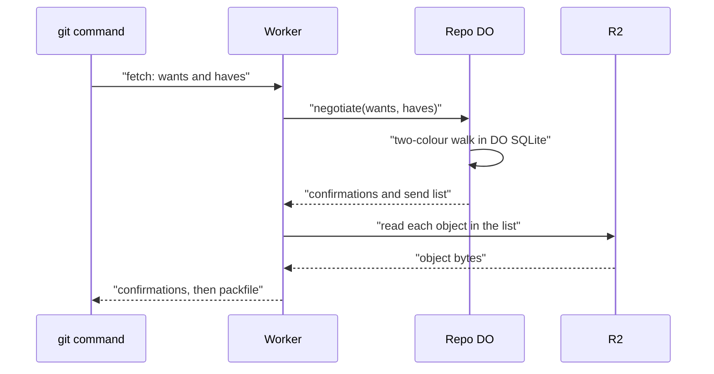

# Want/have negotiation with a commit-graph in SQLite

> Verdict: **lands with caveats** · feasibility 4/5 · reliability 3/5 · correctness 3/5 · effort: weeks
> Read the words in [how-to-read.md](../findings/how-to-read.md). Engineers: [proof](../proofs/want-have-negotiation.md) · [review](../reviews/want-have-negotiation.md)

## What this idea is

git is a tool that keeps every version of a set of files, and lets many people share those versions. A commit is one saved version of the files, with a note about what changed. When you ask a server for new commits, the server must work out which commits you lack. git does that with a short exchange, where you name the commits you want and the commits you already have. This idea answers that question from a small table of commits and their parents inside the server's own database. The server never has to read each commit from the large file store.

Think of it like this. A friend asks which episodes of a series they have missed. You do not watch the series again. You look at the episode list, find the last one they saw, and read off everything after it.

## How it works

1. A repository is one project's full set of files and their history. A Durable Object, or DO, is a single small program with its own storage that handles one thing at a time. There is one DO for each repo. Think of it like the one librarian who is allowed to update the catalog. DO SQLite is the small database inside each Durable Object.
2. Push means sending your new commits to the server. An object is one stored item in git. An object is a file's content, a folder listing, or a commit. During a push, the server opens every new commit and folder listing anyway. From those, the server fills three tables in DO SQLite.
3. The commits table holds each commit, its folder listing, and its generation number. A generation number is one more than the highest number among its parents, so every parent has a lower number than its children. The parents table holds each commit's parents. The introduced table lists, for each commit, the objects that first appear in that commit.
4. Fetch means getting commits from the server. A clone gets everything for the first time. Protocol v2 is the newer, cleaner set of messages git uses to talk to a server. A fetch sends a protocol v2 message with a list of wanted commits and a list of commits the client has.
5. Cloudflare Workers are small programs that run on Cloudflare's network close to the user, with no server to manage. A Worker forwards that message to the DO of the repository.
6. A ref is a name that points at one commit. A branch is a ref. A tag is a ref. A branch is a named line of commits, like a bookmark that moves forward as you save. The wanted commits are usually the tips of branches. The DO confirms each commit the client has, if that commit is in the commits table.
7. The DO then walks the history in two colours, the same way git does. Commits the client has, and all their parents, are painted as not needed. The walk always handles the commit with the highest generation number next, so every commit is settled before its parents. The walk stops when every commit left to look at is painted as not needed.
8. The commits still unpainted are the ones to send. One query on the introduced table gives every object those commits brought in. All of that used DO SQLite only, with no read from the large file store.
9. R2 is Cloudflare's large file store. It holds the git objects. Only now does the Worker read R2, once per object in the send list.
10. A packfile is one bundle that holds many objects, squeezed to save space. Sideband is a way to send two kinds of data in one stream, like a main channel and a progress channel. The Worker streams the confirmations, a divider, and then the packfile inside a sideband.
11. A protocol v2 client resends its full list of commits it has on every round. So each request stands alone, and the DO stores nothing between rounds.

## What the reviewer decided

The reviewer decided that this idea lands with caveats.

| Score | Value |
|---|---|
| Feasibility | 4 of 5 |
| Reliability | 3 of 5 |
| Correctness | 3 of 5 |

Feasibility asks if Cloudflare can run the idea today. Reliability asks if the idea keeps data safe when things fail. Correctness asks if the idea does what its title says.

Lands with caveats. The idea is sound and can be built. The proof has one or more problems that must be fixed first, and the reviewer described each fix. Think of it like a flight with a runway that needs some repairs before you land. The runway is there. The repairs are known.

A blocker is a problem that stops the idea from working until it is fixed. A caveat is a limit or a condition. The idea works, but only inside this limit. For this idea, the reviewer found three blockers and six caveats.

GA means a Cloudflare feature that is finished and supported, not a preview. Every feature the proof uses is GA. The walk is git's own method, and the send list is proven to hold everything the client needs, and perhaps a little more. But the code as written does not work with a normal git command, because its sideband frames are too large. The push side also breaks when commits arrive out of order. The reviewer expects those two fixes to take days, and the tree diff and scaling work around them to take weeks.

## Problems that must be fixed first

### Problem 1: Sideband frames are too large for git

**What goes wrong.** Pkt-line is git's way of framing a message. Each line starts with four characters that give its length. The proof puts 65,519 bytes of data in each sideband frame, which makes a pkt-line of 65,524 bytes. git refuses any pkt-line whose length minus four is 65,520 or more, and stops with a bad line length error.

**Why it matters.** A normal git clone or fetch fails for any repository that holds a file over 64 KB. That is nearly every repository. The reviewer notes that the proof was never run against a real git command.

**How to fix it.** Put at most 65,515 bytes of data in each sideband frame. That is one constant.

### Problem 2: Pushed commits arrive out of order

**What goes wrong.** When the push records a commit, the code reads each parent's generation number with a helper that throws when the row is missing. Objects in a pushed packfile are not sorted parents first. So a child commit often arrives before its parent, the helper throws, and the whole push transaction is cancelled.

**Why it matters.** A normal git push with more than one new commit fails at random. The user sees no clear reason.

**How to fix it.** Sort the new commits so that every parent comes before its children. Then insert them.

### Problem 3: The walk is too slow on medium repositories

**What goes wrong.** On every step, the walk sorts the whole list of commits still to look at, then takes the first one. The cost grows much faster than the number of commits. A few tens of thousands of commits to send is enough to go past the 30 second CPU limit of a DO.

**Why it matters.** A fetch that covers a large part of the history stops with an error on a repository of medium size.

**How to fix it.** Keep the commits in a heap ordered by generation number, so each step costs almost nothing.

## Things to know

- The introduced table needs a comparison of each new commit's folder listing against its parents' listings, which live in R2. The proof skips that work and takes the result as given. That work is the real cost, and gives about 400 MB of DO SQLite for a repository with five million objects.
- The DO returns the whole send list in one reply, which has a cap of 32 MB. The DO then feeds the list into one query, which has a cap of about 32,000 values. Both need batching, and a fresh clone must go to the ready-made packfile of idea #7 instead.
- A failed R2 read during the packfile stream becomes an unhandled error, and the stream is never closed. The client hangs until the connection drops, instead of getting an error frame in the sideband.
- The proof does not say that the ref move and the commit record share one transaction. A crash between them can leave a ref whose commit is missing from the table. Every fetch of that ref then fails until someone pushes again.
- The rule that says when to stop the exchange is looser than git's own rule. The result is a packfile that holds more than needed, which git accepts. But an unrelated commit in the client's list can produce a packfile of nearly the whole history.
- Wants that name a tag object, the include-tag option, and the shallow and filter options are left out. A client that asks for shallow or filter gets a full packfile with no warning, instead of an error.

## How this idea connects to the others

This idea needs [#1 One Durable Object per repo as the ref authority](./repo-do-ref-authority.md), which is the DO that holds the commit tables.

This idea needs [#2 Refs in DO SQLite, objects in R2](./refs-sqlite-objects-r2.md), which places the tables in DO SQLite and the objects in R2.

This idea needs [#4 Packfile parsing in a Worker with a streaming inflater](./streaming-pack-parser.md), which opens each pushed commit and fills the tables.

This idea needs [#5 Content-addressed R2 keys](./content-addressed-r2-keys.md), which sets where the Worker reads each object.

This idea needs [#3 Speak git protocol v2 only, translate v0 at the edge](./protocol-v2-only.md), because the exchange uses protocol v2 messages.

This idea needs [#53 The /info/refs?service= entrypoint and pkt-line codec](./info-refs-endpoint.md), which reads the pkt-lines of the fetch message.
