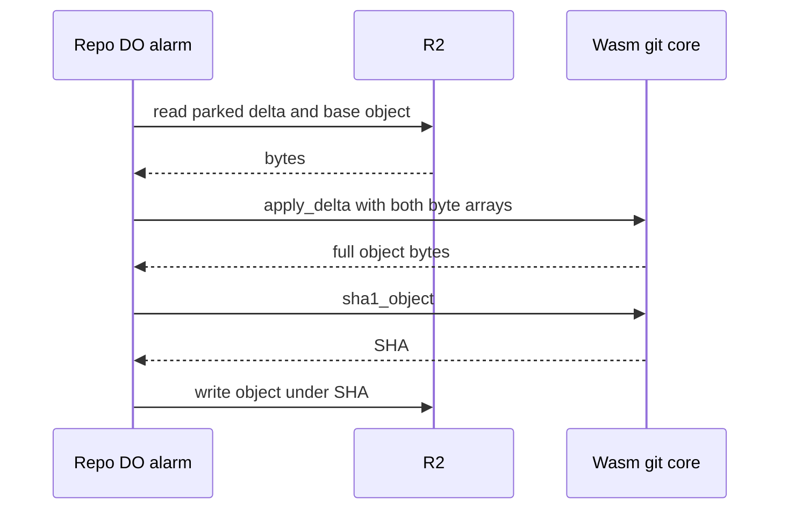

# Wasm git core for delta resolution and merge

> Verdict: **risky** · feasibility 4/5 · reliability 3/5 · correctness 3/5 · effort: weeks
> Read the words in [how-to-read.md](../findings/how-to-read.md). Engineers: [proof](../proofs/wasm-git-core.md) · [review](../reviews/wasm-git-core.md)

## What this idea is

Git is a tool that keeps every version of a set of files, and lets many people share those versions. A repository, or repo, is one project's full set of files and their history. Cloudflare Workers, or Workers, are small programs that run on Cloudflare's network close to the user, with no server to manage. Wasm, or WebAssembly, is a way to run code from other languages, such as Rust, inside a Worker. Some git work is heavy, such as rebuilding a file from a delta or merging two versions of a file. This idea compiles a small part of gitoxide, a git library written in Rust, to Wasm. The TypeScript code does all reading and writing. The Wasm code only turns bytes into other bytes.

Think of it like this. A restaurant kitchen brings in one pastry chef for the hard work. The waiters carry every plate in and out. The pastry chef never leaves the station.

## How it works

An object is one stored item in git. An object is a file's content, a folder listing, or a commit. A commit is one saved version of the files, with a note about what changed. A delta is a stored object written as "the same as that other object, with these changes". A packfile, or pack, is one bundle that holds many objects, squeezed to save space. A push is sending your new commits to the server. R2 is Cloudflare's large file store. It holds the git objects. A SHA, or hash, is a fingerprint of an object's content. Two objects with the same content have the same fingerprint. A Durable Object, or DO, is a single small program with its own storage that handles one thing at a time. There is one DO for each repo. Think of it like the one librarian who is allowed to update the catalog. An alarm is a timer inside a Durable Object. A DO has only one alarm at a time.

1. A Rust crate with gitoxide's delta applier, object parser and file merger is compiled to Wasm and shipped inside the Worker bundle.
2. Each Worker isolate creates one instance of the Wasm module and keeps that instance.
3. The module exposes four pure functions: apply_delta, merge_blob, parse_tree and sha1_object.
4. During a push, some deltas cannot be applied at once, because their base object is not present yet. The parser parks them in a pending area in R2.
5. An alarm in the repo DO reads each parked delta and its base from R2, copies both into Wasm memory, and calls apply_delta.
6. The DO computes the SHA of the result and writes the result to R2 under that SHA.
7. The server-side merge idea calls merge_blob with the base, ours and theirs versions, and writes the merged file to R2.
8. The Wasm code never calls back out. TypeScript finishes all reads before each call.

## What the reviewer decided

The reviewer's verdict is Risky.

| Score | Value |
|---|---|
| Feasibility | 4 of 5 |
| Reliability | 3 of 5 |
| Correctness | 3 of 5 |

Risky. The idea can be built. But the proof shows one or more problems the reviewer could not fully solve, or it does a weaker version of the goal. Think of it like a runway you can see on the map, but nobody has checked it for holes.

For this idea, the split of work is sound. The host does all input and output, and the Wasm side handles pure bytes. GA, or generally available, means a Cloudflare feature that is finished and supported, not a preview. Every Cloudflare feature used is GA. No data can be lost and no two records can disagree, because refs stay in the DO and R2 keys are content-addressed. Content-addressed means stored under its own fingerprint, so the name tells you what is inside. A blocker is a problem that stops the idea from working until it is fixed. But the proof has three blockers, and the reviewer says the verdict becomes "lands with caveats" once all three are fixed. The reviewer expects two to four weeks of work.

## Problems that must be fixed first

### Problem 1: Offset deltas point at nothing

**What goes wrong.** A delta in a pack names its base in one of two ways. A ref-delta gives the base's SHA. An ofs-delta gives a byte offset inside the same pack. This proof resolves an ofs-delta by reading a byte range at the pack key plus the offset in R2. But the pack parser never stores the raw pack. The parser stores each object as a loose file under its SHA. Also, the entry at that offset can itself be a delta, and git chains deltas up to 50 deep. The proof treats whatever sits at that offset as full content.

**Why it matters.** The result hashes to a garbage SHA. The DO stores a file nobody points to, the connectivity check fails, and a normal git push fails.

**How to fix it.** Either store the raw pack under a key that the parser records. Or make the parser park each offset as a pending key, and resolve chains in order inside the DO.

### Problem 2: The alarm can loop forever

**What goes wrong.** When a base object is missing, the code skips the delta and re-arms the alarm 50 milliseconds later. When a pending key is missing in R2, an assertion throws, and the alarm retries. In both cases the alarm re-arms forever.

**Why it matters.** The push never commits and never reports a failure. The client sits in git push until the connection times out. The DO burns time and blocks the janitor. A janitor, also called a sweep or GC, is a background task that deletes files nobody points to anymore.

**How to fix it.** Fail the push with `ng <ref> missing base <sha>`. Cap the number of retries per push id.

### Problem 3: Wasm memory only grows

**What goes wrong.** The Wasm instance lives as long as the isolate. The code asks for memory for each request and never frees or resets that memory. The memory grows with every request.

**Why it matters.** An isolate is capped at 128 MB. When the cap is reached, every request on that isolate dies.

**How to fix it.** Expose a reset function or a free function in the Wasm module. Call that function after each request.

## Things to know

A caveat is a limit or a condition. The idea works, but only inside this limit.

- The 50 millisecond drain alarm in this proof and the 15 minute janitor alarm in two-phase push overwrite each other. A small push can delay a large push's drain by 15 minutes.
- Wasm is wired only into the rare parked-delta path in the DO, and the hot inline delta apply in the pack parser stays JavaScript. The promised speed gain mostly does not land unless the parser also calls apply_delta.
- Nobody has checked that the gix-merge crate compiles to Wasm, because that crate pulls in command, filter and temp file crates. The fallback is to copy the text merge driver into the project.
- The claim "byte-identical to git merge" is overstated, because the diff algorithm and the conflict marker labels can differ from git in edge cases. Conflict detection is the same.
- The per-slice budget counts rows, 64 at a time, not bytes. Sixty-four deltas of 40 MB each can exceed the 30 second CPU limit unless a CPU limit is configured.
- This proof touches no git wire messages. Working with real git depends fully on the push report from two-phase push.

## How this idea connects to the others

This idea must agree with [#4 Packfile parsing in a Worker with a streaming inflater](./streaming-pack-parser.md) on where parked deltas and raw packs live.

This idea runs inside the pending step of [#6 Two-phase push](./two-phase-push.md) and shares that idea's alarm.

This idea writes results under their fingerprint, as set out in [#5 Content-addressed R2 keys](./content-addressed-r2-keys.md).

This idea replaces the pure JavaScript merge in [#17 Server-side three-way merge in the Worker](./server-side-merge.md).

This idea relies on the repo's DO owning the refs, as in [#1 One Durable Object per repo as the ref authority](./repo-do-ref-authority.md).
