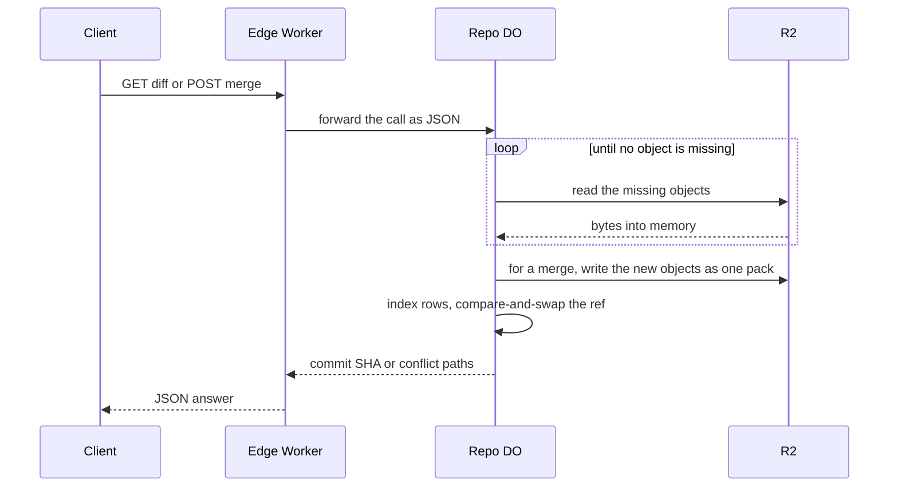

# Wasm git core for delta resolution and merge

> Verdict: **risky** · feasibility 4/5 · reliability 3/5 · correctness 3/5 · effort: weeks
> Read the words in [how-to-read.md](../findings/how-to-read.md). Engineers: [proof](../proofs/wasm-git-core.md) · [review](../reviews/wasm-git-core.md)

## What this idea is

Git is a tool that keeps every version of a set of files, and lets many people share those versions. A repository, or repo, is one project's full set of files and their history. Cloudflare Workers, or Workers, are small programs that run on Cloudflare's network close to the user, with no server to manage. Wasm, or WebAssembly, is a way to run code from other languages, such as Rust, inside a Worker.

Some git work is heavy, such as merging two versions of a file or finding every difference between two versions. This idea makes the whole Worker one Rust crate compiled to Wasm, so all git work runs in one language and one engine. On top of that crate, the idea adds a merge engine, a diff engine, and two web routes that call them.

Think of it like this. The kitchen stopped hiring a separate pastry chef for the hard dishes. Every cook now works from the same recipe book. The two new dishes on the menu are a plate that shows the difference between two recipes, and a plate that combines two recipes into one.

## How it works

The second pass writes the design in Rust, against one shared contract that every idea in this set follows. The hybrid of TypeScript and a small Wasm module is gone. The whole Worker is one Rust crate, and that crate is the git core.

1. The shared crate already resolves every delta of every push. A push is sending your new commits to the server. A commit is one saved version of the files, with a note about what changed. A delta is a stored object written as "the same as that other object, with these changes". An object is one stored item in git. An object is a file's content, a folder listing, or a commit.
2. This idea adds the merge and diff pieces the crate did not have. The text merge driver is vendored, which means its 926 lines are copied into the project. A diff library named imara-diff and a small tree merge complete the piece.
3. Two JSON routes appear under the repo's web address. The diff route takes the ids of two objects. The merge route takes a target ref, a commit id, and a message. A ref is a name that points at one commit. A branch is a ref. A tag is a ref.
4. Each route forwards the call to the repo's Durable Object as JSON. A Durable Object, or DO, is a single small program with its own storage that handles one thing at a time. There is one DO for each repo. Think of it like the one librarian who is allowed to update the catalog.
5. Inside the DO, a plain function computes over objects held in memory. When the function needs an object that is not loaded, the function returns the missing ids. A waiting half then reads those objects from R2 and calls the function again. R2 is Cloudflare's large file store. It holds the git objects.
6. The diff route loads the two objects and answers with the line ranges that differ for two files, or with the list of changed paths for two commits.
7. The merge route finds the last commit the two sides share. The merge then walks the three folder trees, merges each changed file with the vendored driver, and builds the new objects.
8. A merge ends as a normal push inside the DO. The new objects go to R2 as one pack. A packfile, or pack, is one bundle that holds many objects, squeezed to save space. The index rows go to DO SQLite. DO SQLite is the small database inside each Durable Object.
9. One compare-and-swap moves the ref only if the tip has not moved. Compare-and-swap, or CAS, means change a value only if it still has the value you expect. If someone changed it first, do nothing and report it. A clean merge answers with the new commit's SHA. A SHA, or hash, is a fingerprint of an object's content. Two objects with the same content have the same fingerprint. A conflicted merge answers with the list of conflicted paths, and no ref moves.

## What the reviewer decided

The reviewer looks for blockers and caveats. A blocker is a problem that stops the idea from working until it is fixed. A caveat is a limit or a condition. The idea works, but only inside this limit.

The verdict is Lands with caveats.

| Score | Value |
|---|---|
| Feasibility | 4 of 5 |
| Reliability | 4 of 5 |
| Correctness | 3 of 5 |

| Score | First pass | Second pass |
|---|---|---|
| Feasibility | 4 of 5 | 4 of 5 |
| Reliability | 3 of 5 | 4 of 5 |
| Correctness | 3 of 5 | 3 of 5 |

Lands with caveats. The idea is sound and can be built. The proof has one or more problems that must be fixed first, and the reviewer described each fix. Think of it like a flight with a runway that needs some repairs before you land. The runway is there. The repairs are known.

For this idea, the second pass is a real step forward, and the verdict moves up from risky. Making the whole crate the git core deletes the first pass's entire failure surface. The memory leak, the endless alarm, and the parked-delta mismatch are gone by design. The surviving feature is a real push with the right ordering, so reliability rises from 3 to 4. Correctness stays at 3 because the merge route, as written, fails its own main test.

The remaining work is local. One bug hides the shared base commit and breaks the main merge case. One ordering slip can strand a finished pack in R2. Four function calls do not match the pinned libraries. One shared type has two rival definitions in the sibling ideas. The reviewer still expects weeks of work, because the foundation must land first.

## What changed in the second pass

- Offset deltas pointed at nothing: fixed by the contract modules. The raw pack is now saved whole under the push's own pending key. The parser resolves each delta chain by its recorded offset, in order, with a depth cap. Only fully resolved bytes get a fingerprint, so a broken chain cannot mint a plausible one.
- The drain alarm could loop forever: fixed. There is no drain loop anymore. A missing base fails the push at once with an unpack message and an ng line for every ref.
- Wasm memory only grew: fixed. There is no separate Wasm module and no memory protocol anymore. Object data lives in ordinary Rust memory, bounded by byte budgets, and is dropped when the request ends.
- The drain alarm and the janitor alarm overwrote each other: fixed by the contract modules. A janitor is a background task that deletes files nobody points to anymore. The merge registers no job and finishes inside one request, and the jobs dispatcher is the only code that arms the alarm.
- Wasm ran only on the rare parked-delta path: fixed. Every delta of every push is now resolved inside the crate during the ingest step. The rare path no longer exists.
- Nobody had checked that the gix-merge crate compiles to Wasm: fixed. The text driver is vendored instead. The full merge crate needs filesystem helpers that do not exist on Wasm.
- The free plan's 3 MB size cap was tight: fixed. That cap no longer exists. The whole foundation measures 605 KB, or 262 KB compressed.
- Sixty-four large deltas in one slice could exceed the CPU limit: fixed. The work now runs inside one request under a configured CPU limit and byte budgets, not a row count.
- A base read by offset could itself be a delta: fixed by the contract modules. The chain resolves to a full object before the fingerprint is computed. The waiting half still loads bytes first, then a plain function computes.
- The claim of byte-identical merge output was overstated: partly fixed. The proof drops the claim and states the limit plainly. Conflict detection is equivalent to git. Marker text and hunk placement can differ.
- A crash in the drain threw on every alarm forever: fixed. The parked-delta machinery that held the bug is deleted. A crash mid-merge leaves an open push row that the janitor expires.

## Problems that must be fixed first

### Problem 1: The merge cannot find its own base commit

**What goes wrong.** The code that finds the last shared commit can return an id it never loaded. The next step reads that commit from memory, finds nothing, and reports not-found. The merge route answers 404 on the most common case, where each side moved one commit.

**Why it matters.** The headline route of this idea does not work as written. The proof's own main test hits this bug.

**How to fix it.** Load the base commit through the same read step as every other object, before reading the folder tree of the base. The fix is one line.

### Problem 2: A crash can strand a finished pack

**What goes wrong.** The merge writes the finished pack to R2 before it posts the pack row to the DO. If the request dies in between, R2 holds a complete pack that has no row. The janitor only deletes packs that carry a row marked dead.

**Why it matters.** A pack of up to 64 MiB stays in R2 forever, and no mechanism reclaims the pack.

**How to fix it.** Post the empty pack row before the upload starts. Two-phase push already orders the steps this way.

### Problem 3: Two siblings define the commit call differently

**What goes wrong.** The request and answer types of the commit step exist in two versions, one in each of two sibling proofs. The versions do not match. This proof's code compiles against only one of them.

**Why it matters.** Rust code with mismatched types does not compile. The crate stays broken until one definition wins.

**How to fix it.** Pick one definition of the commit request and response. Record the winner in the shared contract.

### Problem 4: Four calls do not match the pinned libraries

**What goes wrong.** Four function calls use names or argument counts that the pinned versions do not have. The diff call does not exist under that name at all. Two parse calls each need one more argument. One call needs a scratch buffer for its output.

**Why it matters.** The file does not compile as written. Every fix is mechanical, but nothing runs before the fixes land.

**How to fix it.** Rename the calls and add the missing arguments to match the pinned versions. Build the crate on day one.

## Things to know

- Paths of nested files come out wrong, because the code joins path parts without a slash. A file that becomes a folder on both sides gets an error instead of a conflict. Both fixes are mechanical.
- The merge message has no size cap, and the merge commit skips the size check other new objects get. A large enough message creates a commit over the 16 MiB per-object limit.
- The cap on loaded objects, the merge output buffer, and the upload part buffer can add up past the 128 MB isolate limit. The worst case is a crash, not a clean limit error.
- The diff route accepts full fingerprints only, and only a pair of files or a pair of commits. Two files return the differing line ranges. Two commits return a list of changed paths.
- The merge uses one shared base and has no rename detection. Some merges git resolves cleanly come back as conflicts. A refused merge is always safe.
- Several parts are not verified at run time. These are the JSON call into the DO, the error decoding from the DO, real R2 multipart uploads, the deployed size, and cold start.
- A second idea now carries its own copy of the tree merge. The two copies can drift apart.

## How this idea connects to the others

- The push machinery a merge reuses comes from [#1 One Durable Object per repo as the ref authority](./repo-do-ref-authority.md) and [#6 Two-phase push](./two-phase-push.md).
- The live-object index and the batched reads come from [#2 Refs in DO SQLite, objects in R2](./refs-sqlite-objects-r2.md).
- The delta resolution every push runs comes from [#4 Packfile parsing in a Worker with a streaming inflater](./streaming-pack-parser.md).
- The job dispatcher that owns the alarm, and the janitor that reclaims a crashed merge, come from [#55 GC and repack as a DO alarm](./gc-and-repack-alarm.md).
- The edge routing this idea extends comes from [#53 The /info/refs?service= entrypoint and pkt-line codec](./info-refs-endpoint.md).
- The repo route and the caller's identity come from [#54 Auth and multi-tenancy: owner/repo routing to DO ids](./auth-and-multitenancy.md).
