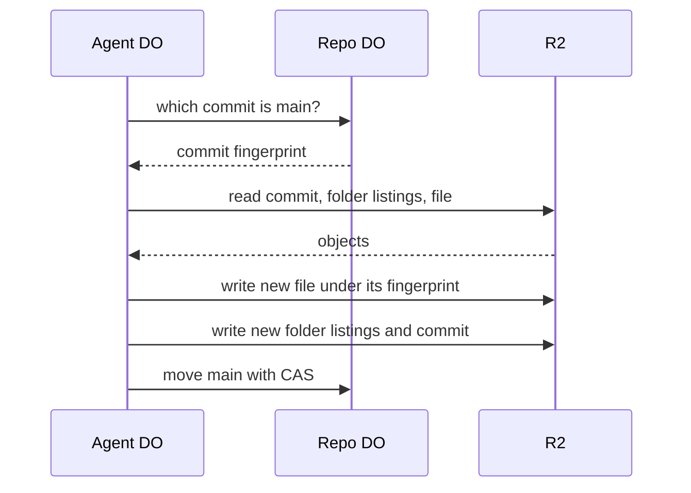

# Zero-clone execution: repo as a virtual filesystem inside an agent DO

> Verdict: **risky** · feasibility 4/5 · reliability 2/5 · correctness 3/5 · effort: weeks
> Read the words in [how-to-read.md](../findings/how-to-read.md). Engineers: [proof](../proofs/zero-clone-vfs.md) · [review](../reviews/zero-clone-vfs.md)

## What this idea is

Git is a tool that keeps every version of a set of files, and lets many people share those versions. A repository, or repo, is one project's full set of files and their history. Normally a program must download a whole repo before it can read one file. This idea skips that download. An automated agent reads each file straight from storage, by its fingerprint, only when the agent needs the file. The agent can also edit files and save a new version without ever holding the whole repo.

Think of it like this. You do not photocopy an entire encyclopedia to look up one entry. You walk to the shelf, open the right volume, and read the one page you need. If you want to add a note, you write it on a slip and file the slip in the right place.

## How it works

An object is one stored item in git. An object is a file's content, a folder listing, or a commit. A commit is one saved version of the files, with a note about what changed. A ref is a name that points at one commit. A branch is a ref. A tag is a ref. A SHA, or hash, is a fingerprint of an object's content. Two objects with the same content have the same fingerprint. Content-addressed means stored under its own fingerprint, so the name tells you what is inside. A Durable Object, or DO, is a single small program with its own storage that handles one thing at a time. There is one DO for each repo. Think of it like the one librarian who is allowed to update the catalog. In this idea there is also one DO for each agent session. R2 is Cloudflare's large file store. It holds the git objects. DO SQLite is the small database inside each Durable Object.

1. The agent DO binds itself to one repo and one ref. The agent DO asks the repo DO which commit the ref points at.
2. To read a file, the agent DO reads the commit from R2, then the top folder listing, then each subfolder, then the file. Each step is one R2 read of a content-addressed object.
3. The agent DO stores every path and fingerprint it learns in DO SQLite. A second read of a known path is one R2 read.
4. To write a file, the agent DO computes the fingerprint of the new content and writes the content to R2 under that fingerprint. The agent DO records the path in an overlay table. An overlay is a list of changed files that are not yet part of any commit.
5. To save, the agent DO builds new folder listings for the changed paths and a new commit. The agent DO writes those objects to R2.
6. The agent DO asks the repo DO to move the ref with compare-and-swap. Compare-and-swap, or CAS, means: change a value only if it still has the value you expect. If someone changed it first, do nothing and report it.
7. No copy of the repo is ever written to a disk. The working copy is the DO SQLite table plus the overlay.

## What the reviewer decided

The reviewer's verdict is Risky.

| Score | Value |
|---|---|
| Feasibility | 4 of 5 |
| Reliability | 2 of 5 |
| Correctness | 3 of 5 |

Risky. The idea can be built. But the proof shows one or more problems the reviewer could not fully solve, or it does a weaker version of the goal. Think of it like a runway you can see on the map, but nobody has checked it for holes.

The proof is the small test program the study wrote to check the idea. The lazy read method is sound and standard, and it uses only finished Cloudflare features. The code that reads loose objects is correct. But the proof works only on a repo that has never received a normal git push, because pushed objects arrive in packs. The proof can also publish a commit that points at a deleted file. And a write that lands during a save can be lost in silence. The proof also delivers less than the title claims. The agent can read, edit, and save without a clone. Running a shell or a test suite still needs a real machine with a real disk. The reviewer expects the fixes to take weeks.

## Problems that must be fixed first

A blocker is a problem that stops the idea from working until it is fixed. The reviewer found three blockers.

### Problem 1: Objects inside packs cannot be read

**What goes wrong.** The proof reads only loose objects, each stored under its own fingerprint at objects/fingerprint. Push is sending your new commits to the server. A packfile, or pack, is one bundle that holds many objects, squeezed to save space. Every object that arrives through a real git push is inside a pack. The proof has no code to find an object inside a pack.

**Why it matters.** Without pack support, the agent cannot read anything that a real user pushed. So the idea works only on a repo that no normal client has ever pushed to.

**How to fix it.** Build a pack index table in DO SQLite. Read one object from a pack with an R2 range read. Resolve deltas by reading the base object first. A delta is a stored object written as "the same as that other object, with these changes".

### Problem 2: Cleanup can delete an unsaved file

**What goes wrong.** The agent writes a new file to R2 before any commit points at it. A janitor, sweep, or GC is a background task that deletes files nobody points to anymore. The janitor sees that no ref reaches the new file, so the janitor deletes it. Later the agent saves. The new commit points at a file that is gone.

**Why it matters.** Fetch is getting commits from the server. After that save, every normal git fetch of the branch fails with "bad object". The branch is damaged for everyone.

**How to fix it.** Give overlay files a lease that the janitor must respect. Or make the save step check that every overlay file still exists in R2 before it moves the ref.

### Problem 3: A write during a save is lost

**What goes wrong.** An input gate is the rule that a Durable Object handles one request at a time while it waits on its own storage. The gate opens when the DO waits on the network instead. The save step reads the overlay, then waits on several R2 writes. During those waits the gate is open, so a new write can add a row to the overlay. When the save step finishes, it deletes the whole overlay. The new row is deleted without ever being in a folder listing.

**Why it matters.** The agent's edit is lost with no error. The agent believes the file was saved.

**How to fix it.** Wrap the save step so no other request runs until it finishes. Or stamp each overlay row with a generation number, and delete only rows from the generation the save step read.

## Things to know

A caveat is a limit or a condition. The idea works, but only inside this limit.

- A warm read costs two R2 reads, not one. The lookup reads the commit object again on every call, because the link from commit to top folder listing is never stored.
- The code that finds the top folder listing reads fixed byte positions in a commit. That breaks on annotated tags and on SHA-256 repos.
- The save step is not implemented. It must sort folder entries the way git does, where a folder name compares as if it ends with a slash. It must write author and committer lines. And the fetch path must also pack loose objects, or a normal git fetch fails with "did not receive expected object".
- Every written file gets the normal file mode, so an executable file loses that mark. Spreading bytes through argument lists stalls on files of several megabytes. There is no way to delete a file, and symbolic links and submodules are handled wrong.
- If a second agent moves the same ref first, the CAS fails and the loser has no recovery. The loser's overlay is stuck. No two records disagree, but the work is stranded.
- Execution is not delivered. Running a shell or tests still needs a container with a real disk. The proof delivers lazy read plus save only.

## How this idea connects to the others

- This idea reads each object by its fingerprint, from [#5 Content-addressed R2 keys](./content-addressed-r2-keys.md).
- This idea keeps refs in the DO database and objects in R2, from [#2 Refs in DO SQLite, objects in R2](./refs-sqlite-objects-r2.md).
- This idea asks one DO per repo to own the refs, from [#1 One Durable Object per repo as the ref authority](./repo-do-ref-authority.md).
- This idea moves the ref through a direct DO call, from [#29 Push from a sibling workspace DO over RPC, no HTTP](./tui-rpc-push.md).
- This idea needs the pack index that comes from [#4 Packfile parsing in a Worker with a streaming inflater](./streaming-pack-parser.md).
